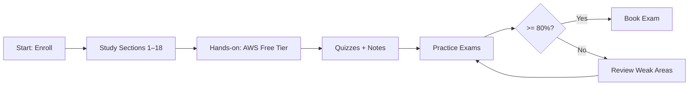

# Introduction & Course Overview

Subtitle: Your roadmap to AWS CLF-C02 success

## What you will learn
- Certification scope, format, scoring, and timeline
- How to use this book, notes, and quizzes effectively
- Study plan and milestones

## Exam at a glance
- Duration: 90 minutes
- Questions: 65 (50 scored + 15 unscored)
- Passing: 700/1000
- Delivery: Online/proctored

## How to study
1. Watch video segment for each section
2. Read the corresponding chapter in this book
3. Do 10–15 minutes of hands-on in AWS Free Tier
4. Take the section quiz; target  80%
5. Log learnings and open questions

## Resources
- AWS Exam Guide, Well-Architected, Pricing Calculator
- This repository: notes, diagrams, quizzes, study-plan

---

Next: Cloud Computing Fundamentals
