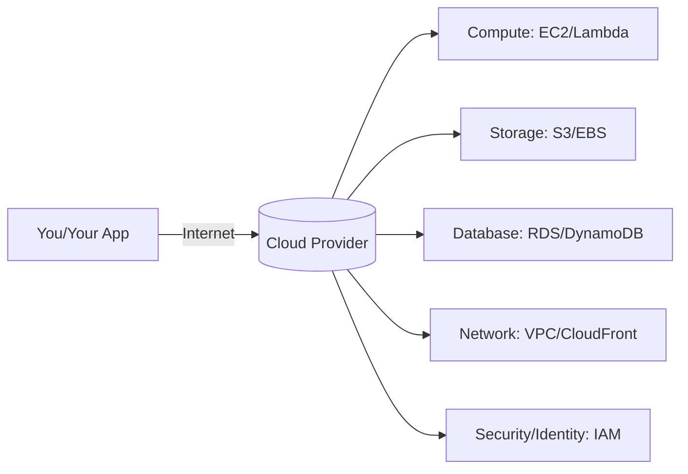
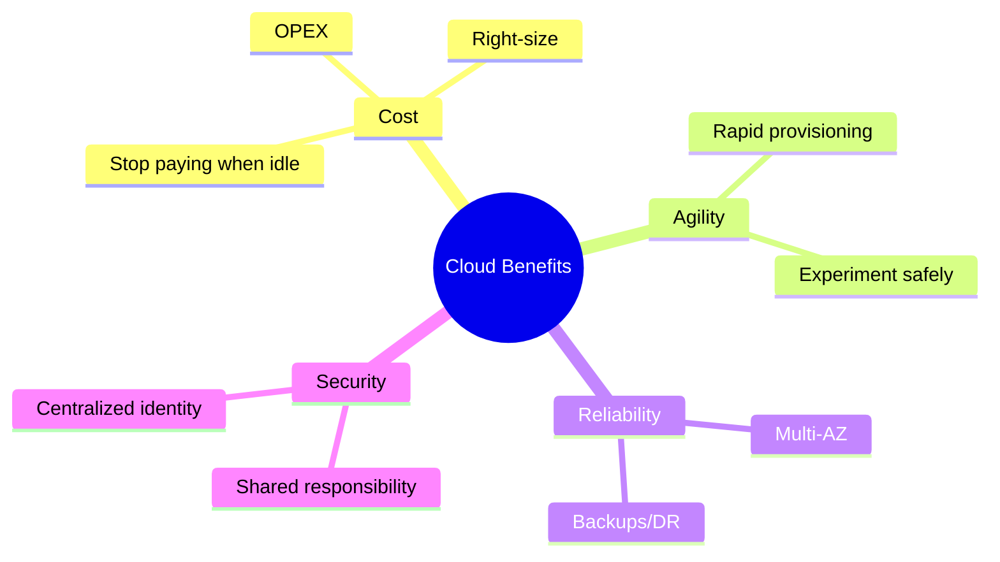
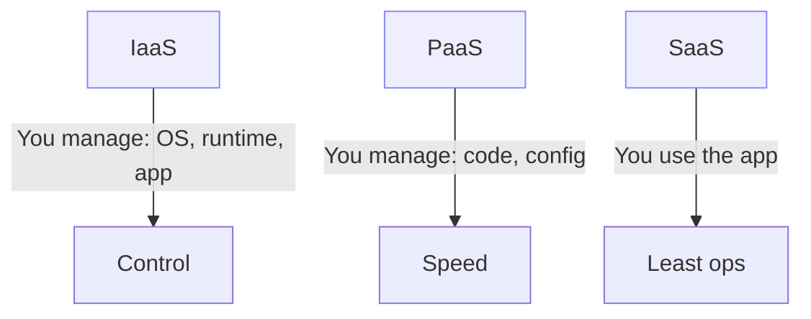
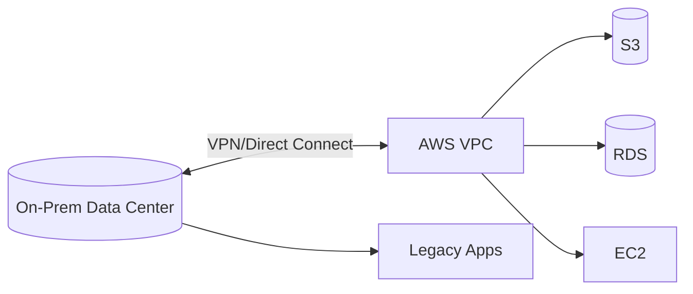
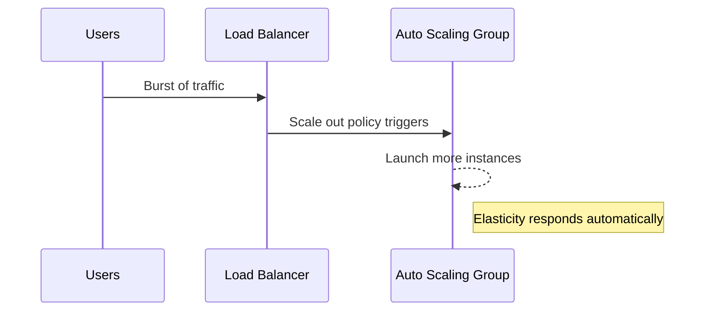
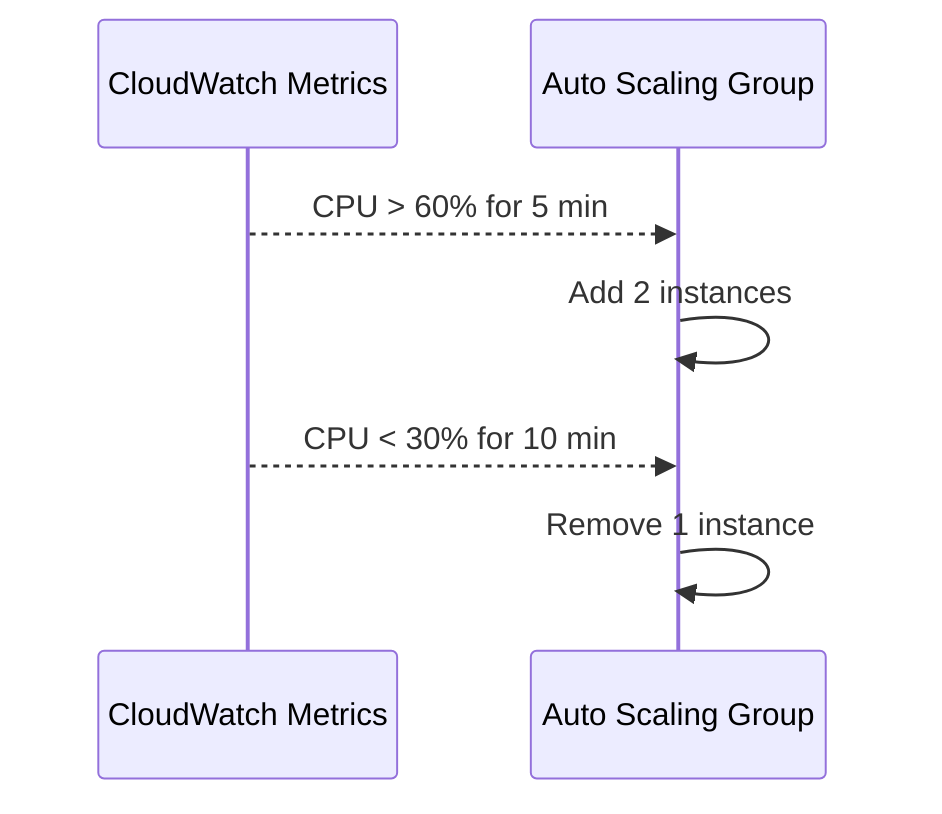

# Cloud Computing Fundamentals

Subtitle: Practical guide to models, benefits, patterns, and trade-offs

## What is Cloud Computing?
Cloud computing is renting computing resources from a provider’s global data centers instead of owning hardware. You pay for what you use, scale on demand, and access services over secure networks.

- You do not manage physical servers or power/cooling.
- You focus on building apps and use managed services (databases, queues, analytics).
- You gain global reach by deploying in multiple AWS Regions.



## Why organizations move to cloud
- Cost model shift: From CAPEX (buy servers) to OPEX (pay-as-you-go).
- Speed and agility: Provision resources in minutes, not weeks.
- Reliability and scale: Multi-AZ architectures, autoscaling, global CDNs.
- Managed services: Offload undifferentiated heavy lifting (backups, patching).



## Service Models: IaaS, PaaS, SaaS
- IaaS (Infrastructure as a Service): You manage OS and above. Example: EC2 + EBS + VPC. Best for maximum control.
- PaaS (Platform as a Service): You bring code; platform manages OS/runtime. Example: Elastic Beanstalk. Faster delivery.
- SaaS (Software as a Service): You consume the app. Example: Amazon Chime, WorkDocs. Minimal ops effort.



### Choosing a model (rule of thumb)
- Need fine-grained control or legacy workloads → IaaS
- Need fast delivery with standard runtimes → PaaS
- Need a solution, not the platform → SaaS

## Deployment Models: Public, Private, Hybrid
- Public Cloud: Multi-tenant provider (AWS). Most common for startups and modern apps.
- Private Cloud: Dedicated on-prem or hosted environment (single-tenant). Higher control, higher cost.
- Hybrid Cloud: Mix of on-prem and public cloud (e.g., Direct Connect + VPC). Pragmatic for gradual migrations.



## Core Properties: Elasticity vs Scalability
- Scalability: Increase capacity (add bigger servers or more servers).
- Elasticity: Automatically scale with demand (up and down) and pay only for what you use.



## Cost Model: CAPEX → OPEX
- CAPEX: Buying servers upfront (depreciation, overprovisioning risk).
- OPEX: Pay only for resources used (metered billing, better alignment to demand).

Practical tip: Right-size resources and use Savings Plans/Spot for compute to cut costs.

## Security: Shared Responsibility Model (preview)
- Cloud provider is responsible for security of the cloud (facilities, hardware, hypervisor).
- You are responsible for security in the cloud (data, identity, app configs).

This division enables faster delivery while keeping you accountable for proper identity, encryption, and network rules.

## Scenario Walkthroughs (step-by-step)
1) Startup building an MVP API
   - Choose PaaS/Serverless: API Gateway + Lambda + DynamoDB.
   - Benefits: No server mgmt, scales automatically, minimal cost at low traffic.
   - Risks: Cold starts (mitigated by provisioned concurrency), service limits.

2) Enterprise lift-and-shift
   - Choose IaaS: Rehost VMs to EC2 with EBS; reuse existing tooling.
   - Benefits: Fast migration with minimal code changes.
   - Next step: Gradually adopt managed DB (RDS) and autoscaling.

3) Hybrid analytics
   - Keep sensitive data on-prem, burst compute to AWS EMR/EKS.
   - Connect with Direct Connect; store outputs in S3 for BI tools.

## Common Pitfalls (and how to avoid them)
- Overprovisioning: Start small, monitor, auto scale, set budgets.
- Misunderstanding elasticity: Set scaling policies and alarms early.
- Security gaps: Enforce IAM least privilege, enable GuardDuty/CloudTrail.
- Vendor lock-in fear: Abstract with standard interfaces where it makes sense.

## Hands-on: 10-minute checklist
1. Open AWS Console → top-right, confirm your Region.
2. Create an S3 bucket (unique name), upload a test file.
3. Launch an EC2 t4g.small (Free Tier eligible type varies), stop it, observe billing behavior.
4. Create a Lambda hello-world function and invoke it once.

## Quick Glossary
- Region: A physical location with multiple isolated Availability Zones.
- Availability Zone (AZ): One or more data centers in a Region with independent power/network.
- High Availability (HA): Designing to minimize downtime (multi-AZ, health checks).
- Fault Tolerance: Continue operating during component failures (redundancy).
- DR (Disaster Recovery): Strategies to recover—RTO/RPO define objectives.
- Right-sizing: Matching resource size to actual utilization.

## Service Model Responsibilities (Who manages what?)

```text
Layer/Task                 | On-Prem | IaaS (EC2) | PaaS (Beanstalk) | FaaS (Lambda) | SaaS
---------------------------|---------|------------|------------------|---------------|-----
Facilities, Power, Cooling |   You   |   AWS      |       AWS        |      AWS      | AWS
Physical Servers           |   You   |   AWS      |       AWS        |      AWS      | AWS
Hypervisor                 |   You   |   AWS      |       AWS        |      AWS      | AWS
OS Patching                |   You   |   You      |       AWS        |      AWS      | AWS
Runtime/Container          |   You   |   You      |       AWS        |      AWS      | AWS
Application Code           |   You   |   You      |       You        |      You      | N/A
Data/Access Config         |   You   |   You      |       You        |      You      | Limited
Scaling/Capacity           |   You   |   You/AWS  |       AWS        |      AWS      | AWS
```

Key insight: moving right reduces your operational burden but may limit low-level control.

## Elasticity vs Scalability — deeper view
- Vertical scaling: increase instance size (t3.small → t3.xlarge).
- Horizontal scaling: add more instances (n=2 → n=6) behind a load balancer.
- Elasticity: policy-driven, automatic scale out/in based on metrics (CPU, RPS, latency).



Practical policy: Target tracking at 50–60% CPU for web tiers; scale step-wise to avoid flapping.

## Decision Framework: Picking the right model

```text
Workload Type       | Recommended First Choice        | Rationale
--------------------|---------------------------------|------------------------------------------
Event-driven API    | Lambda + API Gateway            | Spiky traffic, pay-per-use, low ops
Long-running jobs   | ECS on Fargate or EC2           | Predictable execution, containerized
Stateful DB         | RDS/Aurora managed service      | Backups, patching, HA built-in
Static website      | S3 + CloudFront                 | Global CDN, low cost, high durability
Legacy VM           | EC2 (rehost) → optimize later   | Fast migration path
```

## Cost and Capacity — worked example
Assume a REST API with 50 requests/second peak, 100ms average compute per request.

- Lambda estimate: 128–256 MB, 100ms, 50 rps → ~5,000,000 invocations/day; cost dominated by requests (free tier may cover early).
- EC2 estimate: 2–3 t3.small behind ALB; pay for instance hours regardless of idle.

Guideline: Low, spiky traffic → Lambda wins. High, steady traffic → EC2/ECS may be cheaper.

## Security Foundations (preview)
- Identity: Use IAM roles over long-lived access keys; apply least privilege.
- Encryption: At rest (S3 SSE-S3/SSE-KMS), in transit (TLS). Prefer KMS-managed keys.
- Network: VPC subnets, Security Groups (stateful), NACLs (stateless), private endpoints.

## Compliance & Data Residency
- Choose Regions that meet residency requirements (e.g., eu-west-1 for EU data).
- Use AWS Organizations and SCPs to enforce guardrails.
- Log everything: CloudTrail on, S3 access logs/CloudFront logs to a central account.

## Adoption Patterns and Anti-Patterns
- Rehost → Replatform → Refactor: iterate to managed/serverless over time.
- Anti-patterns: Lift-and-shift then ignore optimization; public S3 buckets; single-AZ production.

## Hands-on Labs (step-by-step)
1) S3 and CloudFront (static site)
   - Create S3 bucket (block public access enabled), enable versioning.
   - Upload index.html. Attach CloudFront distribution pointing to S3 origin.
   - Invalidate cache after updates; observe global propagation.

2) Autoscaling web tier
   - Create launch template (Amazon Linux, user data installs web server).
   - Create ASG across 2 AZs with target tracking policy (CPU 55%).
   - Place behind ALB; run a small load test; watch scale events.

3) Serverless API
   - Create Lambda (Python/Node), integrate with API Gateway HTTP API.
   - Add CloudWatch Logs insights query to analyze latency distributions.

## FAQ (concise)
- Is cloud always cheaper? No—design and right-sizing determine cost.
- Do I still need ops? Yes—different responsibilities: identity, data, architecture.
- Can I avoid vendor lock-in? Use standard interfaces judiciously; balance speed vs portability.

## Interview-style checkpoints
- Explain elasticity vs scalability with an example.
- Map a legacy 3-tier app to AWS services with HA.
- Describe shared responsibility for EC2 vs RDS vs Lambda.

---

Next: AWS Overview
