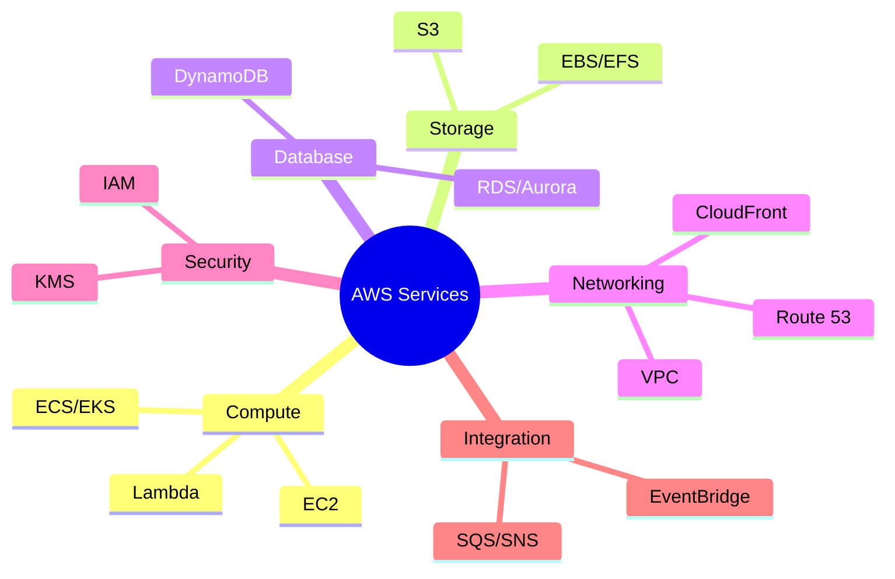
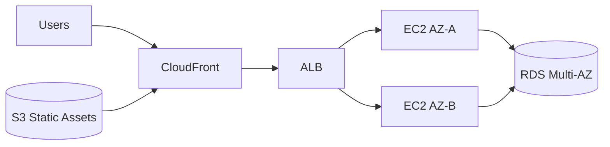
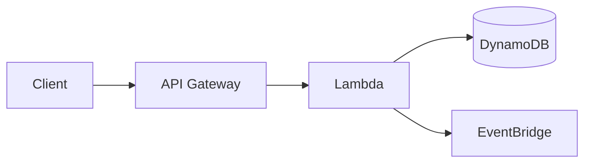

# AWS Overview

Subtitle: Service families, global reach, and reference architectures

## AWS at a glance
- Launched in 2006 with S3 and EC2; now 200+ services
- Core value: breadth of managed services + global infrastructure
- Typical outcomes: faster delivery, improved reliability, lower TCO with good governance

```mermaid
flowchart LR
  subgraph Global Infrastructure
    R[Regions]-->AZ[Availability Zones]
    R-->Edge[Edge Locations]
  end
  subgraph Service Families
    C[Compute]
    S[Storage]
    DB[Database]
    N[Networking]
    Sec[Security]
    Obs[Observability]
    Int[Integration]
  end
  Global Infrastructure-->Service Families
```

## Service families and flagship services
- Compute: EC2, Lambda, ECS, EKS, Fargate
- Storage: S3, EBS, EFS, FSx, Glacier
- Database: RDS/Aurora, DynamoDB, Redshift, ElastiCache
- Networking: VPC, Route 53, CloudFront, API Gateway, Direct Connect
- Security: IAM, KMS, Secrets Manager, WAF, Shield, GuardDuty
- Observability: CloudWatch, CloudTrail, X-Ray
- Integration: SQS, SNS, EventBridge, Step Functions



## Global infrastructure fundamentals
- Regions: independent geographic areas with multiple AZs
- AZs: isolated facilities connected by low-latency links
- Edge: CloudFront POPs for caching; Route 53 anycast DNS
- Choose Regions for latency, compliance, and service availability

## Reference architectures
### 1) Highly available web app (two-tier)
- ALB → EC2 ASG in two AZs → RDS Multi-AZ
- S3 for static assets, CloudFront for global distribution
- IAM + Security Groups + KMS for security



### 2) Serverless API
- API Gateway → Lambda → DynamoDB
- EventBridge for async events; CloudWatch for logs/metrics



### 3) Container platform
- EKS (managed Kubernetes) or ECS on Fargate
- Ingress via ALB; observability via CloudWatch + X-Ray

## Governance and cost controls (essentials)
- Accounts and Organizations for isolation and billing
- Budgets, Cost Explorer, and tagging strategy
- IAM least privilege, SCPs, and config baselines

## Hands-on checklist (10–15 min)
- Create an S3 bucket and enable versioning
- Launch an EC2 t4g.small, attach a security group, stop it
- Create a Lambda function and invoke it from the console

---

Next: Global Infrastructure
