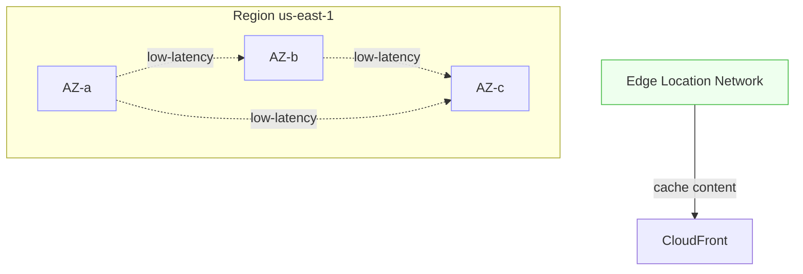
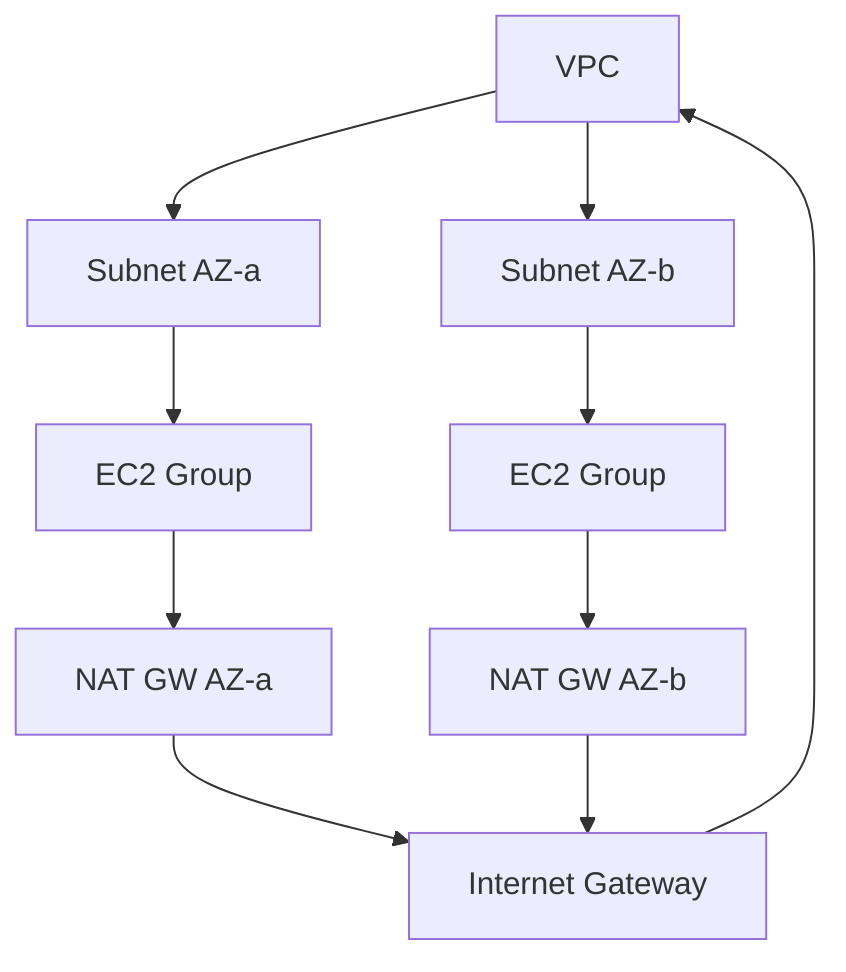
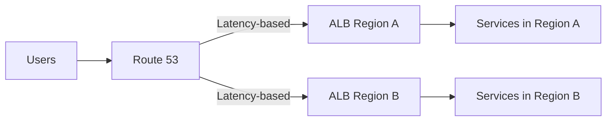

# AWS Global Infrastructure

Subtitle: Regions, Availability Zones, Edge, and how design choices map to resilience

## Core building blocks
- Region: Independent geographic area containing multiple Availability Zones (AZs).
- Availability Zone (AZ): One or more data centers with independent power, cooling, and networking.
- Edge Location: Global points of presence for CloudFront and Route 53 (DNS) to reduce latency.
- Local Zone / Wavelength / Outposts: Extensions of AWS infrastructure closer to end users or on-premises.



## Why this matters for architecture
- Fault isolation: AZs reduce blast radius; one AZ failure shouldn’t take down your app.
- Latency and proximity: Choose Regions close to users; use CloudFront for static and dynamic acceleration.
- Compliance and residency: Some data must stay within country/region boundaries.
- Service availability: Not all services exist in every Region; confirm before designing.

## Designing for high availability (HA) and disaster recovery (DR)
- Multi-AZ pattern (in-Region resilience):
  - EC2 Auto Scaling across 2–3 AZs behind an ALB.
  - RDS Multi-AZ for automatic failover.
  - S3 is inherently multi-AZ within a Region.
- Multi-Region DR patterns:
  - Backup & Restore: Cheapest, slowest RTO.
  - Pilot Light: Minimal core services always on in secondary Region.
  - Warm Standby: Scaled-down copy of prod; faster RTO.
  - Active/Active: Both Regions serve traffic; complex but fastest RTO.

```mermaid
flowchart LR
  subgraph Region A
    ALB1[ALB]
    EC2A1[EC2 in AZ-a]
    EC2A2[EC2 in AZ-b]
    RDSA[(RDS Multi-AZ)]
    ALB1 --> EC2A1
    ALB1 --> EC2A2
    EC2A1 --> RDSA
    EC2A2 --> RDSA
  end
  subgraph Region B (DR)
    ALB2[ALB]
    EC2B1[EC2 minimal]
    RDSB[(RDS read replica)]
    ALB2 --> EC2B1
    EC2B1 --> RDSB
  end
  DNS[Route 53] -->|primary| ALB1
  DNS -->|failover| ALB2
```

## Data residency and sovereignty
- Keep PII within specific Regions where required by law.
- Use S3 bucket location controls, KMS keys scoped to Region, and VPC endpoints.
- For strict US govt workloads, use AWS GovCloud (US).

## Network design essentials
- VPC spans a Region; subnets are confined to AZs.
- Place redundant resources across subnets in different AZs.
- Use NAT Gateways in multiple AZs for egress resilience.



## Choosing Regions (practical checklist)
- Latency: Run `cloudping` or similar tests from user geographies.
- Service coverage: Validate required services exist in target Region.
- Compliance: Residency laws, contractual obligations, export controls.
- Cost: Regional price differences (EC2, data transfer, NAT).
- Growth: Capacity signals (available AZs, Local Zones if needed).

## Hands-on (10–15 min)
- Create a VPC with two public and two private subnets across two AZs.
- Deploy an ALB + EC2 Auto Scaling group across both AZs.
- Create an S3 bucket and confirm its Region; upload an object and test latency via CloudFront.

## Common pitfalls
- Single-AZ production deployments.
- Single NAT Gateway for multi-AZ private subnets (SPOF for egress).
- Ignoring inter-AZ data transfer costs in design and tests.
- Picking a Region before confirming service availability.

## Routing policies and global traffic management
- Simple: one record, one value; no health checks.
- Weighted: split traffic by percentage (blue/green, canaries).
- Latency-based: route to the lowest-latency Region per user.
- Failover: primary/secondary with health checks.
- Geo/Geo-proximity: steer by user location (compliance, performance).



## Inter-Region and hybrid connectivity
- VPC Peering: simple, point-to-point; no transitive routing.
- Transit Gateway: hub-and-spoke for many VPCs/on-prem; centralizes routing.
- Direct Connect: private, consistent network to AWS; combine with TGW.

## Cost awareness (high-level)
- Inter-AZ data transfer usually billed; design chatty tiers in the same AZ and use HA replicas across AZs.
- NAT Gateway data processing charges: minimize egress via VPC Endpoints (S3/DynamoDB gateway endpoints).
- CloudFront egress cheaper than S3 direct; cache aggressively.

## Service availability and limits (practical reminders)
- Not all services are in every Region; check the Regional Services list before committing.
- AZ count per Region differs (2–3+); more AZs allow better blast-radius control.
- Some quotas are regional (e.g., EC2 vCPU-based limits); request increases early.

---

Next: Cloud Architecture & Core Concepts
