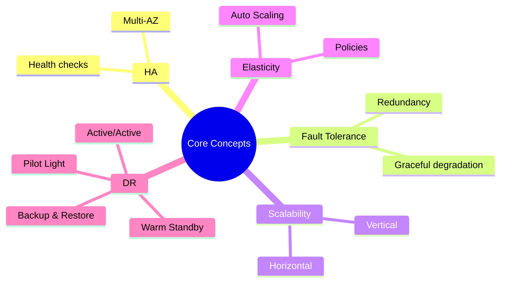
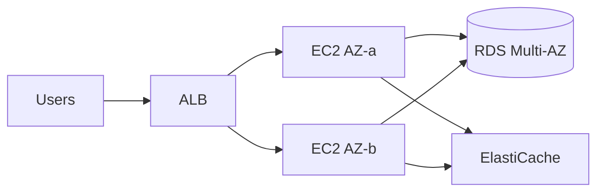
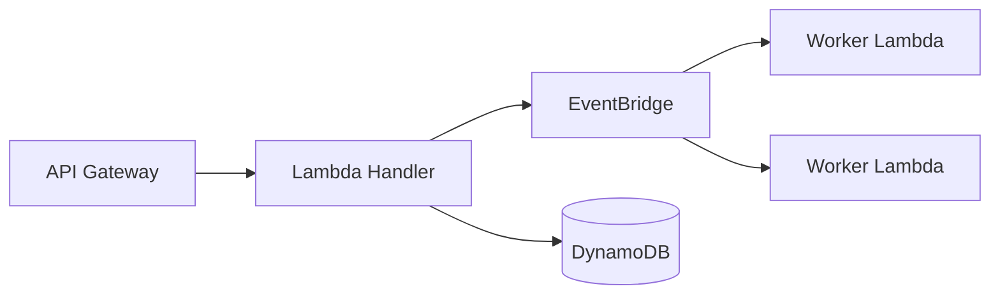

# Cloud Architecture & Core Concepts

Subtitle: Availability, resilience, elasticity, and disaster recovery patterns

## Core definitions
- High Availability (HA): Minimize downtime via redundancy and quick failover.
- Fault Tolerance: Continue functioning despite component failures.
- Scalability: Increase capacity to meet demand (vertical vs horizontal).
- Elasticity: Automatically adjust capacity up/down based on load.
- RTO/RPO: Recovery Time Objective / Recovery Point Objective for DR.

## Reference patterns
### Multi-AZ web tier + RDS
- ALB → EC2 in two AZs; user sessions stored in ElastiCache or cookies (stateless app).
- RDS Multi-AZ for automatic failover.

### Event-driven (serverless) microservice
- API Gateway → Lambda; asynchronous flows via SQS/EventBridge; idempotency for retries.

## DR strategies compared
- Backup & Restore: Lowest cost, hours RTO, suitable for non-critical.
- Pilot Light: Critical components running; minutes-to-hours RTO.
- Warm Standby: Reduced-capacity full stack; minutes RTO.
- Active/Active: Zero-to-near-zero RTO; highest complexity and cost.

## Capacity and scaling guidance
- Stateless first: externalize session/state.
- Use target tracking autoscaling; start with 50–60% targets.
- Protect databases with connection pooling and backpressure.

## Resilience checklist
- [ ] Two or more AZs for production.
- [ ] Health checks and circuit breakers.
- [ ] Graceful degradation (read-only modes, feature flags).
- [ ] Run chaos experiments (e.g., terminate nodes) in non-prod.

## Hands-on
- Create an ALB + two EC2 instances across AZs; update health checks and observe failover.
- Add RDS Multi-AZ; perform a managed failover and measure impact.

---

Next: Core Services – Compute
