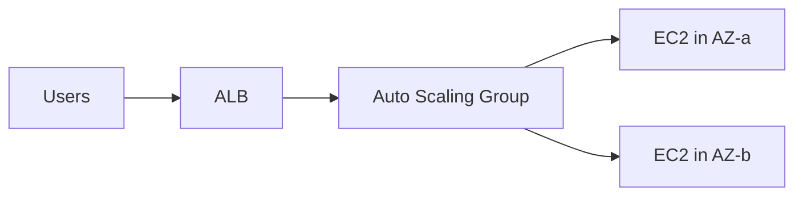
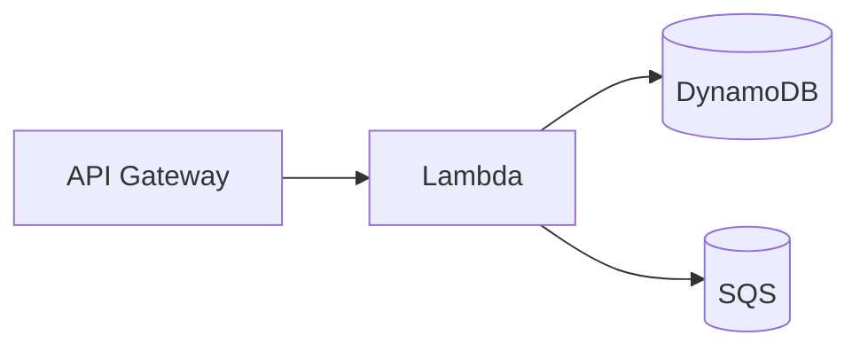

# Core Services: Compute

Subtitle: EC2, Auto Scaling, Load Balancing, Lambda, and Containers

## EC2 Fundamentals
- Instance families: General (T/M), Compute (C), Memory (R/X), Storage (I/D), Accelerated (G/P)
- Pricing: On-Demand, Savings Plans/RI, Spot, Dedicated Hosts
- Storage: EBS (gp3/io2), Instance Store, AMIs, user data

Guidance: Start with t3/t4g burstable for web tiers; right-size using CloudWatch + Compute Optimizer.

## Load Balancing & Auto Scaling
- ALB: HTTP/HTTPS (layer 7), path-based routing, WAF integration.
- NLB: TCP/UDP (layer 4), extreme performance.
- Target tracking autoscaling: keep utilization near a target (e.g., 55% CPU).

## Lambda (Serverless Compute)
- Event-driven, per-invocation billing, concurrency scaling.
- Integrations: API Gateway, S3, EventBridge, SQS, DynamoDB Streams.
- Packaging: container images or zip; keep cold start in mind.

## Containers: ECS and EKS
- ECS: AWS-native orchestrator; launch type Fargate (serverless) or EC2.
- EKS: Managed Kubernetes control plane; worker nodes in EC2 or Fargate.
- Patterns: blue/green deployments, service autoscaling, service discovery.

## Choosing compute (decision guide)
- Spiky, unpredictable traffic, minimal ops → Lambda
- Containerized workloads, portability → ECS/EKS (prefer Fargate to start)
- Legacy or custom low-level needs → EC2 (then optimize)

## Cost levers
- Savings Plans for steady-state compute (EC2, Fargate, Lambda)
- Spot for non-critical, interrupible jobs; set diversification strategies
- Right-size instances; schedule off-hours shutdown in dev/test

## Hands-on
- Create ALB + Auto Scaling template; verify scale out/in with a load test.
- Build a Lambda function and invoke via API Gateway.
- Deploy a simple ECS service on Fargate behind an ALB.

---

Next: Core Services – Storage (Part 1 continuation and Part 2)
