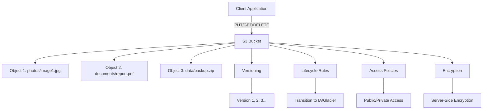
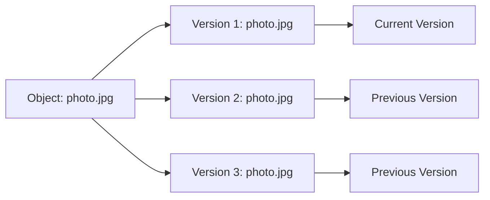
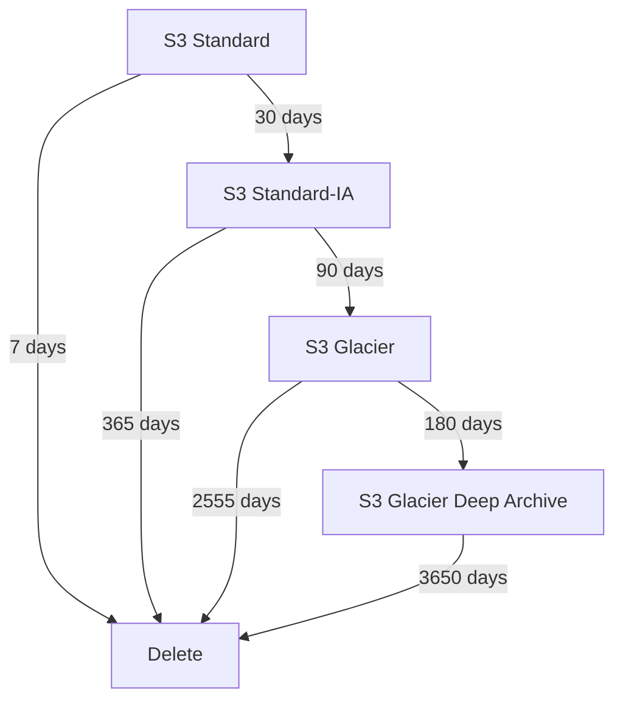

# Core Services: Storage (Part 1)

Subtitle: Amazon S3 - Object Storage Fundamentals

## Amazon S3 Overview

Amazon Simple Storage Service (S3) is AWS's primary object storage service, designed for 99.999999999% (11 9's) durability and 99.99% availability. It's built to store and retrieve any amount of data from anywhere on the web.

### Key Concepts

**Buckets**: Containers for objects, globally unique names across all AWS accounts
**Objects**: Files stored in buckets, identified by a key (path) and value (data)
**Regions**: Geographic locations where buckets are created and stored
**Keys**: Unique identifier for objects within a bucket



## Storage Classes

### S3 Standard
- **Use Case**: Frequently accessed data
- **Availability**: 99.99% (99.9% for requests)
- **Durability**: 99.999999999% (11 9's)
- **Storage Location**: Multiple AZs
- **Access Time**: Milliseconds
- **Cost**: Highest storage cost, no retrieval fees

### S3 Standard-Infrequent Access (IA)
- **Use Case**: Infrequently accessed data (30-90 days)
- **Availability**: 99.9%
- **Durability**: 99.999999999% (11 9's)
- **Storage Location**: Multiple AZs
- **Access Time**: Milliseconds
- **Cost**: Lower storage cost, retrieval fees apply

### S3 One Zone-Infrequent Access
- **Use Case**: Infrequently accessed, non-critical data
- **Availability**: 99.5%
- **Durability**: 99.999999999% (11 9's)
- **Storage Location**: Single AZ
- **Access Time**: Milliseconds
- **Cost**: Lowest storage cost, retrieval fees apply

### S3 Glacier
- **Use Case**: Long-term archival (90+ days)
- **Availability**: 99.99%
- **Durability**: 99.999999999% (11 9's)
- **Storage Location**: Multiple AZs
- **Access Time**: 1-5 minutes (Standard), 1-12 hours (Expedited)
- **Cost**: Very low storage cost, retrieval fees apply

### S3 Glacier Deep Archive
- **Use Case**: Long-term archival (180+ days)
- **Availability**: 99.99%
- **Durability**: 99.999999999% (11 9's)
- **Storage Location**: Multiple AZs
- **Access Time**: 12 hours
- **Cost**: Lowest storage cost, highest retrieval fees

## Versioning

Versioning enables you to keep multiple versions of an object in the same bucket.

### Benefits
- Protection against accidental deletion
- Protection against accidental overwrites
- Rollback capability
- Compliance requirements

### States
- **Suspended**: Default state, no versioning
- **Enabled**: All objects get version IDs
- **MFA Delete**: Requires MFA to delete versions



## Lifecycle Management

Automatically transition objects between storage classes or delete them based on rules.

### Transition Rules
- **Immediate**: Move to IA after 30 days
- **Long-term**: Move to Glacier after 90 days
- **Archive**: Move to Deep Archive after 180 days

### Expiration Rules
- **Temporary files**: Delete after 7 days
- **Logs**: Delete after 90 days
- **Backups**: Delete after 1 year



## Security & Access Control

### Access Control Methods
1. **IAM Policies**: User/role-based permissions
2. **Bucket Policies**: Bucket-level permissions
3. **ACLs**: Object-level permissions (legacy)
4. **Pre-signed URLs**: Temporary access to objects

### Block Public Access
- **Account Level**: Applies to all buckets
- **Bucket Level**: Applies to specific bucket
- **Settings**: Block public ACLs, policies, and access

### Encryption
- **Server-Side Encryption (SSE-S3)**: AWS-managed keys
- **SSE-KMS**: Customer-managed keys via KMS
- **SSE-C**: Customer-provided keys
- **Client-Side Encryption**: Encrypt before upload

## Hands-On Exercises

### Exercise 1: Create and Configure S3 Bucket
```bash
# Create bucket
aws s3 mb s3://my-unique-bucket-name-2024

# Enable versioning
aws s3api put-bucket-versioning \
  --bucket my-unique-bucket-name-2024 \
  --versioning-configuration Status=Enabled

# Upload object
aws s3 cp local-file.txt s3://my-unique-bucket-name-2024/
```

### Exercise 2: Lifecycle Configuration
```json
{
  "Rules": [
    {
      "ID": "TransitionRule",
      "Status": "Enabled",
      "Transitions": [
        {
          "Days": 30,
          "StorageClass": "STANDARD_IA"
        },
        {
          "Days": 90,
          "StorageClass": "GLACIER"
        }
      ]
    }
  ]
}
```

### Exercise 3: Bucket Policy
```json
{
  "Version": "2012-10-17",
  "Statement": [
    {
      "Sid": "PublicReadGetObject",
      "Effect": "Allow",
      "Principal": "*",
      "Action": "s3:GetObject",
      "Resource": "arn:aws:s3:::my-bucket/*"
    }
  ]
}
```

## Best Practices

### Naming Conventions
- Use DNS-compliant names (lowercase, no spaces)
- Include environment prefix (dev-, prod-, staging-)
- Use descriptive names (logs-, backups-, data-)

### Security
- Enable versioning for important data
- Use MFA delete for critical buckets
- Enable server-side encryption
- Use least privilege access
- Monitor access with CloudTrail

### Cost Optimization
- Use lifecycle policies
- Choose appropriate storage classes
- Monitor usage with Cost Explorer
- Use S3 Intelligent-Tiering for unknown access patterns

### Performance
- Use multipart upload for large files (>100MB)
- Use CloudFront for global distribution
- Use S3 Transfer Acceleration for uploads
- Consider request patterns for optimal performance

## Common Use Cases

### Static Website Hosting
- Host HTML, CSS, JavaScript files
- Configure bucket for website hosting
- Use CloudFront for global distribution

### Data Lake
- Store structured and unstructured data
- Use with analytics services (Athena, Redshift)
- Implement data lifecycle management

### Backup and Archive
- Automated backups from EC2, RDS, EBS
- Long-term archival for compliance
- Cross-region replication for disaster recovery

### Application Data
- User uploads and content
- Application logs and metrics
- Configuration files and assets

## Pricing Considerations

### Storage Costs
- **Standard**: $0.023 per GB/month
- **Standard-IA**: $0.0125 per GB/month
- **Glacier**: $0.004 per GB/month
- **Deep Archive**: $0.00099 per GB/month

### Request Costs
- **PUT/COPY/POST**: $0.0004 per 1,000 requests
- **GET/SELECT**: $0.0004 per 1,000 requests
- **Glacier Retrieval**: $0.01 per 1,000 requests

### Data Transfer
- **Inbound**: Free
- **Outbound to Internet**: $0.09 per GB (first 10TB)
- **Outbound to CloudFront**: Free

---

**Next**: [Core Services: Storage (Part 2)](./07-core-services-storage-part2.md) - EBS, EFS, and Snow Family
