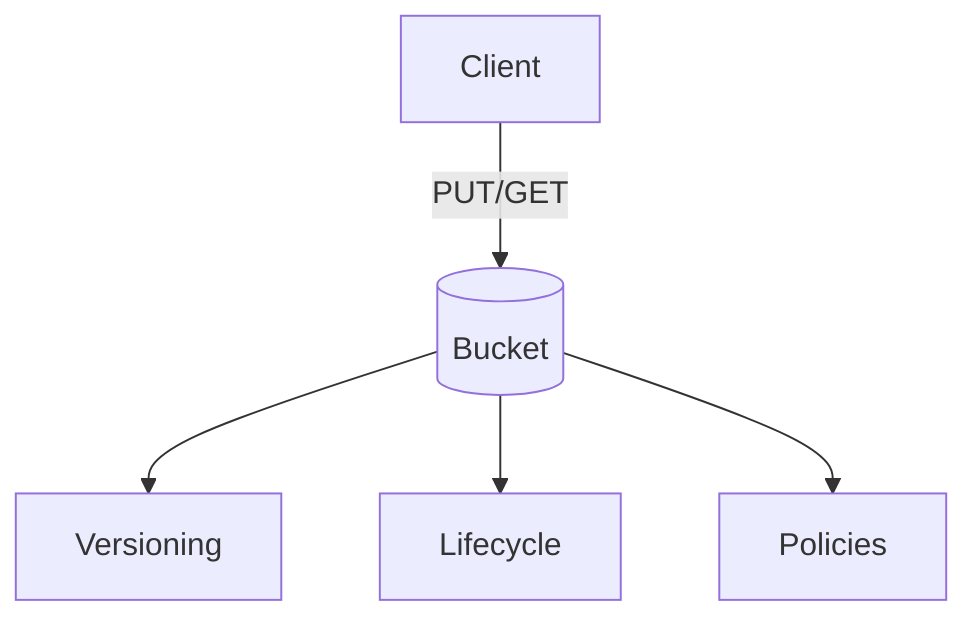

# Core Services: Storage (Part 1)

Subtitle: S3 essentials up to 2h49m

## Amazon S3 Basics
- Buckets (global unique names), Objects (key, value), Regions
- Durability 99.999999999% (11 9s), high availability
- Strong read-after-write for new objects

## Storage Classes (covered so far)
- S3 Standard: Frequent access, multi-AZ
- S3 Standard-IA: Infrequent access, retrieval fee
- S3 Glacier / Glacier Deep Archive: Archival (queued restores)

## Versioning & Lifecycle
- Versioning: Protects against accidental deletes/overwrites
- Lifecycle rules: Transition to IA/Glacier; expiration

## Security & Access (intro)
- Bucket policies vs IAM policies
- Block Public Access (account & bucket level)

## Example Steps
1. Create bucket in your nearest Region
2. Enable versioning
3. Upload object; overwrite and observe versions
4. Create lifecycle rule: transition to IA after 30 days
5. Test public block settings

---

Next: Core Services – Storage (Part 2, continue after 2h49m)
