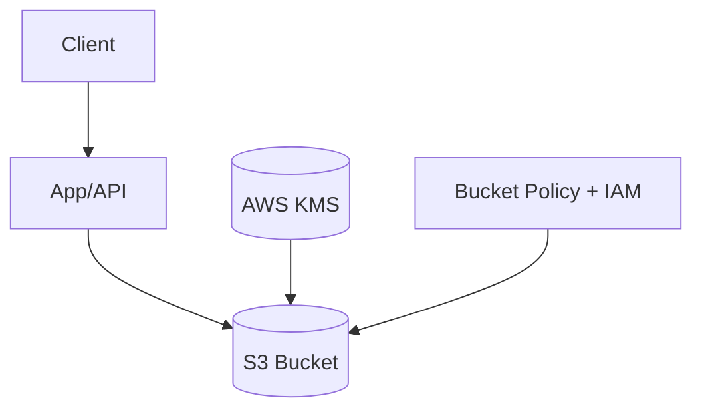

# Core Services: Storage (Part 2)

Subtitle: Deep dive into S3 security, performance, and data lifecycle

## Access control and security
- Block Public Access: account and bucket level; keep ON by default.
- IAM vs Bucket Policies: identity-centric vs resource-centric; often used together.
- Pre-signed URLs: temporary, scoped access to specific objects.
- Encryption: SSE-S3, SSE-KMS (preferred), client-side; key rotation via KMS.

## Performance and cost
- S3 scales automatically; request parallelism via multi-part upload.
- Intelligent-Tiering for unknown or changing access patterns.
- Lifecycle transitions: Standard → IA → Glacier (Expedited/Standard/Bulk restores).
- S3 Select for partial object retrieval; reduce data scanned.

## Eventing and integration
- S3 Event Notifications: trigger Lambda/SQS/EventBridge on PUT/DELETE.
- Common patterns: image/video processing, data lake ingestion, audit trails.

## Data lake foundation
- S3 as durable storage; Glue catalog + Athena/Redshift Spectrum for querying.
- Partition data by date/customer to optimize scans.

## Hands-on
- Create a bucket policy that denies unencrypted PUTs; test with CLI.
- Enable Intelligent-Tiering; set lifecycle rule for Glacier after 60 days.
- Configure an S3 event to trigger a Lambda thumbnail generator.

---

Next: Core Services – Database
