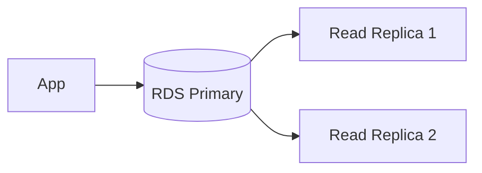
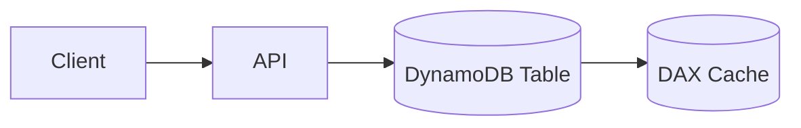

# Core Services: Database

Subtitle: RDS/Aurora, DynamoDB, ElastiCache, and migration patterns

## Relational (RDS/Aurora)
- Engines: MySQL, PostgreSQL, MariaDB, Oracle, SQL Server; Aurora variants
- Multi-AZ for HA; read replicas for scale-out reads
- Backups, snapshots, PITR; parameter groups and option groups

## NoSQL (DynamoDB)
- Key-value and document store; single-digit ms latency
- Partitions by partition key; GSIs/LSIs for access patterns
- On-demand vs provisioned capacity; auto scaling; DAX for caching

## Caching (ElastiCache)
- Redis/Memcached; offload hot reads, session storage, rate-limits
- Patterns: cache-aside, write-through, write-behind

## Data warehousing (Redshift) — overview
- Columnar storage, MPP, spectrum for S3

## Migration tools
- DMS for heterogeneous migrations
- SCT for schema conversion

## Hands-on
- Create RDS Multi-AZ PostgreSQL, a read replica; failover test
- Create a DynamoDB table with a GSI; enable auto scaling
- Add ElastiCache Redis for a hot leaderboard

---

Next: Core Services – Networking
