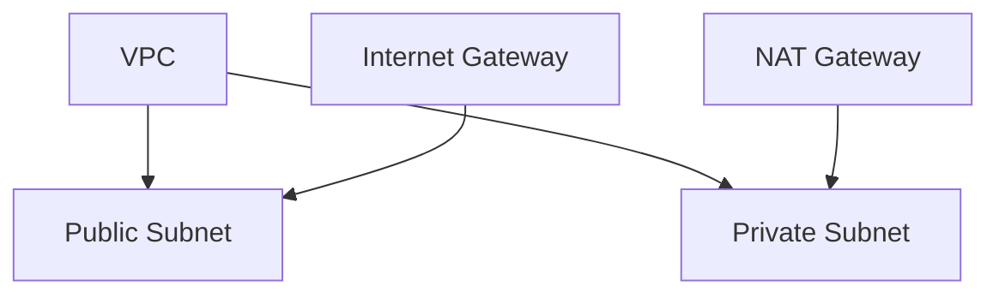

# Core Services: Networking

Subtitle: VPC, subnets, routing, security groups, NACLs, and edge services

## VPC fundamentals
- VPC spans a Region; subnets are AZ-scoped (public vs private)
- Route tables, Internet/NAT gateways, VPC endpoints

## Security layers
- Security Groups: stateful, attach to ENIs/instances; allow rules only
- NACLs: stateless, subnet-level allow/deny; default allow all
- Prefer SGs for most use; use NACLs for coarse subnet filters

## Name and traffic services
- Route 53 (DNS): public/private hosted zones, routing policies
- CloudFront: CDN for static/dynamic content; origin S3/ALB
- Direct Connect/VPN: hybrid connectivity

## Load balancing and ingress
- ALB vs NLB vs GWLB; target groups, health checks
- Private ALB for internal microservices

## Hands-on
- Build a VPC with 2 public + 2 private subnets
- Create SGs for web tier and DB tier; test allowed flows
- Configure CloudFront for an S3 static site with OAC (origin access control)

---

Next: Security & Compliance
