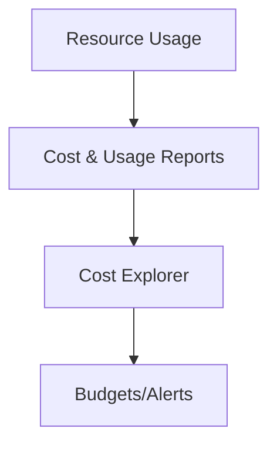

# Billing, Pricing, and Support

Subtitle: Pricing models, cost tools, and support plans

## Pricing models
- On-Demand: pay per hour/second; flexible
- Savings Plans/Reserved: commit for 1–3 years; big discounts
- Spot: spare capacity; up to 90% off; interruptible
- Dedicated Hosts/Instances: compliance/licensing needs

## Cost tools and practices
- Budgets and alerts; Cost Explorer for trends
- CUR for detailed reporting; tag and allocate costs
- Pricing Calculator for estimates; right-size and schedule shutdowns

## Support plans
- Basic: account and billing only
- Developer: business hours via email; general guidance
- Business: 24x7 email/chat/phone; production workloads
- Enterprise: TAM, concierge; mission-critical

## Hands-on
- Create two budgets (cost and usage); set email notifications
- Use Cost Explorer to identify top spend by tag
- Model a workload in Pricing Calculator (EC2 + RDS + S3)

---

Next: Deployment & Management Tools
