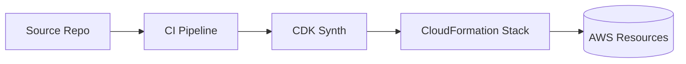

# Deployment & Management Tools

Subtitle: CloudFormation, CDK, Elastic Beanstalk, CLI/SDKs, and automation

## Infrastructure as Code (IaC)
- CloudFormation: declarative JSON/YAML; stacks/changesets; drift detection
- CDK: define infra in TypeScript/Python/Java/etc; compiles to CloudFormation
- Best practice: version control + pipeline deployments

## Elastic Beanstalk
- PaaS for web apps; environments, health, auto scaling, rolling/blue-green
- Good for standard stacks without managing servers directly

## AWS CLI and SDKs
- CLI for scripting; profiles/roles
- SDKs for app integration; retries/backoff; pagination

## Config and Governance
- AWS Config rules for compliance; Service Catalog for curated products

## Hands-on
- Create a CDK app with an S3 bucket and deploy
- Deploy a Beanstalk sample app with rolling updates

---

Next: Monitoring & Analytics
