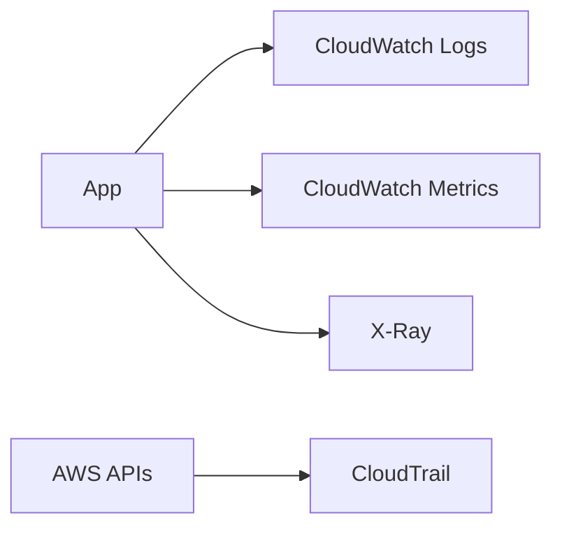

# Monitoring & Analytics

Subtitle: CloudWatch, CloudTrail, X-Ray, and observability patterns

## CloudWatch
- Metrics, Logs, Alarms, Dashboards; Synthetics and RUM
- Logs Insights for querying; embedded metrics format

## CloudTrail
- API auditing across accounts/Regions; organization trails
- Store logs in S3 with lifecycle and encryption

## X-Ray
- Distributed tracing; service maps; latency breakdowns

## Patterns
- Centralized logs account; cross-account dashboards
- Alarms triggering SNS/EventBridge for auto-remediation

## Hands-on
- Create metric alarms on CPU and error rate
- Enable org trail and bucket policies
- Instrument a Lambda with X-Ray

---

Next: Application Integration
