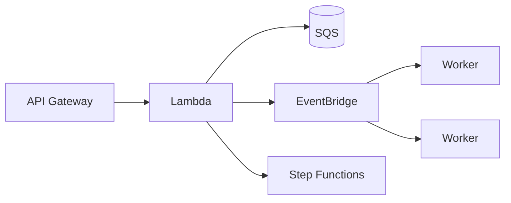

# Application Integration

Subtitle: SQS, SNS, EventBridge, Step Functions, and API Gateway

## Messaging and events
- SQS: decouple with queues; DLQs; visibility timeout
- SNS: pub/sub fan-out; multiple protocols
- EventBridge: event bus, filtering, schema registry; SaaS integrations

## Orchestration
- Step Functions: workflows, retries, error handling; service integrations

## API Gateway
- HTTP/REST/WebSocket APIs; auth (IAM, Cognito, Lambda authorizers)

## Patterns
- Async-first; idempotency keys; outbox pattern for reliability

## Hands-on
- Build a queue with DLQ; publish via SNS
- Create an EventBridge rule to route specific events to a Lambda
- Create a Step Functions state machine for an order workflow

---

Next: Migration & Innovation
