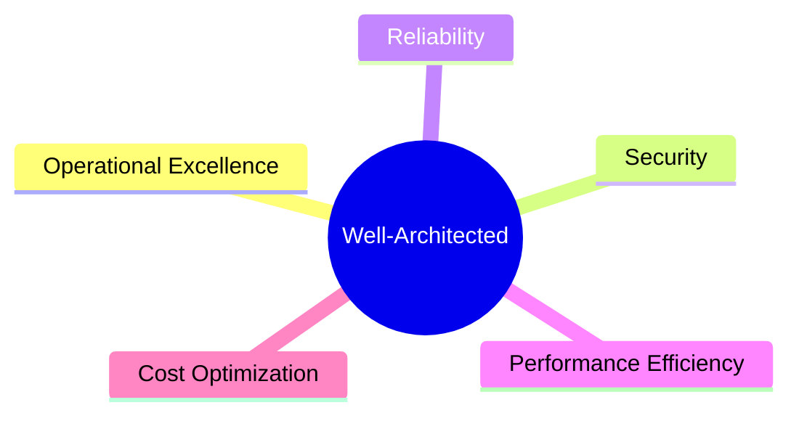

# Well-Architected Framework

Subtitle: The five pillars and design trade-offs

## Pillars
- Operational Excellence, Security, Reliability, Performance Efficiency, Cost Optimization
- (Sustainability is often referenced as an additional lens)

## Review process
- Perform reviews with workloads; capture risks and improvement items
- Use the AWS Well-Architected Tool; track remediation

## Practical guidance
- Document decisions; measure with KPIs; iterate

## Hands-on
- Run a review in the WA Tool for your sample workload

---

Next: Practice Exams & Final Review
