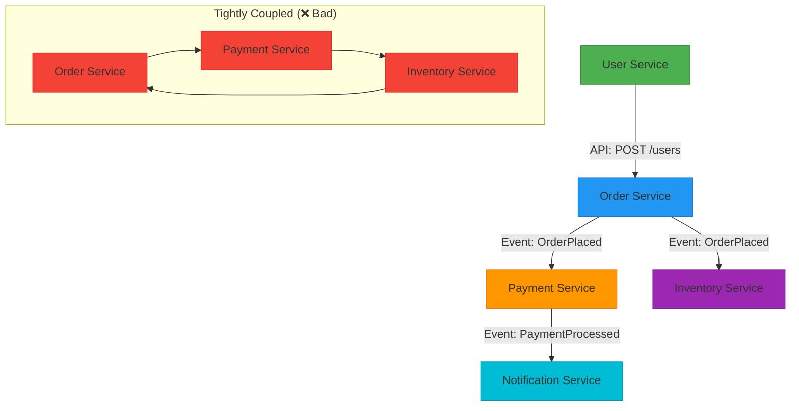

# 02 - High Cohesion and Low Coupling

> 💡 *"A microservice should do one thing well — and depend on others as little as possible."*

This principle is the **foundation of good microservices design**. It defines how to structure services so they are **focused, maintainable, and independently evolvable**.

If you get this right, your system will scale gracefully.
If you get it wrong, you'll end up with a **distributed monolith** — many services, but tightly bound together.

Let's break down what **high cohesion** and **low coupling** mean, why they matter, and how to apply them.

---

## 🎯 What Is High Cohesion?

> **High Cohesion** = A service is focused on a single business capability or a closely related set of functions.

Think: *"What is this service's job?"*
The answer should be **short and specific**.

### ✅ Good Examples (High Cohesion)

| Service                  | Responsibility                                 |
| ------------------------ | ---------------------------------------------- |
| `User Service`         | Manage user lifecycle: sign-up, login, profile |
| `Payment Service`      | Process payments, refunds, status checks       |
| `Notification Service` | Send emails, SMS, push notifications           |
| `Inventory Service`    | Track stock levels, update on order            |

Each service has **one clear purpose**.

### ❌ Bad Examples (Low Cohesion)

| Service                                        | Problem                                       |
| ---------------------------------------------- | --------------------------------------------- |
| `User Service` sends emails                  | Now it does auth + notifications → two jobs  |
| `Order Service` handles payments             | Mixes order logic with money movement         |
| `Notification Service` manages user profiles | No relation — violates single responsibility |

📌 **Golden Rule**:

> If you can't describe a service's job in one sentence, it's doing too much.

---

## 🔗 What Is Low Coupling?

> **Low Coupling** = Services depend on each other as little as possible.

They interact through **well-defined contracts** (APIs or events), not internal details.

### ✅ Characteristics of Low Coupling

- Services communicate via **APIs or events**
- One service doesn't know how another works internally
- Changes in one service don't force changes in others
- Failure in one service doesn't automatically break others

### ❌ Tight Coupling Anti-Patterns

| Mistake                                     | Why It's Bad                   |
| ------------------------------------------- | ------------------------------- |
| Direct database access across services      | One schema change breaks others |
| Hardcoded service URLs                      | Can't move or scale services   |
| Shared libraries with business logic        | Update one → must redeploy all |
| Synchronous blocking calls with no fallback | Failure cascades                |

---

## 🧩 Real-World Analogy

Think of a restaurant:

| Role    | Responsibility (Cohesion) | Independence (Coupling)                  |
| ------- | ------------------------- | ---------------------------------------- |
| Chef    | Cooks food                | Doesn't wait for waiter to serve        |
| Waiter  | Takes order, serves food  | Doesn't need to know how food is cooked |
| Cashier | Handles payment           | Doesn't care who cooked the meal        |

✅ High cohesion: each role has a clear job
✅ Low coupling: chef doesn't call the cashier — they use tickets (like events)

Now imagine:

- Chef also serves food and takes payment → chaos
- Waiter can't serve unless chef is done *right now* → blocks everything

That's **low cohesion + tight coupling**.

---

## 📊 Diagram: High Cohesion & Low Coupling



✅ Left: Services interact via **APIs and events** — loose coupling
❌ Right: Circular, direct dependencies — **tight coupling**, fragile system

---

## 🛠️ How to Design for High Cohesion

### 1. **Use Business Capabilities as Boundaries**

Ask: *"What does this service enable for the business?"*

|                  |                     |
| ---------------- | ------------------- |
| User Management  | `User Service`    |
| Order Processing | `Order Service`   |
| Payment Handling | `Payment Service` |
| Product Catalog  | `Product Service` |

Avoid technical boundaries like "Auth Service", "Logging Service" — unless truly cross-cutting.

### 2. **Single Responsibility Principle (SRP)**

Each service should have **one reason to change**.

If you update tax logic and it affects `Order`, `Payment`, and `Invoice` services → you've violated SRP.

### 3. **Avoid Scope Creep**

Don't let a service grow beyond its purpose.

Example:

* `Notification Service` starts storing user preferences → now it's doing user data
* Fix: Create a `UserPreferences Service` or let `User Service` own it

---

## 🔁 How to Achieve Low Coupling

### 1. **Use APIs, Not Direct Dependencies**

```http
GET /users/123 → from User Service API
```

❌ NOT: `SELECT * FROM usersdb.users WHERE id = 123`

### 2. **Prefer Asynchronous Communication**

Instead of:

```
Order Service → waits for → Payment Service → then proceeds
```

Use:

```
Order Service → publishes → OrderPlaced → continues
Payment Service → listens → processes payment
```

Now:

* Payment can be slow → Order still succeeds
* Payment can be down → event waits in queue

### 3. **Use Events for Side Effects**

When user signs up:

* Publish: `UserSignedUp`
* Let `Email Service`, `Analytics Service`, `Profile Service` react independently

No direct calls → low coupling.

### 4. **Avoid Shared Libraries with Business Logic**

❌ Don't create `common-utils.jar` with validation rules used by 10 services.

Why?

* Change one rule → must redeploy all 10 services
* Violates independence

✅ Instead: Define **API contracts** (OpenAPI) or **event schemas** (Avro/Protobuf)

---

## 🧪 Example: E-Commerce Platform

### ❌ Tightly Coupled, Low Cohesion

In a tightly coupled system, components are heavily dependent on one another, leading to low cohesion. This means that a change in one part of the system can have a significant impact on other parts, making the system difficult to maintain and scale.

- **Monolithic Architecture**: A monolithic application handles various functionalities such as users, orders, payments, and emails within a single, tightly integrated codebase.
  - **Single Database**: It uses one database for all its operations.
  - **Single Team**: Typically, one team is responsible for the entire application.
  - **Single Deployment**: The entire application is deployed as a single unit.
  - **Potential Downside**: If there is a failure in the email service, it could potentially bring down the entire application, illustrating the coupling between components.

### ✅ Loosely Coupled, High Cohesion

**Loosely Coupled, High Cohesion**

- User Service → creates user → publishes `UserCreated`
- Order Service → creates order → publishes `OrderPlaced`
- Payment Service ← listens to `OrderPlaced`
- Inventory Service ← listens to `OrderPlaced`
- Notification Service ← listens to both events

Now:

* Each service can be developed, deployed, scaled independently
* Teams own their services
* Failure in one doesn't kill others

---

## 🚫 Common Anti-Patterns

|                                             |                                 |
| ------------------------------------------- | ------------------------------- |
| "We'll just add it here"                   | Define clear service boundaries |
| Shared database tables                      | Each service owns its data      |
| Sync call chains: A→B→C→D                | Break with events or async      |
| One service knows another's internal state | Use APIs, not direct access     |
| No event versioning                         | Use schema registry             |

---

## 🧠 Mentor's Insight: How to Spot Coupling

Ask these questions:

1. **"If I change this service, how many others must change?"**
   → More than one? You're tightly coupled.
2. **"Can this service be deployed without coordinating with others?"**
   → No? Tight coupling.
3. **"Does this service do only one thing?"**
   → No? Low cohesion.
4. **"Can this service fail without bringing down the system?"**
   → No? You need better isolation.

---

## 🔁 Summary: High Cohesion & Low Coupling

|                         |                      |                                                 |
| ----------------------- | -------------------- | ----------------------------------------------- |
| **High Cohesion** | One service, one job | Align with business capabilities, follow SRP    |
| **Low Coupling**  | Minimal dependencies | Use APIs/events, avoid shared DBs, prefer async |

> ✅ Together, they enable:
>
> * Independent development
> * Independent deployment
> * Independent scaling
> * Resilience to failure

---

## 📚 References & Further Reading

* [Martin Fowler: Microservices](https://martinfowler.com/articles/microservices.html)
* [Domain-Driven Design by Eric Evans](https://domainlanguage.com/ddd/)
* [Building Microservices by Sam Newman](https://www.oreilly.com/library/view/building-microservices/9781491931879/)
* [OpenAPI Specification](https://spec.openapis.org/oas/v3.1.0)
* [Apache Kafka Documentation](https://kafka.apache.org/documentation/)

> 🧓 Mentor's Note:
> This principle is simple to understand — but hard to get right in practice.
> Every time you add a new feature, ask:
> *"Does this belong here, or should it be in another service?"*
> Discipline today saves pain tomorrow.