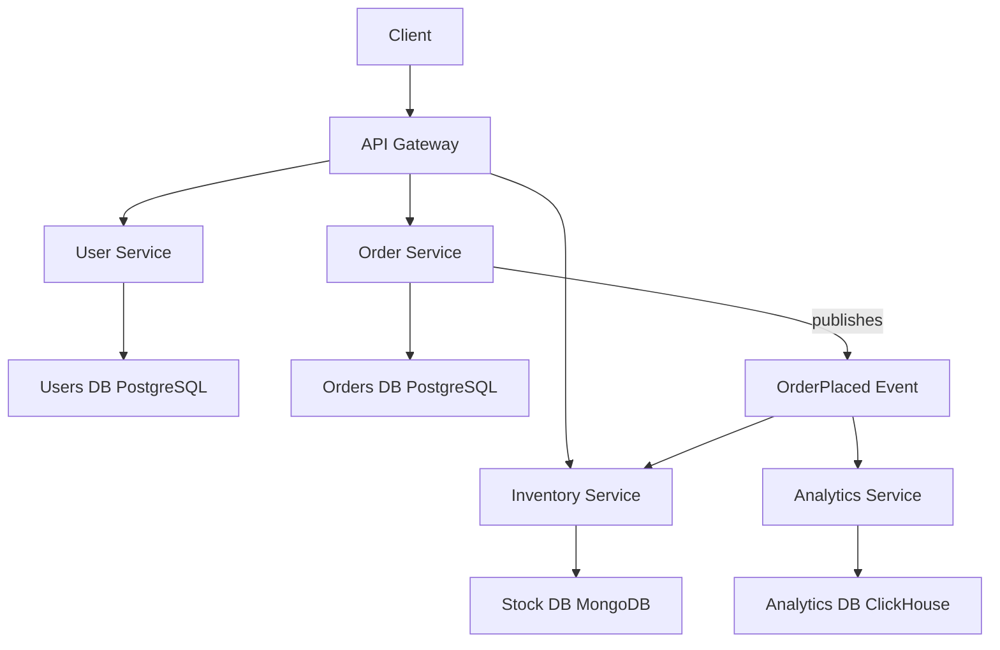
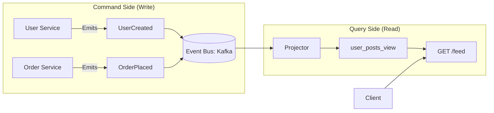

# 03 - Decentralize Data Management

> 💡 *"If multiple services share a database, they are not microservices — they are a distributed monolith."*

This principle is **one of the most violated** in microservices — even by experienced teams. But it's also one of the most important.

**Decentralized data management** means:

> ✅ Each microservice owns its data.
> ❌ No shared databases.
> 🔐 No direct access to another service's data store.

Let's break this down so you never make this mistake — and instead, build systems that scale, evolve, and survive.

---

## 🧱 Why Shared Databases Are Dangerous

In monolithic applications, one database is shared by all components:

```text
+---------------------+
|     Monolith App    |
|                     |
| - Users             |
| - Orders            |
| - Payments          |
+----------+----------+
           |
           ↓
   +------------------+
   | Shared Database  |
   | (One schema)     |
   +------------------+
```

This seems simple — until:

- One team changes the `orders` table → breaks `payments`
- Can't scale the database per service
- Can't use the best database for each need (e.g., NoSQL for inventory)
- A bug in one part risks corrupting shared data

---

## ✅ What Decentralized Data Management Means

> Each microservice has its own **private database** — not shared with others.

| Service               | Owns This Data     | Uses This Database |
| --------------------- | ------------------ | ------------------ |
| `User Service`      | Users, profiles    | PostgreSQL         |
| `Order Service`     | Orders, line items | PostgreSQL         |
| `Inventory Service` | Stock levels       | MongoDB            |
| `Analytics Service` | User behavior      | ClickHouse         |

### 📊 Diagram: Decentralized Data Architecture



✅ Each service:

- Owns its data lifecycle
- Can evolve its schema independently
- Can be scaled and backed up separately

---

## 🔗 How Services Access Data (Without Sharing DBs)

If services can't share databases, how do they get the data they need?

### ✅ Option 1: API Composition

Call other services via **REST or gRPC**.

```js
// In Order Service
const user = await fetch(`http://user-service/users/${userId}`);
```

✔️ Pros: Simple
❌ Cons: Synchronous, adds latency, failure propagation

### ✅ Option 2: Event-Driven with Projections (CQRS)

Listen to events and build **denormalized views**.

```text
User Service → publishes → UserCreated
Order Service → publishes → OrderPlaced
                              ↓
              [ Dashboard Service ]
                              ↓
         Builds: user_orders_view (PostgreSQL)
                              ↓
                 Clients query this view
```

✔️ Pros: Fast reads, eventual consistency, resilient
❌ Cons: More complex, requires event infrastructure

---

## 📊 Diagram: CQRS (Command Query Responsibility Segregation)



> ✅ **CQRS** separates:
>
> - **Command Side**: Handles writes, emits events
> - **Query Side**: Builds optimized read models from events
>
> This allows fast, scalable queries without JOINs across services.

---

## 🧩 Real-World Example: E-Commerce Feed

You want to show:

> "Show me all orders with user names and product details"

### ❌ Wrong: Shared DB with JOINs

```sql
SELECT o.id, u.name, p.title 
FROM orders o, users u, products p 
WHERE o.userId = u.id AND o.productId = p.id;
```

→ Fails if you can't JOIN across databases.

### ✅ Right: CQRS with Materialized View

1. On `OrderPlaced` event:
   - Fetch user name (via API or from event)
   - Fetch product name (via API or from event)
   - Insert into `order_summary_view`
2. Query: `SELECT * FROM order_summary_view WHERE userId = 123`

✅ No JOINs, no cross-service calls at read time
✅ Fast, scalable, resilient

---

## 🛠️ Tools That Help

| Tool                               | Purpose                          |
| ---------------------------------- | -------------------------------- |
| **Kafka / RabbitMQ**         | Event streaming and messaging    |
| **OpenAPI / Swagger**        | Define API contracts             |
| **Schema Registry**          | Ensure event formats don't break |
| **PostgreSQL / MongoDB**     | Per-service data stores          |
| **Redis**                    | Cache frequently accessed data   |
| **Eventuate / EventStoreDB** | Event sourcing platforms         |

---

## 🚫 Common Anti-Patterns

| Mistake                               | Why It's Bad                                           |
| ------------------------------------- | ------------------------------------------------------ |
| Shared database tables                | Tight coupling — one team's change breaks others      |
| Direct DB access from another service | Violates ownership, creates hidden dependencies        |
| Forcing all services to use same DB   | Can't optimize for use case (e.g., graph, time-series) |
| No ownership clarity                  | "Who owns this data?" → No one → chaos               |
| Ignoring eventual consistency         | Expecting real-time sync in distributed systems        |

---

## 🧠 Mentor's Insight: Data Ownership

Ask: **"Who is the System of Record (SoR) for this data?"**

- User email? → `User Service`
- Order status? → `Order Service`
- Stock level? → `Inventory Service`

✅ Only the SoR can **write** to that data.Others can **read** via API or events — but never write.

> 📌 Rule: **One service. One database. One source of truth.**

---

## 🔁 How to Migrate from Shared DB

If you're moving from a monolith:

1. **Identify bounded contexts** (DDD)
2. **Extract services one at a time**
3. **Create private DBs** for each
4. **Replace direct DB access** with API calls
5. **Introduce events** for cross-service updates
6. **Build materialized views** for complex queries

💡 Use **strangler pattern**: slowly route traffic to new services.

---

## ✅ Benefits of Decentralized Data

| Benefit                          | Explanation                                         |
| -------------------------------- | --------------------------------------------------- |
| **Independent Scaling**    | Scale `Inventory DB` without touching `User DB` |
| **Technology Flexibility** | Use SQL, NoSQL, Graph, Time-Series per need         |
| **Team Autonomy**          | Teams own their data — no coordination hell        |
| **Resilience**             | One DB down → only that service affected           |
| **Easier Evolution**       | Change `User` schema without impacting `Order`  |

---

## 🚫 When Not to Decentralize (Yet)

| Case                    | Recommendation                             |
| ----------------------- | ------------------------------------------ |
| Early-stage startup     | Start with shared DB, plan for split later |
| Simple app, low traffic | Don't over-engineer                        |
| No event infrastructure | Build it first before CQRS                 |

> 🟡 Rule: **Start simple, but design for decentralization.**

---

## 🔁 Summary: Decentralized Data Management

| Do                                | Don't                                  |
| --------------------------------- | -------------------------------------- |
| ✅ Each service owns its database | ❌ Share DB tables                     |
| ✅ Use APIs or events to get data | ❌ Query another service's DB directly |
| ✅ Choose best DB per service     | ❌ Force all to use same DB            |
| ✅ Own your data lifecycle        | ❌ Let others depend on your schema    |

> ✅ This principle enables **independent evolution, scalability, and resilience**.

---

## 📚 References & Further Reading

- [Martin Fowler: Microservices](https://martinfowler.com/articles/microservices.html)
- [Domain-Driven Design by Eric Evans](https://domainlanguage.com/ddd/)
- [Building Microservices by Sam Newman](https://www.oreilly.com/library/view/building-microservices/9781491931879/)
- [Kafka: The Definitive Guide](https://www.confluent.io/resources/kafka-the-definitive-guide/)
- [CQRS Pattern - Microsoft Docs](https://learn.microsoft.com/en-us/azure/architecture/patterns/cqrs)

> 🧓 Mentor's Note:
> This principle separates real microservices from distributed monoliths.
> Every time you're tempted to write a JOIN across services, stop.
> Ask: *"Am I violating data ownership?"*
> Discipline here is what makes systems last.
