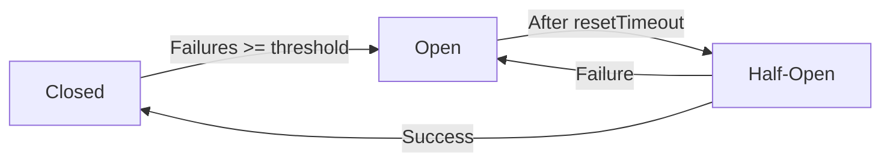
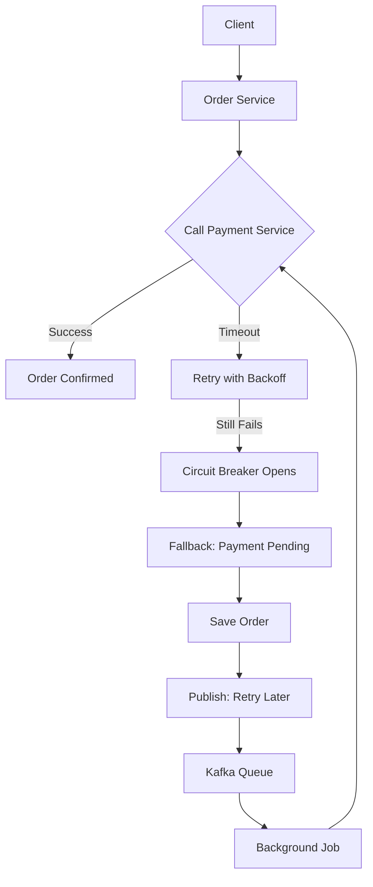

# 04 - Design for Failure and Resilience

> 💡 *"In distributed systems, failure is not a bug — it's a feature of reality."*

This principle is the **mindset shift** that separates junior engineers from senior system designers.

Microservices run across networks, containers, databases, and cloud providers. At scale, **something is always failing** — a service crashes, the network slows, a database times out.

If your system assumes "everything works", it will fail **catastrophically**.

But if you **design for failure**, your system becomes **resilient** — it survives, degrades gracefully, and recovers.

Let's go deep.

---

## 💥 What Is "Catastrophic Failure"?

> ❌ **Catastrophic failure** = A small problem triggers a **chain reaction** that brings down the **entire system**, even parts that could have kept working.

It's not just "a service is down."  
It's:  
➡️ One service fails →  
➡️ Others wait for it →  
➡️ Their threads fill up →  
➡️ They start failing →  
➡️ The **whole app becomes unresponsive** —  
➡️ Even for features that had **nothing to do** with the original failure.

This is called **cascading failure**.

---

### 🔥 Real-World Example: E-Commerce on Black Friday

```text
User → Clicks "Place Order"
       ↓
Order Service → Calls → Payment Service
                         ↑
                  Payment Service is slow (due to bug)
                         ↑
Order Service waits... and waits... (no timeout!)
                         ↑
10,000 users placing orders → 10,000 pending requests
                         ↑
Order Service runs out of threads → becomes unresponsive
                         ↑
Now even "View Cart" fails — even though it doesn't need Payment Service!
```

🎯 Result:  
❌ The **entire site is down**  
❌ Because of **one slow service**  
❌ And **no resilience** (no timeout, no fallback)

That's **catastrophic failure**.

---

## 🧱 Why This Happens

In microservices, services talk over the **network** — which is **unreliable by nature**.

| Wrong Assumption | Reality |
|------------------|--------|
| "The network is reliable" | ❌ Packets get lost, delayed, dropped |
| "Services always respond fast" | ❌ Services can be slow or crash |
| "One failure only affects one feature" | ❌ Without safeguards, it spreads |

When you **don't design for failure**, you're building a house on sand.

---

## ✅ The 4 Pillars of Resilience

| Pattern | Purpose |
|--------|--------|
| **Timeouts** | Don't wait forever |
| **Retries (with backoff)** | Try again, but wisely |
| **Circuit Breaker** | Stop hammering a dead service |
| **Fallbacks** | Keep working with degraded functionality |

Let's explore each.

---

## 1️⃣ Timeouts: Don't Wait Forever

### ❌ Problem:
```js
const res = await fetch('http://payment-service/process'); // Waits... forever?
```
If `payment-service` hangs, your service also hangs → **cascading failure**.

### ✅ Solution: Set a timeout
```js
const controller = new AbortController();
const timeoutId = setTimeout(() => controller.abort(), 5000); // 5 sec

try {
  const res = await fetch('http://payment-service/process', {
    method: 'POST',
    signal: controller.signal
  });
} catch (err) {
  console.log('Payment service slow or down.');
  return res.status(503).send('Payment temporarily unavailable');
}
```

> ✅ **Rule**: Every external call must have a timeout.

---

## 2️⃣ Retries with Exponential Backoff

Sometimes a failure is temporary (network glitch). A **smart retry** can fix it.

### ✅ Example: Retry with Backoff
```js
async function callWithRetry(url, maxRetries = 3) {
  let lastError;
  for (let i = 0; i <= maxRetries; i++) {
    try {
      const res = await fetch(url, { signal: timeoutSignal(5000) });
      if (res.ok) return await res.json();
    } catch (err) {
      lastError = err;
      if (i < maxRetries) {
        const delay = Math.pow(2, i) * 1000; // 1s, 2s, 4s
        await new Promise(r => setTimeout(r, delay));
        console.log(`Retry ${i + 1} after ${delay}ms`);
      }
    }
  }
  throw lastError;
}
```

#### ⚠️ But Beware:
- Don't retry on `400 Bad Request` (user error)
- Do retry on `503 Service Unavailable`
- Use **exponential backoff** to avoid overwhelming the system

---

## 3️⃣ Circuit Breaker: Stop Hammering a Dead Service

### ❌ Problem:
If `Payment Service` is down, 1000 requests per second keep failing → logs fill up, threads block.

### ✅ Solution: Circuit Breaker Pattern

Like a real circuit breaker in your house:
- One short circuit → breaker trips
- No more power → prevents fire
- After timeout, tries to restore

Same idea.

### 🔄 Three States:



- **Closed**: Requests go through
- **Open**: All requests fail immediately
- **Half-Open**: Let 1 request through to test recovery

---

### 💡 Using Opossum (Node.js Circuit Breaker)

```bash
npm install opossum
```

```js
const circuitBreaker = require('opossum');
const fetch = require('node-fetch');

async function callPaymentService(orderId) {
  const res = await fetch(`http://localhost:4000/process/${orderId}`);
  if (!res.ok) throw new Error('Payment failed');
  return res.json();
}

const options = {
  timeout: 3000,
  errorThresholdPercentage: 50,
  resetTimeout: 10000
};

const breaker = new circuitBreaker(callPaymentService, options);

// Fallback
breaker.fallback(() => ({ status: 'failed', reason: 'Service down. Try later.' }));

// Events
breaker.on('open', () => console.log('🔴 Circuit opened'));
breaker.on('halfOpen', () => console.log('🔧 Testing recovery'));
breaker.on('close', () => console.log('✅ Circuit closed'));

// Use it
app.post('/order', async (req, res) => {
  try {
    const result = await breaker.fire(req.body.orderId);
    res.json({ status: 'success', data: result });
  } catch (err) {
    res.status(503).json({ error: err.message });
  }
});
```

---

## 4️⃣ Fallbacks: Have a Backup Plan

When a service fails, can you still provide **degraded functionality**?

### ✅ Example: Return Cached Data
```js
async function getUserWithFallback(userId) {
  try {
    const res = await fetchWithTimeout(`http://user-service/users/${userId}`, 3000);
    if (res.ok) return await res.json();
  } catch (err) {
    console.log('User service failed, using cache');
    const cached = await getFromRedis(`user:${userId}`);
    if (cached) return JSON.parse(cached);
    return { id: userId, name: 'Unknown (service down)' };
  }
}
```

#### Other Fallback Ideas:
- Show stale data
- Skip non-critical steps (e.g., don't send email now)
- Use a simpler algorithm

> ✅ Goal: **Keep the user experience alive**, even if limited.

---

## 🛠️ Tools That Help

| Tool | Purpose |
|------|--------|
| **Opossum** | Circuit breaker for Node.js |
| **Redis** | Cache fallback data |
| **Kafka/SQS** | Queue failed work for later |
| **Sentry/New Relic** | Monitor failures |
| **Gremlin/Chaos Monkey** | Test resilience by injecting failures |

---

## 🧩 Resilience in Practice: Order Flow Example

```text
User places order
  ↓
Call Payment Service (with timeout: 5s)
  ↓
If timeout → Retry (3x, exponential backoff)
  ↓
If still fails → Open circuit breaker
  ↓
Return: "Order saved, payment pending"
  ↓
Publish: OrderPaymentFailed → retry later via job
  ↓
User can retry payment later
```

✅ System didn't crash.  
✅ User wasn't blocked.  
✅ Core function (create order) succeeded.

That's **resilience**.

---

## 🚫 Anti-Patterns to Avoid

| Mistake | Why Bad |
|--------|--------|
| No timeout | One slow service blocks all others |
| Unlimited retries | DDoS your own system |
| No circuit breaker | Cascading failures |
| No fallback | Entire feature breaks on one failure |
| Silent failures | Can't debug or alert |

---

## 📊 Diagram: Resilience Patterns in Action



✅ Even when `Payment Service` is down, the system **keeps working**.

---

## 🧠 What Is Chaos Engineering?

> **Chaos Engineering** = *Intentionally breaking your system in production-like environments to learn how it fails — so you can fix it before it matters.*

It's like **fire drills** for software.

### 🔬 Examples:
- Kill a service instance
- Inject 2s network delay
- Fill up disk space
- Cut off database

### ✅ Why It Matters:
- Finds hidden dependencies
- Tests your monitoring
- Builds team confidence

> 💡 Rule: **Test in staging first. Never surprise users.**

---

## 🔤 What Is Idempotency?

> **Idempotent** = Calling the same operation multiple times has the **same effect** as calling it once.

### ✅ Example:
```http
DELETE /orders/123 → idempotent
PUT /users/123 → idempotent
```

```http
POST /orders → not idempotent
```

### ✅ Solution: Use Idempotency Keys
```http
POST /orders
Idempotency-Key: order_abc123
```

Server checks if key was used → if yes, returns same result → prevents duplicates.

> 💡 Critical for payments, orders, retries.

---

## 🎯 Summary: Resilience Checklist

| Do | Example |
|----|--------|
| ✅ Always use timeouts | `fetch(url, { signal: AbortController with 5s })` |
| ✅ Retry with backoff | 1s, 2s, 4s — not instantly |
| ✅ Use circuit breakers | Stop calling a failing service |
| ✅ Provide fallbacks | Cache, default values, async recovery |
| ✅ Monitor failures | Log, alert, trace |
| ✅ Test failure modes | Chaos engineering |

---

## 📚 References & Further Reading

- [Martin Fowler: Circuit Breaker](https://martinfowler.com/bliki/CircuitBreaker.html)
- [Netflix Chaos Engineering](https://netflixtechblog.com/chaos-engineering-4c84b07efc56)
- [Opossum Docs](https://github.com/nodeshift/opossum)
- [Building Microservices by Sam Newman](https://www.oreilly.com/library/view/building-microservices/9781491931879/)
- [Google SRE Book](https://sre.google/books/)

> 🧓 Mentor's Note:  
> You can't prevent all failures.  
> But you can **design for them** — contain them, recover from them, and keep the system alive.  
> That's the mark of a true systems engineer.