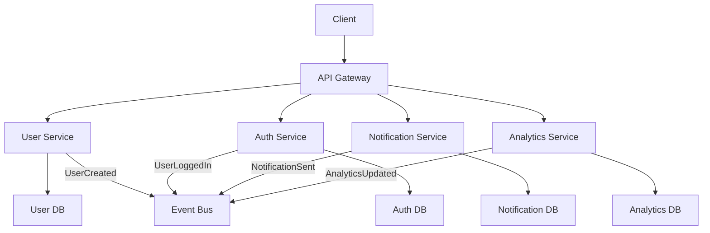

# 06 - Single Responsibility Principle

> 💡 *"A microservice should have only one reason to change."*

This principle is the **foundation of clean microservices design**. It's simple to understand but **hard to master** in practice.

The Single Responsibility Principle (SRP) means:
> ✅ Each microservice does **one thing** and does it **well**.  
> ❌ No service should handle multiple, unrelated responsibilities.  
> 🎯 **One reason to change** = One responsibility.

When you get this right, your services become **focused, maintainable, and independently deployable**.  
When you get it wrong, you end up with **bloated services** that are hard to change and scale.

Let's dive deep into how to apply SRP correctly in microservices.

---

## 🎯 What Is the Single Responsibility Principle?

> **SRP** = A class (or service) should have only **one reason to change**.

In microservices context:
> **SRP** = A service should handle **one business capability** and have **one reason to change**.

### ✅ Good Examples (High Cohesion)

| Service | Single Responsibility | Reason to Change |
|---------|----------------------|------------------|
| `User Service` | Manage user lifecycle | User management requirements |
| `Payment Service` | Process payments | Payment processing rules |
| `Notification Service` | Send notifications | Notification delivery methods |
| `Inventory Service` | Track stock levels | Inventory management rules |

Each service has **one clear job**.

### ❌ Bad Examples (Multiple Responsibilities)

| Service | Multiple Responsibilities | Problems |
|---------|-------------------------|----------|
| `User Service` | Auth + Notifications + Analytics | 3 reasons to change |
| `Order Service` | Orders + Payments + Inventory | Tight coupling |
| `Notification Service` | Notifications + User Management | Violates SRP |

📌 **Golden Rule**:
> If you can't describe a service's job in **one sentence**, it's doing too much.

---

## 🧱 Why SRP Matters in Microservices

### ✅ Benefits of Following SRP

| Benefit | Explanation |
|---------|-------------|
| **Independent Deployment** | Change notification logic → only redeploy Notification Service |
| **Team Autonomy** | Teams can work on their service without coordination |
| **Easier Testing** | Test one responsibility at a time |
| **Better Scaling** | Scale notification service independently of user service |
| **Clearer Ownership** | "Who owns this?" → Clear answer |

### ❌ Problems of Violating SRP

| Problem | Impact |
|---------|--------|
| **Cascading Changes** | Change user auth → must update notification service |
| **Deployment Coupling** | Can't deploy one without the other |
| **Team Conflicts** | Multiple teams fighting over the same service |
| **Testing Complexity** | Must test multiple responsibilities together |
| **Scaling Issues** | Can't scale notification independently of auth |

---

## 🔍 How to Identify SRP Violations

Ask these questions:

### 1. **"How many reasons does this service have to change?"**
```text
User Service changes when:
- User registration rules change
- Authentication methods change  
- User profile fields change
- Password policies change
→ 4 reasons = SRP violation
```

### 2. **"Can I describe this service's job in one sentence?"**
```text
❌ "User Service handles authentication, notifications, and analytics"
✅ "User Service manages user lifecycle and authentication"
```

### 3. **"If I change X, do I need to change this service?"**
```text
If I change email templates → do I need to change User Service?
If YES → SRP violation (notifications belong elsewhere)
```

---

## 🛠️ How to Apply SRP in Practice

### 1. **Identify Business Capabilities**

Start with **Domain-Driven Design (DDD)** concepts:

| Business Capability | Service Name | Responsibility |
|-------------------|--------------|----------------|
| User Management | `User Service` | User lifecycle, profiles |
| Authentication | `Auth Service` | Login, tokens, permissions |
| Order Processing | `Order Service` | Order creation, status |
| Payment Processing | `Payment Service` | Payment methods, processing |
| Notification Delivery | `Notification Service` | Email, SMS, push notifications |

### 2. **Use the "One Reason to Change" Test**

For each service, ask: **"What would cause this service to change?"**

```text
✅ Good: Payment Service
- Changes when: Payment processing rules change
- One reason = One responsibility

❌ Bad: User Service  
- Changes when: User rules change
- Changes when: Notification rules change  
- Changes when: Analytics rules change
- Multiple reasons = Multiple responsibilities
```

### 3. **Split Services by Responsibility**

When you find SRP violations, split the service:

```text
❌ Before: User Service
- User management
- Authentication  
- Notifications
- Analytics

✅ After: Split into 4 services
- User Service (user management)
- Auth Service (authentication)
- Notification Service (notifications)  
- Analytics Service (user analytics)
```

---

## 🧩 Real-World Example: E-Commerce Platform

### ❌ SRP Violation: Monolithic User Service

```text
User Service handles:
├── User registration/login
├── Password management
├── Email notifications
├── SMS notifications  
├── Push notifications
├── User analytics
├── Profile management
└── User preferences
```

**Problems:**
- 8 different reasons to change
- Email team can't deploy without coordinating with analytics team
- Can't scale notifications independently
- Testing is complex (must test all features together)

### ✅ SRP Applied: Split Services

```text
User Service (Core)
├── User registration
├── Profile management
└── User preferences

Auth Service (Security)
├── Login/logout
├── Password management
└── Token management

Notification Service (Communication)
├── Email notifications
├── SMS notifications
└── Push notifications

Analytics Service (Insights)
├── User behavior tracking
├── User metrics
└── User reports
```

**Benefits:**
- Each service has one reason to change
- Teams can work independently
- Can scale and deploy independently
- Easier to test and maintain

---

## 📊 Diagram: SRP in Action



✅ Each service:
- Has its own database
- Handles one responsibility
- Can be deployed independently
- Communicates via events

---

## 🔗 How Services Communicate (While Maintaining SRP)

### ✅ Option 1: API Calls
```js
// User Service calls Auth Service
const authResult = await fetch('http://auth-service/validate-token', {
  method: 'POST',
  body: JSON.stringify({ token: userToken })
});
```

### ✅ Option 2: Event-Driven
```js
// User Service publishes event
await eventBus.publish('UserCreated', {
  userId: user.id,
  email: user.email,
  name: user.name
});

// Notification Service listens
eventBus.subscribe('UserCreated', async (event) => {
  await sendWelcomeEmail(event.email, event.name);
});
```

### ✅ Option 3: Saga Pattern (for Complex Workflows)
```js
// Order Service orchestrates multiple services
const saga = new OrderSaga();
await saga.execute({
  createOrder: () => orderService.create(orderData),
  reserveInventory: () => inventoryService.reserve(orderData.items),
  processPayment: () => paymentService.process(orderData.payment),
  sendNotification: () => notificationService.sendOrderConfirmation(orderData.userId)
});
```

---

## 🚫 Common SRP Anti-Patterns

| Anti-Pattern | Why It's Bad | Solution |
|-------------|--------------|----------|
| **God Service** | One service does everything | Split by business capability |
| **Shared Database** | Services share data tables | Each service owns its data |
| **Cross-Service Dependencies** | Service A directly calls Service B's database | Use APIs or events |
| **Mixed Concerns** | Business logic mixed with infrastructure | Separate concerns |
| **Fat Service** | Service grows beyond its purpose | Extract new services |

---

## 🧠 Mentor's Insight: The "Change Test"

The best way to identify SRP violations:

> **"If I change [business requirement], how many services must I change?"**

### ✅ Good (SRP Followed):
```text
Change: "Add two-factor authentication"
Result: Only Auth Service needs to change
→ SRP is followed
```

### ❌ Bad (SRP Violated):
```text
Change: "Add email notifications for new users"  
Result: Must change User Service, Notification Service, and Email Service
→ SRP is violated (User Service doing too much)
```

---

## 🛠️ Tools That Help with SRP

| Tool | Purpose |
|------|---------|
| **Domain-Driven Design** | Identify business boundaries |
| **Event Storming** | Map business processes |
| **API Gateway** | Route requests to appropriate services |
| **Event Bus** | Decouple services via events |
| **Service Mesh** | Handle cross-cutting concerns |
| **Monitoring** | Track service responsibilities |

---

## 🔁 Migration Strategy: From Monolith to SRP

If you're starting with a monolith:

### 1. **Identify Bounded Contexts**
```text
Monolith contains:
- User management
- Order processing  
- Payment handling
- Notifications
- Analytics
```

### 2. **Extract Services One by One**
```text
Step 1: Extract Notification Service
Step 2: Extract Auth Service  
Step 3: Extract Payment Service
Step 4: Extract Analytics Service
```

### 3. **Use Strangler Pattern**
```text
Route new requests → New services
Keep old requests → Monolith
Gradually migrate → All to new services
```

---

## ✅ Benefits of Following SRP

| Benefit | Impact |
|---------|--------|
| **Independent Development** | Teams work in parallel |
| **Independent Deployment** | Deploy without coordination |
| **Independent Scaling** | Scale based on actual need |
| **Easier Testing** | Test one responsibility |
| **Better Monitoring** | Clear service boundaries |
| **Faster Development** | Smaller, focused codebases |

---

## 🚫 When SRP Might Be Overkill

| Scenario | Recommendation |
|----------|----------------|
| **Early-stage startup** | Start with fewer services, split later |
| **Simple application** | Don't over-engineer |
| **Small team** | Fewer services = less complexity |
| **Low traffic** | Monolith might be fine |

> 🟡 Rule: **Start simple, but design for SRP from the beginning.**

---

## 🎯 Summary: Single Responsibility Principle

| Do | Don't |
|----|-------|
| ✅ One service, one responsibility | ❌ One service, multiple jobs |
| ✅ One reason to change | ❌ Multiple reasons to change |
| ✅ Clear service boundaries | ❌ Blurred responsibilities |
| ✅ Independent deployment | ❌ Coupled deployments |
| ✅ Focused testing | ❌ Complex integration tests |

> ✅ SRP enables **independent development, deployment, and scaling**.

---

## 📚 References & Further Reading

- [Clean Code by Robert Martin](https://www.oreilly.com/library/view/clean-code/9780136083238/)
- [Domain-Driven Design by Eric Evans](https://domainlanguage.com/ddd/)
- [Building Microservices by Sam Newman](https://www.oreilly.com/library/view/building-microservices/9781491931879/)
- [Single Responsibility Principle - Wikipedia](https://en.wikipedia.org/wiki/Single-responsibility_principle)
- [SOLID Principles](https://en.wikipedia.org/wiki/SOLID)

> 🧓 Mentor's Note:  
> SRP is the foundation of good microservices design.  
> Every time you add a feature, ask:  
> *"Does this belong here, or should it be in another service?"*  
> Discipline in SRP today saves complexity tomorrow.