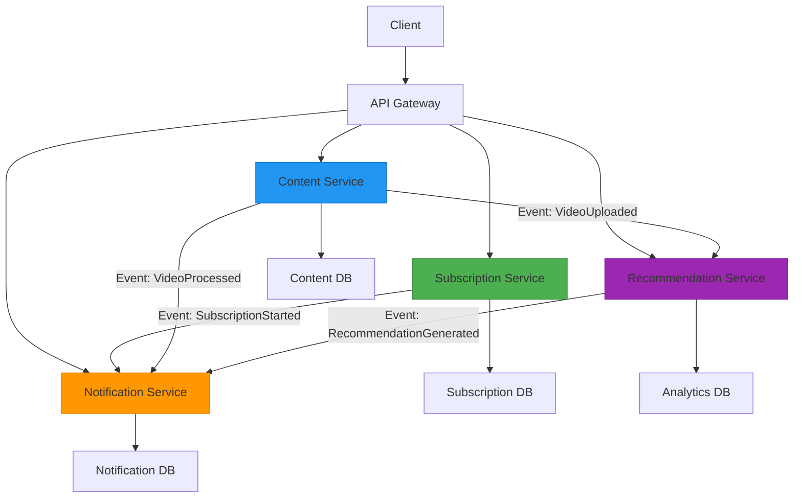

# 07 - Define the Scope Properly

> 💡 *"Clearly defining the boundaries of each microservice is critical. Overlapping responsibilities lead to tight coupling, confusion, and chaos."*

This principle is **closely related to SRP**, but it's about **enforcement and clarity** — not just design.

In microservices, **unclear boundaries** lead to:
- "I thought that service handled it"
- "We'll just add it here"
- "Why is this service calling that one?"
- **Tight coupling**, even if services are technically separate

> ❌ You end up with a **distributed monolith** — many services, but they can't evolve independently.

✅ Proper scoping ensures:
- Clear ownership
- Minimal overlap
- Independent development
- Easier debugging and scaling

Let's dive deep into how to define and maintain proper service scope.

---

## 🔍 What Does "Scope" Mean?

> **Scope = The clear boundary of what a service owns and what it doesn't.**

It answers:
- What data does it own?
- What business capability does it handle?
- What events does it emit?
- What APIs does it expose?
- What problems is it responsible for solving?

### 🆚 Scope vs SRP vs High Cohesion

| Concept | Focus | Question It Answers |
|--------|------|----------------------|
| **Scope** | **Boundaries** | *"What does this service own — and what does it not?"* |
| **SRP** | **Change** | *"Why would this service need to be changed?"* |
| **High Cohesion** | **Internal Focus** | *"Are all its parts working toward the same goal?"* |

---

## 🧱 Why Scope Definition Matters

### ✅ Benefits of Well-Defined Scope

| Benefit | Impact |
|---------|--------|
| **Clear Ownership** | "Who owns this?" → Clear answer |
| **Independent Development** | Teams work without coordination |
| **Easier Debugging** | Know exactly where to look |
| **Better Scaling** | Scale based on actual responsibility |
| **Reduced Conflicts** | No more "I thought you handled that" |

### ❌ Problems of Poor Scope

| Problem | Impact |
|---------|--------|
| **Scope Creep** | Service grows beyond its purpose |
| **Tight Coupling** | Services can't evolve independently |
| **Team Conflicts** | Multiple teams fighting over same service |
| **Deployment Bottlenecks** | Must coordinate changes across teams |
| **Confusion** | "Where does this logic belong?" |

---

## 🧩 Real-World Example: Video Streaming Platform

### ❌ Bad: Unclear Scope

```text
Content Service handles:
├── Upload videos
├── Encode videos
├── Serve videos
├── Handle user subscriptions
├── Send notifications
├── Track analytics
└── Manage user preferences
```

**Problems:**
- Subscription logic changes → must redeploy Content Service
- Encoding pipeline changes → must redeploy
- Notification template changes → must redeploy
- Analytics requirements change → must redeploy

🚫 **One service, many reasons to change** → violates scope.

### ✅ Good: Well-Defined Scope

```text
Content Service:
├── Upload videos
├── Encode videos
└── Serve videos

Subscription Service:
├── Manage user plans
├── Handle billing
└── Track subscription status

Notification Service:
├── Send emails
├── Send SMS
└── Send push notifications

Analytics Service:
├── Track user behavior
├── Generate reports
└── Provide insights

Recommendation Service:
├── Analyze user preferences
├── Suggest content
└── Personalize experience
```

**Benefits:**
- Change encoding? → Only `Content Service`
- Update subscription price? → Only `Subscription Service`
- Change recommendation algorithm? → Only `Recommendation Service`

✅ Each service has a **clear, unambiguous scope**.

---

## 📊 Diagram: Well-Defined Service Boundaries



✅ Each service:
- Owns its domain
- Communicates via events
- Can be developed, deployed, scaled independently

---

## 🛠️ How to Define Scope: 5 Practical Steps

### ✅ Step 1: Use Domain-Driven Design (DDD) Concepts

Identify **Bounded Contexts** — areas of the business with clear rules.

| Bounded Context | Service | Responsibility |
|----------------|---------|----------------|
| User Management | `User Service` | User lifecycle, profiles |
| Order Processing | `Order Service` | Order creation, status |
| Payment Processing | `Payment Service` | Payment methods, processing |
| Content Management | `Content Service` | Content creation, serving |
| Notifications | `Notification Service` | Message delivery |

> 💡 A bounded context defines **what the service owns** — not just code, but **language, rules, and data**.

### ✅ Step 2: Write a "Service Charter"

For each service, write a **one-paragraph mission statement**.

#### Example: `Order Service` Charter
> "The Order Service is responsible for managing the lifecycle of customer orders, from creation to fulfillment. It validates orders, assigns order IDs, tracks status (pending, shipped, canceled), and emits events for downstream services like Payment and Inventory. It does not handle payment processing, email notifications, or inventory updates — those are handled by dedicated services."

**Now everyone knows:**
- ✅ What it does
- ❌ What it doesn't do

> 💡 This is your **source of truth**.

### ✅ Step 3: Define Ownership (Data + Logic)

| Service | Owns This Data | Can Other Services Read? | Can They Write? |
|---------|----------------|--------------------------|-----------------|
| `User Service` | Users, profiles | Yes (via API) | ❌ No |
| `Order Service` | Orders, line items | Yes (via API or events) | ❌ No |
| `Inventory Service` | Stock levels | Yes | ❌ No |
| `Payment Service` | Payment methods, transactions | Yes (via API) | ❌ No |

> ✅ Only one service should **own (CRUD)** a data entity.

### ✅ Step 4: Avoid "Scope Creep"

This is the **silent killer** of microservices.

| Anti-Pattern | Why It Happens | Fix |
|-------------|----------------|-----|
| "We'll just add reporting to this service" | Fast shortcut | Create `Analytics Service` |
| "Let's add email here" | Seems easy | Use `Notification Service` |
| "We need caching" | Performance hack | Use Redis + sidecar |
| "Let's call 5 services in one endpoint" | Orchestration need | Use API Gateway or events |

> 🚫 **"Just one more thing"** → leads to god services.

### ✅ Step 5: Use Events to Enforce Boundaries

When a service emits an event, it **hands off responsibility**.

#### Example: `Order Service` Scope
```js
app.post('/orders', async (req, res) => {
  const order = await createOrder(req.body);
  
  // ✅ Done. Now tell others
  eventBus.publish('OrderPlaced', {
    orderId: order.id,
    userId: order.userId,
    items: order.items,
    total: order.total
  });
  
  res.status(201).json(order);
});
```

**Now:**
- `Payment Service` → processes payment
- `Inventory Service` → reduces stock
- `Notification Service` → sends email

✅ `Order Service` doesn't care — its job is done.

> ✅ Events enforce scope: "I emit, you react."

---

## 🚫 Common Anti-Patterns

| Anti-Pattern | Why It's Bad | Solution |
|-------------|--------------|----------|
| **God Service** | One service does everything | Split by business capability |
| **Shared Database** | Services share data tables | Each service owns its data |
| **Cross-Service Dependencies** | Service A directly calls Service B's database | Use APIs or events |
| **Mixed Concerns** | Business logic mixed with infrastructure | Separate concerns |
| **Fat Service** | Service grows beyond its purpose | Extract new services |
| **No Service Charter** | Ambiguity leads to confusion | Write clear documentation |

---

## 🧠 Mentor's Insight: The "Change Test"

The best way to identify scope violations:

> **"If I change [business requirement], how many services must I change?"**

### ✅ Good (Scope Well-Defined):
```text
Change: "Add two-factor authentication"
Result: Only Auth Service needs to change
→ Scope is well-defined
```

### ❌ Bad (Scope Violated):
```text
Change: "Add email notifications for new users"  
Result: Must change User Service, Notification Service, and Email Service
→ Scope is violated (User Service doing too much)
```

### 🔍 How to Spot Scope Issues

Ask these questions:

1. **"Can I explain this service's job in one sentence?"**  
   → No? Scope is too broad.

2. **"Would a change in marketing, legal, or ops require a redeploy?"**  
   → Yes? It's doing someone else's job.

3. **"Do multiple teams need to coordinate to change this service?"**  
   → Yes? It's a bottleneck.

4. **"Is this service calling more than 2–3 other services?"**  
   → Likely an orchestrator — which is a different responsibility.

> ✅ A well-scoped service is **focused, owned, and independent**.

---

## 🎯 Summary: Define Scope Properly

| Do | Don't |
|----|-------|
| ✅ Write a service charter | ❌ Assume everyone knows |
| ✅ Define data ownership | ❌ Share databases |
| ✅ Use events to hand off work | ❌ Synchronously call other services for side effects |
| ✅ Resist scope creep | ❌ Add "just one more feature" |
| ✅ Align with bounded contexts | ❌ Split by technical layers |
| ✅ Document boundaries clearly | ❌ Leave scope ambiguous |

> ✅ Clear scope = clear ownership = faster, safer evolution.

---

## 📚 References & Further Reading

- [Domain-Driven Design by Eric Evans](https://domainlanguage.com/ddd/)
- [Building Microservices by Sam Newman](https://www.oreilly.com/library/view/building-microservices/9781491931879/)
- [Martin Fowler: Bounded Context](https://martinfowler.com/bliki/BoundedContext.html)
- [12-Factor App: Admin Processes](https://12factor.net/admin-processes)
- [Event Storming](https://www.eventstorming.com/)

> 🧓 Mentor's Note:  
> The best systems aren't built with perfect code — they're built with **perfect clarity**.  
> Every service should have a **charter**, a **boundary**, and a **purpose**.  
> When in doubt: **less is more**.