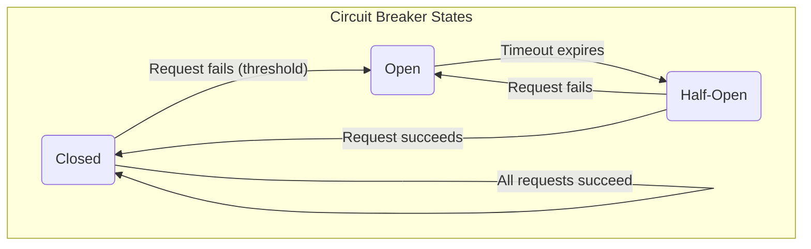

# 3. Design for Failure and Resilience

### Principle Explained
In distributed microservices systems, individual services *will* fail. Resilience means anticipating these failures and handling them gracefully using patterns like circuit breakers, timeouts, and retries. This ensures the system remains operational or degrades gracefully rather than failing entirely.

### Example Use Case
If a delivery status tracking service fails in a logistics application, a circuit breaker can prevent other services (like customer notifications) from overwhelming it with requests. It can also trigger alerts for the operations team, ensuring the overall system remains stable.

**Mentor's Deep Dive:** The core mindset here is: **failure is inevitable**. A system that assumes everything always works perfectly is destined for **catastrophic failure** (a small problem triggering a chain reaction that brings down the entire system). To avoid this, we employ key resilience patterns:

1.  **Timeouts**: Crucial for every external call. Prevents indefinite waiting for slow or unresponsive services, which can otherwise lead to thread exhaustion and cascading failures.
2.  **Retries**: Allows for reattempting operations for transient failures (e.g., network glitches). Must be implemented with **exponential backoff** to avoid overwhelming a recovering service, and only for idempotent operations.
3.  **Circuit Breaker**: A self-protection mechanism. When a service consistently fails, the circuit breaker 'opens,' immediately failing subsequent requests to that service without making a network call. After a `resetTimeout`, it moves to a 'half-open' state to test if the service has recovered. Libraries like **Opossum** in Node.js provide robust implementations.
4.  **Fallbacks**: Providing degraded but functional responses when a service is unavailable. This could involve serving cached data, default values, or gracefully skipping non-critical features.

**Chaos Engineering** is the practice of intentionally injecting failures into systems (e.g., killing service instances, introducing network latency) to test and build confidence in their resilience. **Idempotency** is vital for retries; an idempotent operation produces the same result regardless of how many times it's executed (e.g., `DELETE /resource/123` is idempotent, `POST /resource` typically is not unless an `Idempotency-Key` is used).

### Diagram: Circuit Breaker States
