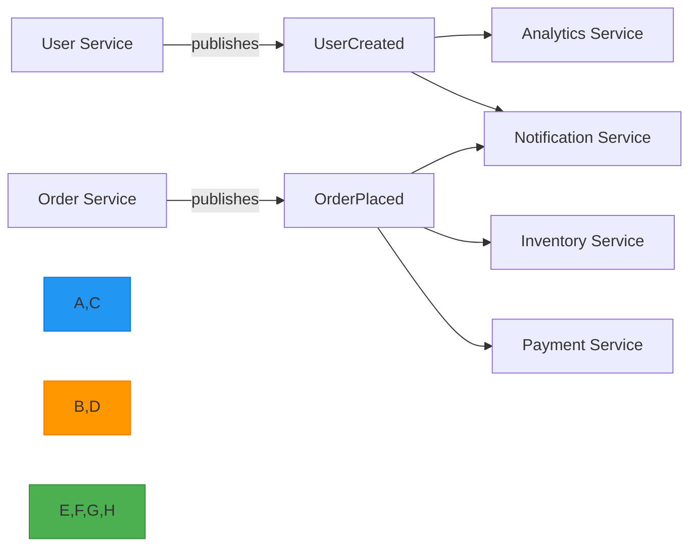

# 08 - Event-Driven Communication

> 💡 *"Microservices should communicate asynchronously whenever possible to avoid direct dependencies between services."*

This is where microservices **shift from fragile chains to resilient networks**.

In synchronous communication (REST), services are **chained**:

```text
Order Service → waits for → Payment Service → waits for → Inventory Service
```

➡️ **Tight coupling**  
➡️ **Failure propagation**  
➡️ **Slow performance**

But with **event-driven communication**, services **react independently**:

```text
Order Service → publishes → "OrderPlaced"
                             ↓
               Payment Service (listens)
                             ↓
           Inventory Service (listens)
```

✅ No waiting  
✅ No direct dependency  
✅ One failure doesn't block others

Let's dive deep into event-driven communication patterns and best practices.

---

## 🔁 Why Event-Driven Communication?

### ✅ Benefits of Event-Driven Systems

| Benefit | Impact |
|---------|--------|
| **Loose Coupling** | Services don't know about each other |
| **Resilience** | One service failure doesn't cascade |
| **Scalability** | Services can scale independently |
| **Flexibility** | Easy to add new consumers |
| **Audit Trail** | All events are logged and replayable |
| **Eventual Consistency** | Data syncs across services over time |

### ❌ Problems of Synchronous Communication

| Problem | Impact |
|---------|--------|
| **Tight Coupling** | Services depend on each other directly |
| **Failure Propagation** | One slow service blocks all others |
| **Performance Bottlenecks** | Chain of calls = sum of all latencies |
| **Deployment Coupling** | Must coordinate changes across services |
| **Difficult Scaling** | Can't scale services independently |

---

## 🧱 Core Concept: Events Over Requests

| Request-Driven (REST) | Event-Driven |
|-----------------------|-------------|
| "Do this now and tell me the result" | "Something happened — react if you care" |
| Synchronous | Asynchronous |
| Tight coupling | Loose coupling |
| Blocking | Non-blocking |
| Immediate failure | Eventually consistent |

> 💡 Think:
> - **REST** = Phone call: "Can you do X?" → wait for answer
> - **Events** = Email: "I did X" → others react when ready

---

## 📊 Diagram: Event-Driven Flow



✅ Each service:
- Publishes events when **something important happens**
- Other services **subscribe** if they care
- No direct calls → **loose coupling**

---

## ✅ When to Use Event-Driven Communication

| Use Case | Example |
|--------|--------|
| **Decouple services** | `Order Service` doesn't call `Payment Service` directly |
| **Handle side effects** | On user signup → send email, create profile |
| **Scale independently** | `Analytics Service` can process events slower |
| **Ensure reliability** | Event survives if consumer is down |
| **Enable audit trails** | All events logged → replayable history |
| **Support eventual consistency** | Data sync across services |

> ✅ **Golden Rule**: Use events when **"something happened"** and others need to react.

---

## 🔧 Key Components of Event-Driven Systems

| Component | Purpose | Tools |
|---------|--------|-------|
| **Event** | A fact that something happened | `{ "type": "OrderPlaced", "data": { ... } }` |
| **Producer** | Service that publishes the event | `Order Service` |
| **Consumer** | Service that reacts to the event | `Payment Service` |
| **Message Broker** | Transport layer for events | Kafka, RabbitMQ, AWS SNS/SQS |
| **Event Schema** | Contract for event structure | JSON Schema, Avro, Protobuf |
| **Dead Letter Queue (DLQ)** | Catch failed messages | For debugging |

---

## 🛠️ Real-World Example: E-Commerce Order Flow

```text
User places order
       ↓
Order Service → saves order → publishes → OrderPlaced event
       ↓
[ Kafka / RabbitMQ ]
       ↓─────────────┐
                     ↓                             ↓
         Payment Service (processes payment)    Inventory Service (reduces stock)
                     ↓                             ↓
           Notification Service (sends email)   Analytics Service (tracks sales)
```

✅ Now:
- If `Payment Service` is down → event waits in queue → retry later
- If `Inventory Service` is slow → no impact on order creation
- Can add `Fraud Detection Service` later — just listen to `OrderPlaced`

> ✅ **Loose coupling, resilience, scalability**

---

## 🧩 Event Patterns You'll See

| Pattern | Description | Use Case |
|-------|-------------|----------|
| **Pub/Sub** | One-to-many: publish event → many subscribers | Notifications, analytics |
| **Event Sourcing** | Store every change as event → rebuild state later | Audit trails, time travel |
| **CQRS** | Use events to build read-optimized views | Complex queries |
| **Saga Pattern** | Manage distributed transactions via events | Multi-step workflows |
| **Outbox Pattern** | Ensure event is sent only after DB commit | Data consistency |

---

## 💡 Example: Outbox Pattern (Avoid Data Loss)

**Problem:**
- Save order to DB → success
- Publish `OrderPlaced` → fails → inconsistency

**Solution:**
1. Insert order into `orders` table
2. Insert event into `outbox` table (same transaction)
3. Background process reads `outbox` → publishes event → deletes record

✅ Now: Event is **not lost** if publish fails.

### 📦 Code: Outbox Pattern Implementation

```js
// order-service.js
app.post('/orders', async (req, res) => {
  const order = req.body;
  
  // Start transaction
  await db.transaction(async (trx) => {
    // Save order
    const savedOrder = await trx('orders').insert(order).returning('*');
    
    // Save event to outbox (same transaction)
    await trx('outbox').insert({
      event_type: 'OrderPlaced',
      payload: JSON.stringify(savedOrder[0]),
      created_at: new Date()
    });
  });
  
  res.status(201).json({ message: 'Order created' });
});

// outbox-processor.js (background job)
setInterval(async () => {
  const events = await db('outbox').select('*').limit(100);
  
  for (const event of events) {
    try {
      await eventBus.publish(event.event_type, JSON.parse(event.payload));
      await db('outbox').where('id', event.id).del();
    } catch (error) {
      console.error('Failed to publish event:', error);
    }
  }
}, 5000);
```

---

## 📦 Code: Simple Event Publishing (Node.js + EventEmitter)

> ⚠️ For production, use **Kafka** or **RabbitMQ** — but this shows the concept.

```js
// event-bus.js
const EventEmitter = require('events');
module.exports = new EventEmitter();

// order-service.js
const eventBus = require('./event-bus');

app.post('/orders', async (req, res) => {
  const order = await saveOrder(req.body);
  
  // Publish event
  eventBus.emit('OrderPlaced', order);
  
  res.status(201).json(order);
});

// payment-service.js
const eventBus = require('./event-bus');

eventBus.on('OrderPlaced', async (order) => {
  console.log('Processing payment for:', order.id);
  await processPayment(order);
});

// inventory-service.js
eventBus.on('OrderPlaced', async (order) => {
  console.log('Reducing stock for:', order.productId);
  await reduceStock(order.productId, order.qty);
});
```

✅ Services don't know each other — they just react to events.

---

## 🔄 Event-Driven vs REST: When to Use Which?

| Scenario | Best Fit | Reason |
|--------|---------|--------|
| User submits form → need immediate response | ✅ REST | User waits for result |
| Background work (send email, update inventory) | ✅ Events | Don't block user |
| One service depends on another's result | ✅ REST | Need immediate data |
| Multiple services react to one action | ✅ Events | Decouple consumers |
| High throughput, decoupling | ✅ Events | Scale independently |
| Simple CRUD app | ✅ REST | Don't over-engineer |

> ✅ **Hybrid Approach**:  
> - Use **REST** for user-facing actions  
> - Use **Events** for background workflows

---

## 📬 Deep Dive: Dead Letter Queue (DLQ)

> 💡 **DLQ = Dead Letter Queue** — the "safety net" of event-driven systems.

A DLQ is a **special queue (or topic) where failed messages are moved so they don't block the main system**.

Think of it like the **"undeliverable mail"** department at a post office:
- You send a letter
- If it can't be delivered (wrong address, recipient gone), it goes to **"Dead Letters"**
- It doesn't keep being re-sent every minute
- Someone can review it later

Same idea in software.

### 🧩 Why Do We Need a DLQ?

In event-driven systems, a **consumer** (service) reads messages from a **queue** (like Kafka or RabbitMQ).

But sometimes, it **fails to process** a message:
- Invalid data
- Temporary DB outage
- Bug in code
- Network failure

If we just **leave the message in the queue**, two bad things happen:

1. **The consumer keeps retrying** → fills logs, wastes resources
2. **The queue gets stuck** → new messages pile up behind it → **system stops working**

💥 This is called **"poison pill"** — one bad message brings down the whole system.

### ✅ How DLQ Solves This

```text
[Main Queue: OrderEvents]
         ↓
   [Order Service]
         ↓
     Success → message removed
         ↓
     Failure → after 3 retries → move to → [DLQ: FailedOrders]
```

Now:
- Main queue keeps flowing
- Other messages are processed normally
- The bad message is **isolated** in DLQ
- Engineers can **inspect, fix, and replay** it later

✅ System stays alive.  
✅ No cascading failure.

### 📊 Real-World Example

Imagine this event:

```json
{
  "eventType": "OrderPlaced",
  "orderId": "123",
  "userId": "456",
  "amount": 99.99
}
```

But the `userId = "456"` doesn't exist in the database.

#### Without DLQ:
- `Payment Service` fails to process
- Retries every 1s → fails again
- Queue stops → no other orders processed
- Entire payment system **down**

#### With DLQ:
- After 3 retries → move to DLQ
- Next order (`orderId=124`) is processed normally
- Engineer checks DLQ → sees bad `userId`
- Fixes data → replays message

✅ Only one order failed — not the whole system.

### 🛠️ How DLQ Works (Under the Hood)

| Step | What Happens |
|------|--------------|
| 1 | Consumer pulls message from main queue |
| 2 | Processing fails (exception thrown) |
| 3 | Message is **retried** (1–3 times, with delay) |
| 4 | If still fails → **moved to DLQ** |
| 5 | Original message is **acknowledged** (removed from main queue) |

> ✅ The main queue is now **unblocked**.

### 🔧 Where Is the DLQ?

It depends on your message broker:

| Broker | DLQ Setup |
|-------|----------|
| **RabbitMQ** | Create a separate queue, configure `dead-letter-exchange` |
| **Kafka** | Use a separate topic (e.g., `orders.failed`) |
| **AWS SQS** | Built-in: set `Redrive Policy` to send to DLQ |
| **Google Pub/Sub** | Use a dead-letter topic |

### 💡 Example: DLQ in RabbitMQ

```js
// Define main queue with DLQ
channel.assertQueue('orders', {
  deadLetterExchange: 'dlx', // Send failed messages here
  messageTtl: 60000         // Retry for 60s
});

// Define DLQ
channel.assertQueue('orders.dlq', {
  durable: true
});

// Bind DLQ to exchange
channel.bindQueue('orders.dlq', 'dlx', '');
```

Now, if a message fails 3 times, it goes to `orders.dlq`.

### 🧪 How to Handle Messages in DLQ

You don't ignore the DLQ — you **monitor and act** on it.

#### Common Strategies:

| Action | When to Use |
|------|-------------|
| **Manual Review** | Look at failed message, fix root cause |
| **Replay After Fix** | Fix code → reprocess message |
| **Auto-Recovery** | If transient error (e.g., DB down), retry later |
| **Discard** | If message is invalid and can't be fixed |
| **Alert** | Send Slack/Email alert when DLQ grows |

> 🚨 Rule: **DLQ size should be near zero in production.**  
> If it's growing → something is broken.

### 📈 Monitoring the DLQ

Track these metrics:

| Metric | Tool | Goal |
|-------|------|------|
| **DLQ Size** | Prometheus, Grafana | Should be 0 or very low |
| **Growth Rate** | Alert if > 5 messages/min |
| **Average Age** | How old are messages? |
| **Top Error Types** | Group by error message |

> 💡 Set up alert:  
> _"If DLQ size > 10 for 5 mins → page on-call engineer"_

### 🧠 Mentor's Insight: DLQ Is a Canary

> 💡 The DLQ is not just a dump — it's your **early warning system**.

When messages appear in DLQ:
- They tell you **what's broken**
- They help you **find edge cases**
- They show you **data quality issues**

Treat your DLQ like a **bug tracker for events**.

---

## 🚫 Anti-Patterns to Avoid

| Mistake | Why Bad | Solution |
|--------|--------|----------|
| Direct service calls instead of events | Tight coupling | Use events for side effects |
| No retry mechanism | Lost events | Implement exponential backoff |
| No schema versioning | Breaking changes | Use Avro/Protobuf with registry |
| Processing events synchronously | Blocks the queue | Use async processing |
| No DLQ | Can't debug failed messages | Implement dead letter queue |
| Ignoring ordering | Events processed out of order → corrupted state | Use partitioning by key |
| **No DLQ** | One bad message blocks the whole system | Always configure DLQ for critical queues |
| **Ignore DLQ** | Bugs go unnoticed | Monitor and alert on DLQ growth |
| **No monitoring** | You won't know it's growing | Set up alerts and dashboards |
| **DLQ too big** | Hard to debug which message failed | Keep DLQ size small, process regularly |
| **No retry limits** | Infinite retry → resource exhaustion | Set reasonable retry limits (3-5 attempts) |

---

## 🧠 Mentor's Insight: Events Are Facts, Not Commands

> ❌ Don't emit: `"ProcessPayment"` → it's a **command** (tight coupling)  
> ✅ Do emit: `"OrderPlaced"` → it's a **fact** (loose coupling)

Facts are **immutable** and **broadcast** — anyone can react.

> 💡 Think: "A sale happened" → not "Go process this sale"

### ✅ Good Event Names (Facts)
- `UserCreated`
- `OrderPlaced`
- `PaymentProcessed`
- `InventoryReserved`

### ❌ Bad Event Names (Commands)
- `CreateUser`
- `ProcessOrder`
- `SendPayment`
- `ReserveInventory`

---

## 🎯 Summary: Event-Driven Communication

| Do | Don't |
|----|-------|
| ✅ Use events for side effects | ❌ Synchronously call other services |
| ✅ Emit facts (OrderPlaced), not commands | ❌ Say "do this" |
| ✅ Use message brokers (Kafka/RabbitMQ) | ❌ Rely on in-memory events in prod |
| ✅ Handle failures with retries + DLQ | ❌ Let events vanish on error |
| ✅ Version your event schemas | ❌ Change fields without warning |
| ✅ Monitor event lag and processing rates | ❌ Ignore observability |
| ✅ **Always configure DLQ for critical queues** | ❌ Assume all messages will succeed |
| ✅ **Monitor DLQ size and growth** | ❌ Ignore it |
| ✅ **Set retry limits (3–5 attempts)** | ❌ Retry forever |
| ✅ **Alert on DLQ growth** | ❌ Wait for user report |
| ✅ **Design a way to replay messages** | ❌ Lose failed data |

> ✅ Event-driven systems are **resilient, scalable, and evolvable** — but harder to debug.  
> The trade-off is worth it.

---

## 📚 References & Further Reading

- [Martin Fowler: Event-Driven Architecture](https://martinfowler.com/articles/201701-event-driven.html)
- [Kafka: The Definitive Guide](https://www.confluent.io/resources/kafka-the-definitive-guide/)
- [Building Event-Driven Microservices by Adam Bellemare](https://www.manning.com/books/building-event-driven-microservices)
- [Event Sourcing by Martin Fowler](https://martinfowler.com/eaaDev/EventSourcing.html)
- [12-Factor App: Admin Processes](https://12factor.net/admin-processes)

> 🧓 Mentor's Note:  
> You're not just learning events — you're learning how **modern systems scale**.  
> Every time you're tempted to call another service directly, ask:  
> *"Could this be an event instead?"*  
> That question will save you from chaos later.