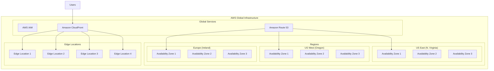
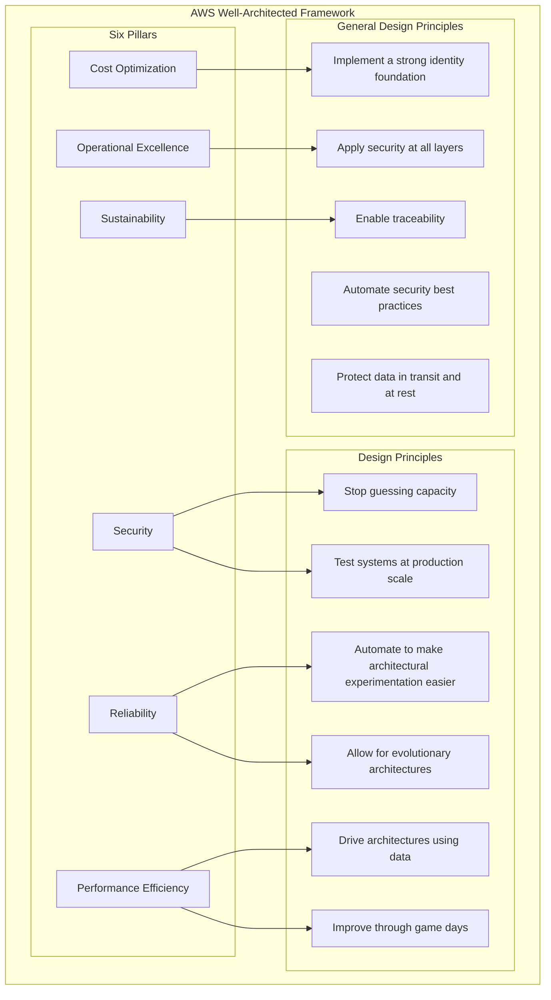
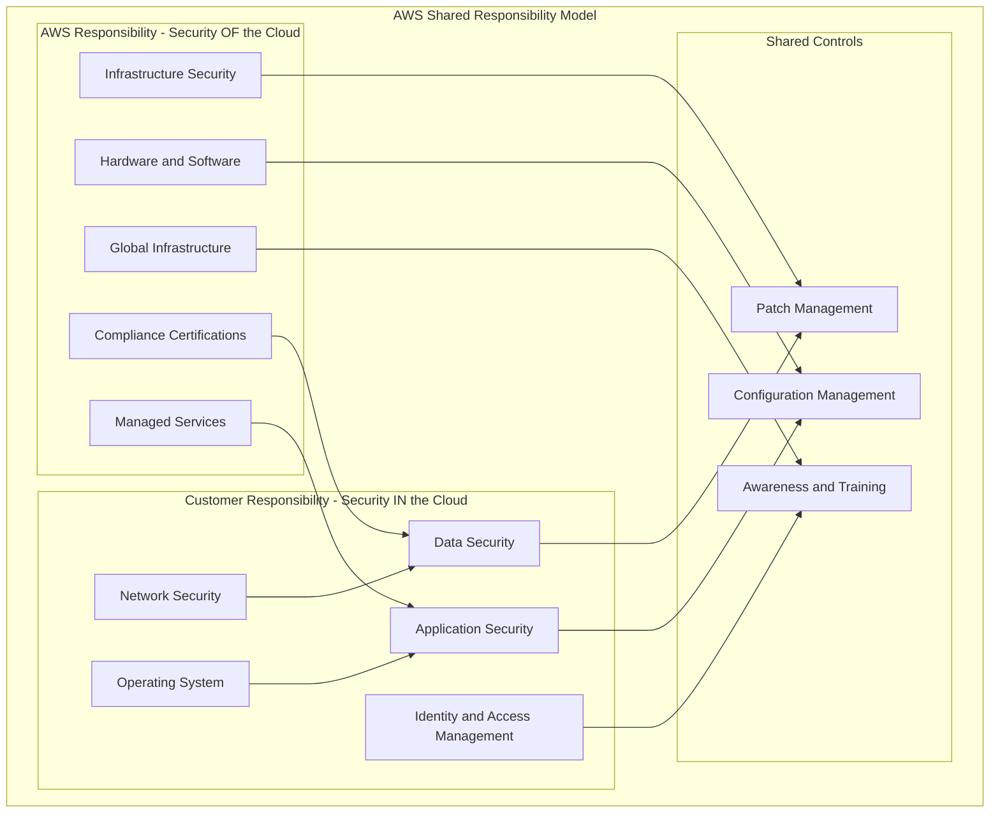
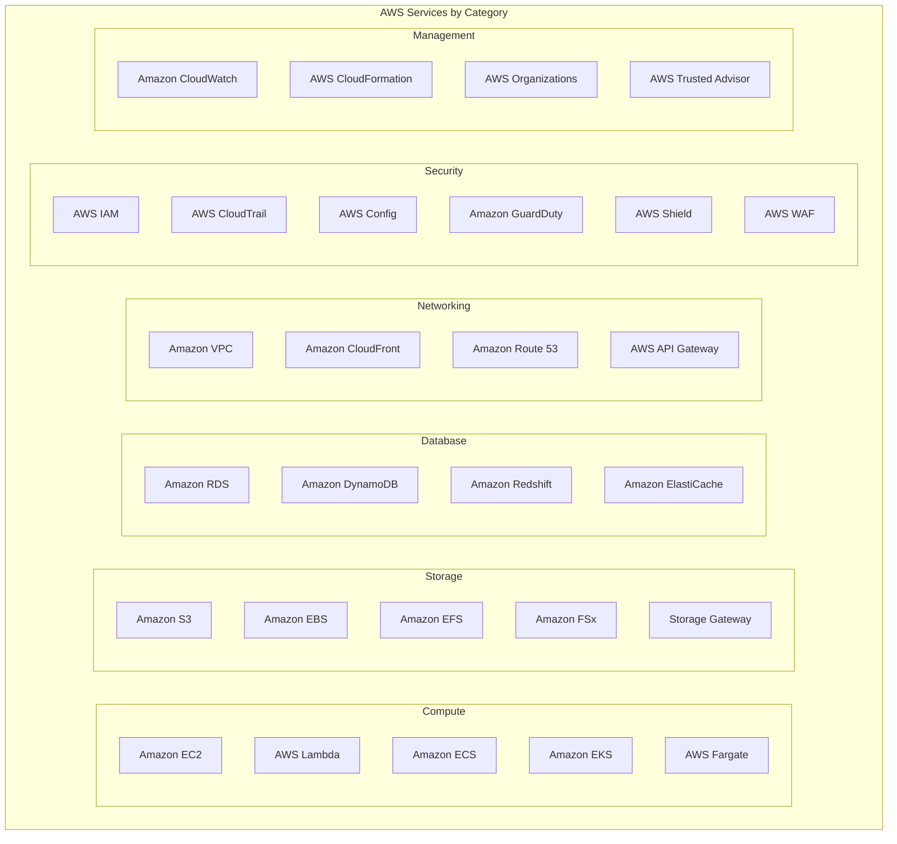
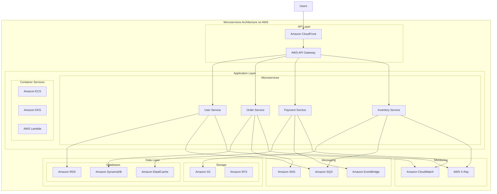
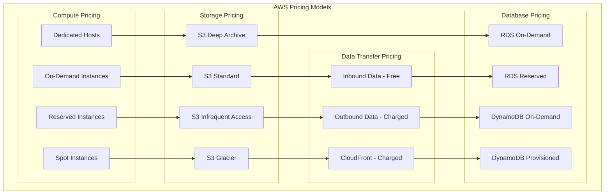
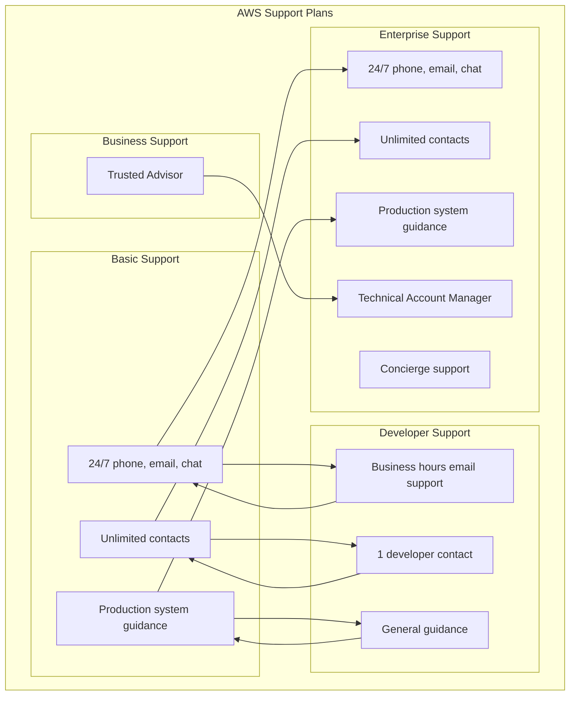

# AWS Architecture Diagrams

## AWS Global Infrastructure

## AWS Well-Architected Framework

## AWS Shared Responsibility Model

## AWS Services by Category

## Microservices Architecture on AWS

## AWS Pricing Models

## AWS Support Plans

---

*These diagrams help visualize key AWS concepts and can be used for study and reference.*
