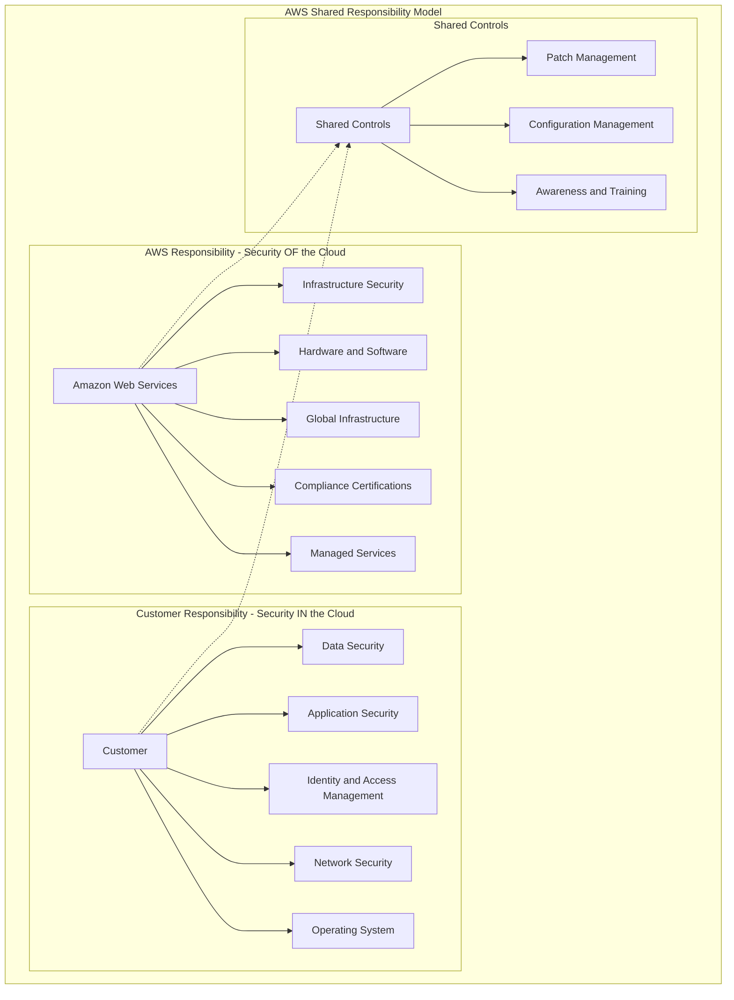
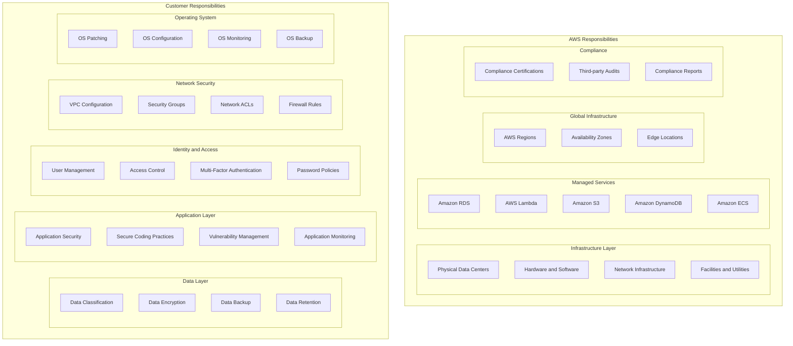
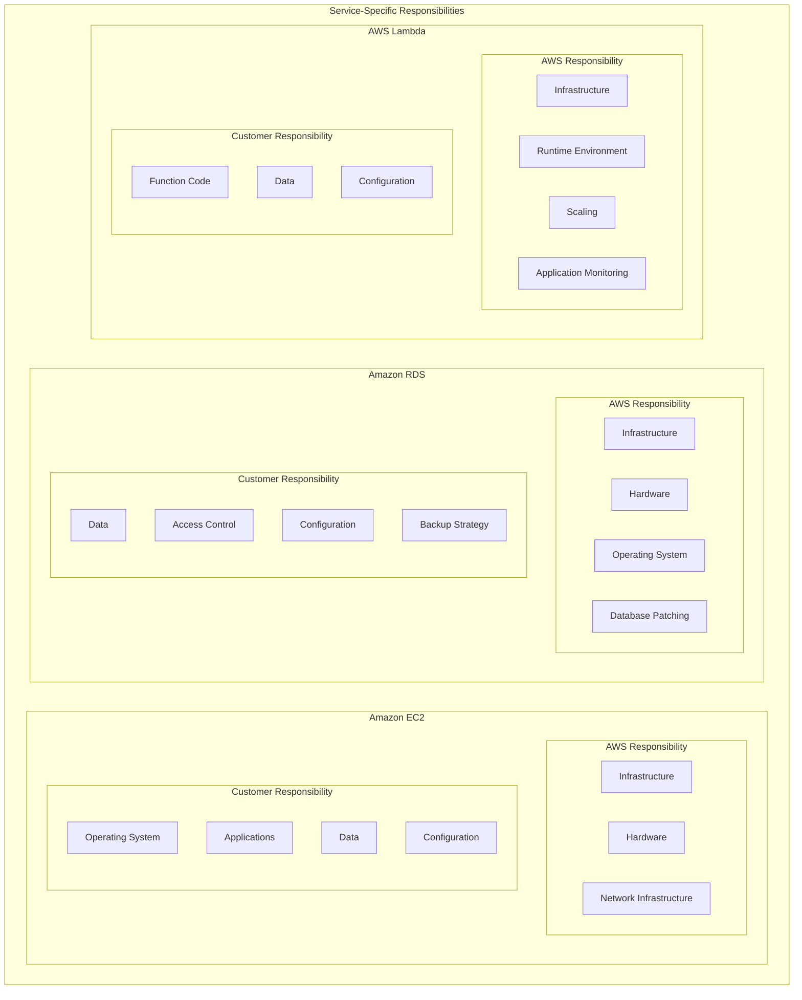
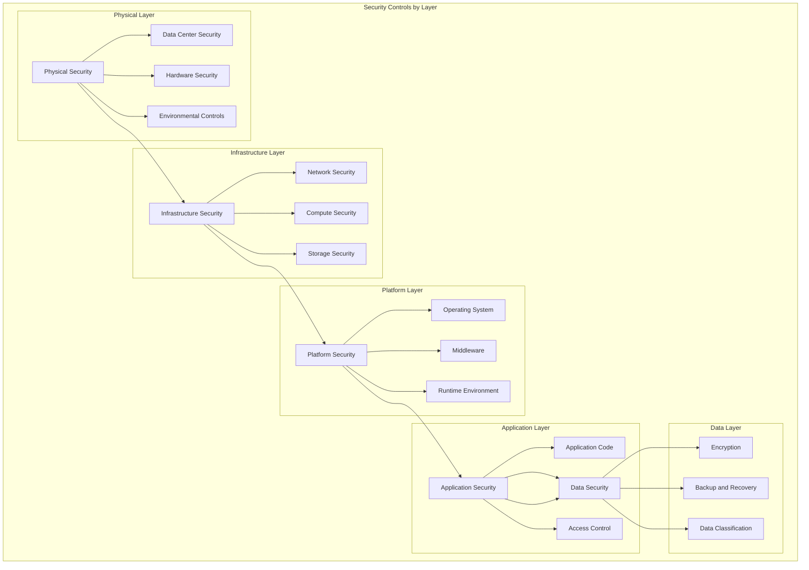
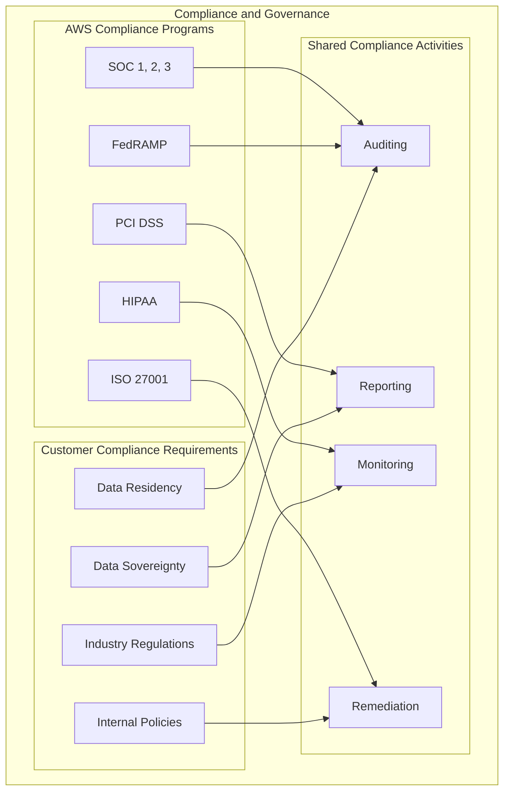
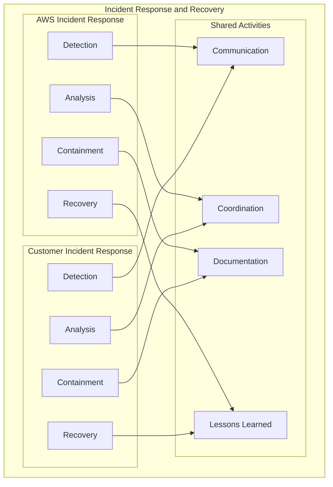
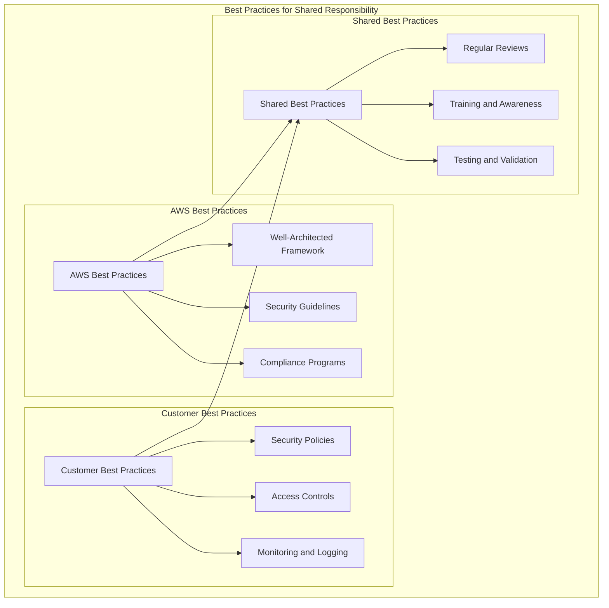

# AWS Shared Responsibility Model Diagrams

## Overview of Shared Responsibility

## Detailed Responsibility Breakdown

## Service-Specific Responsibility Examples

## Security Controls by Layer

## Compliance and Governance

## Incident Response and Recovery

## Best Practices for Shared Responsibility

---

*These diagrams help visualize the AWS Shared Responsibility Model and can be used for study and reference.*
