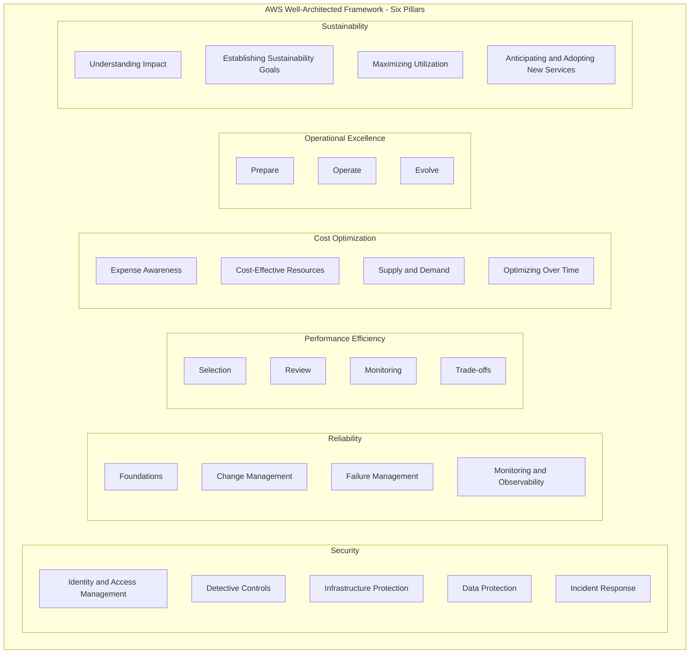
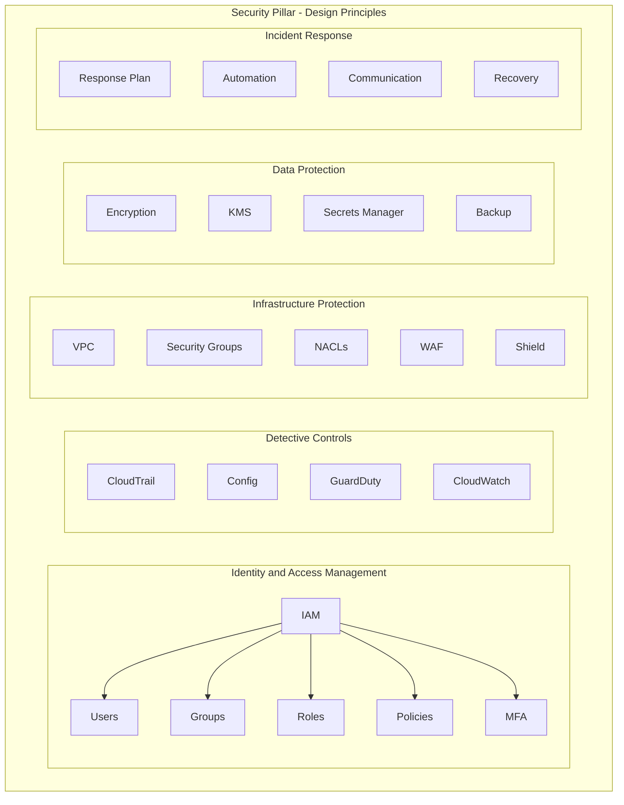
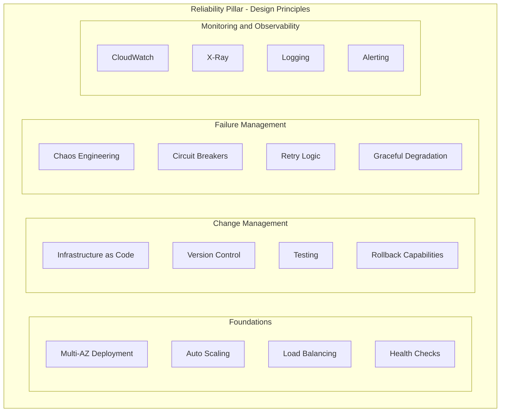
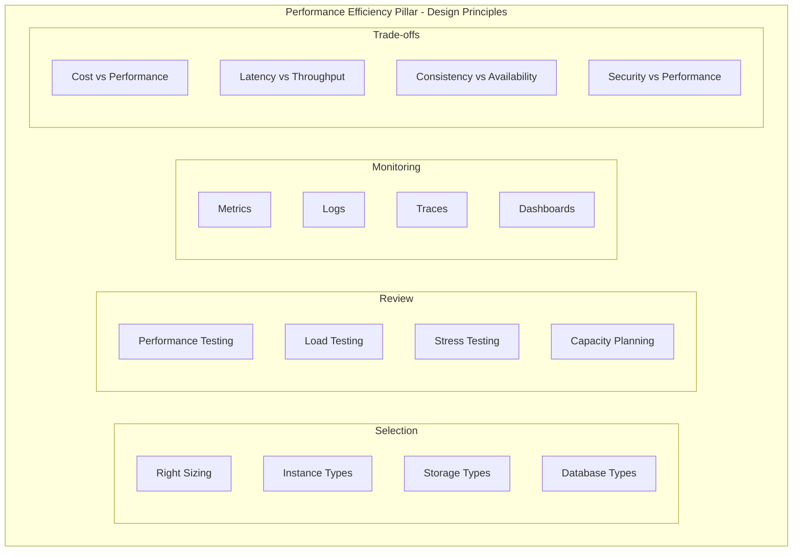
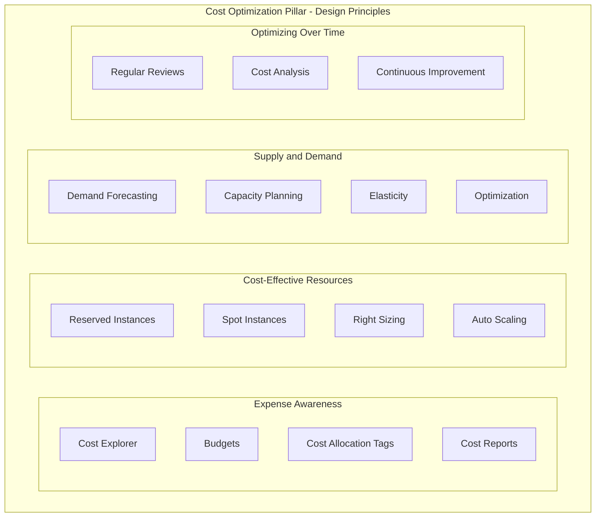
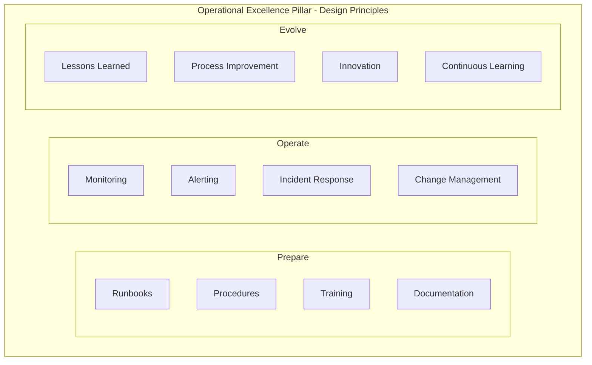
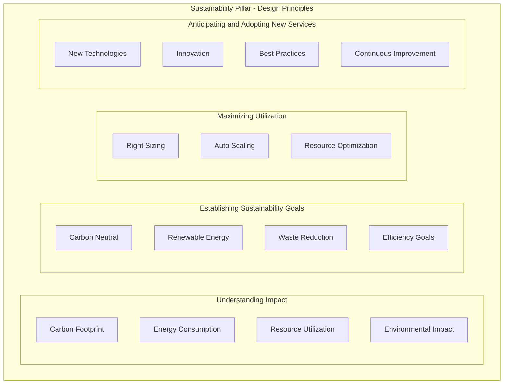
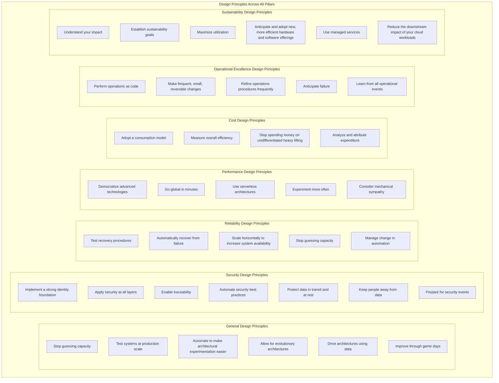
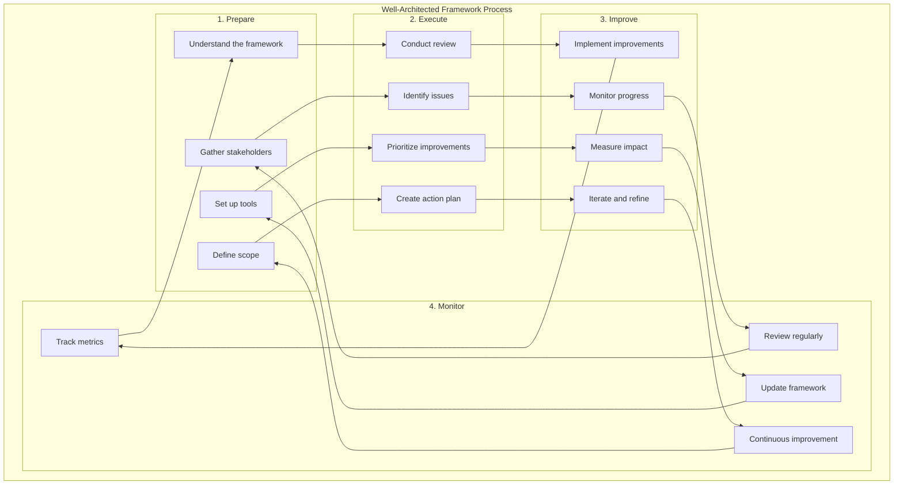
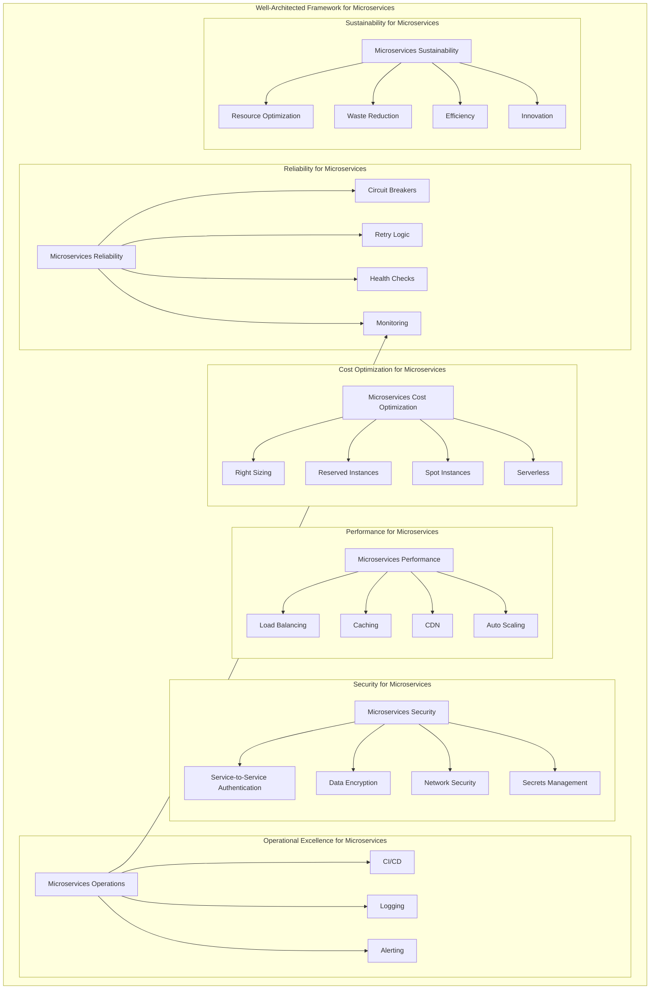

# AWS Well-Architected Framework Diagrams

## Six Pillars Overview

## Security Pillar Deep Dive

## Reliability Pillar Deep Dive

## Performance Efficiency Pillar Deep Dive

## Cost Optimization Pillar Deep Dive

## Operational Excellence Pillar Deep Dive

## Sustainability Pillar Deep Dive

## Design Principles Across All Pillars

## Well-Architected Framework Process

## Integration with Microservices

---

*These diagrams help visualize the AWS Well-Architected Framework and can be used for study and reference.*
