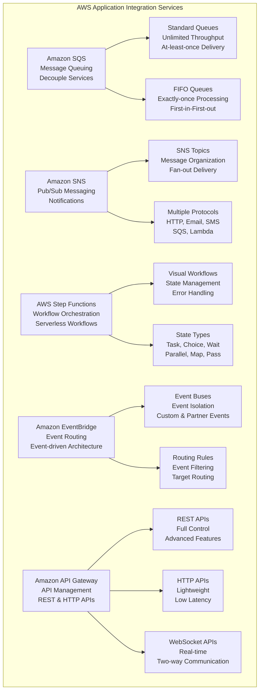

# Application Integration

> **Domain 3: Cloud Technology and Services (34%)** | **Section 15** | **Status:** In Progress

## 📚 Learning Objectives

- [ ] Understand Amazon SQS for message queuing
- [ ] Learn about Amazon SNS for notifications
- [ ] Explore AWS Step Functions for workflow orchestration
- [ ] Understand Amazon EventBridge for event routing
- [ ] Learn about Amazon API Gateway for API management
- [ ] Understand integration patterns and best practices
- [ ] Learn about event-driven architecture concepts

## 🎯 Key Concepts

### Amazon SQS (Simple Queue Service)

**Overview**: Fully managed message queuing service that enables you to decouple and scale microservices, distributed systems, and serverless applications.

**SQS Features**:
- **Message Queuing**: Store messages between components
- **Decoupling**: Loose coupling between services
- **Scalability**: Automatically scale with demand
- **Durability**: Messages stored redundantly
- **Security**: Encryption in transit and at rest
- **Dead Letter Queues**: Handle failed messages

**SQS Queue Types**:
- **Standard Queues**: Unlimited throughput, at-least-once delivery
- **FIFO Queues**: Exactly-once processing, first-in-first-out

**SQS Benefits**:
- **Reliability**: 99.9% availability SLA
- **Cost-effective**: Pay only for what you use
- **Simple**: Easy to use and integrate
- **Scalable**: Handle any volume of messages

### Amazon SNS (Simple Notification Service)

**Overview**: Fully managed pub/sub messaging service that enables you to decouple microservices, distributed systems, and serverless applications.

**SNS Features**:
- **Pub/Sub Messaging**: Publish messages to multiple subscribers
- **Multiple Protocols**: HTTP, HTTPS, Email, SMS, SQS, Lambda
- **Topic-based**: Organize messages by topics
- **Fan-out**: Send to multiple endpoints simultaneously
- **Message Filtering**: Filter messages based on attributes
- **Encryption**: End-to-end encryption

**SNS Topics**:
- **Standard Topics**: Cross-region delivery
- **FIFO Topics**: Exactly-once delivery, ordering

**SNS Use Cases**:
- **Application Alerts**: System notifications
- **Email Notifications**: User communications
- **SMS Alerts**: Mobile notifications
- **Lambda Triggers**: Serverless workflows
- **SQS Integration**: Message queuing

### AWS Step Functions

**Overview**: Serverless workflow orchestration service that makes it easy to coordinate multiple AWS services into serverless workflows.

**Step Functions Features**:
- **Visual Workflows**: Drag-and-drop workflow designer
- **State Management**: Manage workflow state
- **Error Handling**: Built-in retry and error handling
- **Parallel Processing**: Execute steps in parallel
- **Conditional Logic**: Branch based on data
- **Integration**: Works with 200+ AWS services

**Step Functions Types**:
- **Standard Workflows**: Long-running workflows
- **Express Workflows**: High-volume, short-duration workflows

**Step Functions States**:
- **Task State**: Perform work
- **Choice State**: Make decisions
- **Wait State**: Pause execution
- **Parallel State**: Execute branches in parallel
- **Map State**: Process arrays
- **Pass State**: Pass data through

### Amazon EventBridge

**Overview**: Serverless event bus that makes it easy to connect applications using data from your own applications, integrated Software-as-a-Service (SaaS) applications, and AWS services.

**EventBridge Features**:
- **Event Routing**: Route events to targets
- **Schema Registry**: Discover and manage event schemas
- **Custom Events**: Send custom events
- **Partner Events**: Third-party SaaS events
- **Event Buses**: Isolate events by source
- **Rules**: Define event routing rules

**EventBridge Sources**:
- **AWS Services**: Native AWS service events
- **Custom Applications**: Your own applications
- **SaaS Partners**: Third-party services
- **Custom Buses**: Isolated event buses

### Amazon API Gateway

**Overview**: Fully managed service that makes it easy for developers to create, publish, maintain, monitor, and secure APIs at any scale.

**API Gateway Features**:
- **REST APIs**: HTTP APIs with full control
- **HTTP APIs**: Lightweight, low-latency APIs
- **WebSocket APIs**: Real-time two-way communication
- **API Management**: Throttling, caching, monitoring
- **Security**: Authentication and authorization
- **Documentation**: Automatic API documentation

**API Gateway Types**:
- **REST APIs**: Full-featured REST APIs
- **HTTP APIs**: Simple, fast HTTP APIs
- **WebSocket APIs**: Real-time communication

## 📊 Application Integration Architecture Diagram

## 🧠 Key Takeaways

- **SQS for message queuing**: Decouple services with reliable messaging
- **SNS for notifications**: Pub/sub messaging for multiple subscribers
- **Step Functions for workflows**: Orchestrate complex serverless workflows
- **EventBridge for events**: Route events in event-driven architectures
- **API Gateway for APIs**: Manage and secure APIs at scale
- **Choose the right service**: Different services for different integration patterns
- **Design for decoupling**: Loose coupling enables scalability and reliability
- **Handle failures gracefully**: Implement retry logic and dead letter queues

## ❓ Practice Questions

1. **Question**: Which AWS service would be best for decoupling microservices with reliable message queuing?
   - A) Amazon SNS
   - B) Amazon SQS
   - C) AWS Step Functions
   - D) Amazon EventBridge
   - **Answer**: B - SQS is designed for reliable message queuing between services

2. **Question**: What is the main difference between SQS Standard and FIFO queues?
   - A) Standard queues are faster
   - B) FIFO queues guarantee exactly-once processing
   - C) Standard queues are cheaper
   - D) FIFO queues have unlimited throughput
   - **Answer**: B - FIFO queues guarantee exactly-once processing and ordering

3. **Question**: Which service would be best for orchestrating a complex serverless workflow?
   - A) Amazon SQS
   - B) Amazon SNS
   - C) AWS Step Functions
   - D) Amazon API Gateway
   - **Answer**: C - Step Functions is designed for workflow orchestration

4. **Question**: What is the main purpose of Amazon EventBridge?
   - A) Message queuing
   - B) API management
   - C) Event routing
   - D) Workflow orchestration
   - **Answer**: C - EventBridge is designed for event routing in event-driven architectures

## 🔗 Integration with Microservices

**Application Integration in Microservices Architecture**:
- **SQS for microservice communication**: Asynchronous messaging between microservices
- **SNS for microservice notifications**: Publish events to multiple microservices
- **Step Functions for microservice workflows**: Orchestrate complex microservice interactions
- **EventBridge for microservice events**: Route events between microservices
- **API Gateway for microservice APIs**: Expose microservice APIs to clients
- **Event-driven microservices**: Use events for loose coupling
- **Message patterns**: Request-reply, publish-subscribe, point-to-point
- **Circuit breakers**: Implement resilience patterns

## 📚 References

- [Amazon SQS Documentation](https://docs.aws.amazon.com/sqs/)
- [Amazon SNS Documentation](https://docs.aws.amazon.com/sns/)
- [AWS Step Functions Documentation](https://docs.aws.amazon.com/stepfunctions/)
- [Amazon EventBridge Documentation](https://docs.aws.amazon.com/eventbridge/)
- [Amazon API Gateway Documentation](https://docs.aws.amazon.com/apigateway/)
- [AWS Well-Architected Framework - Operational Excellence](https://aws.amazon.com/architecture/well-architected/)

---

*Last updated: January 27, 2025*
*Next: [Migration & Innovation](./migration-innovation.md)*