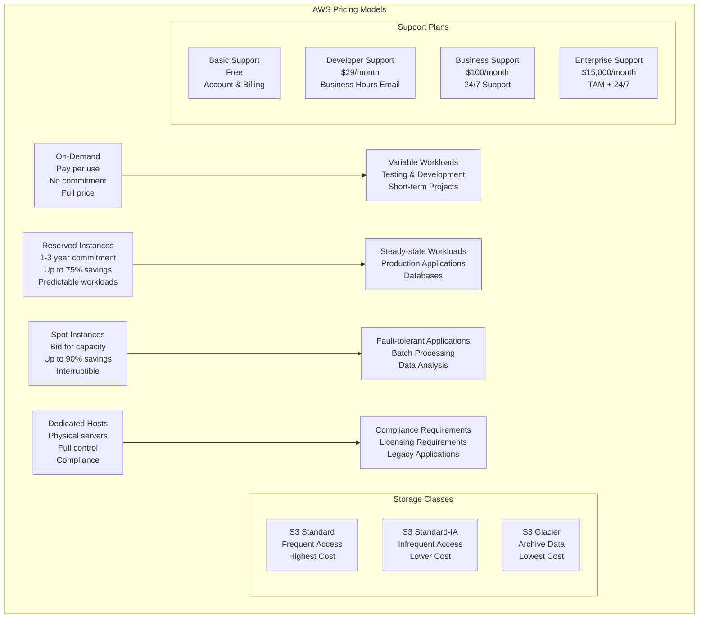

# Billing, Pricing, and Support

> **Domain 4: Billing, Pricing, and Support (12%)** | **Section 12** | **Status:** In Progress

## 📚 Learning Objectives

- [ ] Understand AWS pricing models and philosophy
- [ ] Learn about different account structures and billing
- [ ] Understand AWS support plans and resources
- [ ] Learn about cost optimization strategies
- [ ] Understand AWS Free Tier and pricing calculators
- [ ] Learn about cost management tools and services
- [ ] Understand billing and cost allocation methods

## 🎯 Key Concepts

### AWS Pricing Philosophy

**Overview**: AWS follows a customer-centric pricing philosophy designed to provide value and flexibility.

**Core Principles**:
- **Pay-as-you-go**: Only pay for what you use, when you use it
- **Pay less when you reserve**: Significant discounts for committed usage
- **Pay less when you use more**: Volume discounts for higher usage
- **Pay even less as AWS grows**: Economies of scale benefit customers

**Benefits**:
- **No upfront costs**: Start using services immediately
- **Flexibility**: Scale up or down as needed
- **Cost optimization**: Multiple pricing options for different needs
- **Transparency**: Clear, predictable pricing

### Compute Pricing Models

#### On-Demand Pricing
**Overview**: Pay for compute capacity by the hour or second with no long-term commitments.

**Features**:
- **No upfront costs**: Start using immediately
- **No long-term commitments**: Cancel anytime
- **Full price**: No discounts applied
- **Per-second billing**: For Linux instances (minimum 60 seconds)

**Use Cases**:
- Variable workloads
- Testing and development
- Unpredictable applications
- Short-term projects

**Pricing Example**:
- **t3.micro**: ~$0.0104/hour (US East)
- **m5.large**: ~$0.096/hour (US East)
- **c5.xlarge**: ~$0.17/hour (US East)

#### Reserved Instances (RIs)
**Overview**: Significant discounts for committed usage over 1-3 year terms.

**Features**:
- **1-3 year commitment**: Up to 75% savings
- **Payment options**: All upfront, partial upfront, no upfront
- **Instance flexibility**: Can change instance types
- **Regional benefits**: Can be shared across AZs in same region

**RI Types**:
- **Standard RIs**: Up to 75% savings, most flexible
- **Convertible RIs**: Up to 54% savings, can change instance family
- **Scheduled RIs**: For predictable recurring workloads

**Use Cases**:
- Production applications
- Databases
- Steady-state workloads
- Predictable usage patterns

#### Spot Instances
**Overview**: Bid for unused EC2 capacity at up to 90% savings.

**Features**:
- **Up to 90% savings**: Compared to On-Demand pricing
- **Can be interrupted**: AWS can reclaim instances with 2-minute notice
- **No commitments**: Use when available
- **Bid pricing**: Set maximum price you're willing to pay

**Use Cases**:
- Batch processing
- Data analysis
- Fault-tolerant applications
- Development and testing

**Best Practices**:
- Design applications for interruptions
- Use Spot Fleets for better availability
- Diversify across instance types and AZs
- Monitor Spot pricing trends

#### Dedicated Hosts
**Overview**: Physical servers dedicated to your use with full control over instance placement.

**Features**:
- **Physical servers**: Dedicated hardware
- **Full control**: Over instance placement
- **Compliance**: Meet regulatory requirements
- **Licensing**: Use existing server-bound software licenses

**Use Cases**:
- Software with per-socket licensing
- Compliance requirements
- Regulatory requirements
- Legacy applications

### Storage Pricing Models

#### Amazon S3 Storage Classes
| Storage Class | Use Case | Durability | Availability | Cost | Retrieval Time |
|---------------|----------|------------|--------------|------|----------------|
| **S3 Standard** | Frequently accessed | 99.999999999% | 99.99% | Highest | Millisecond |
| **S3 Standard-IA** | Infrequently accessed | 99.999999999% | 99.9% | Lower | Millisecond |
| **S3 One Zone-IA** | Recreatable data | 99.999999999% | 99.5% | Lower | Millisecond |
| **S3 Glacier** | Archive data | 99.999999999% | 99.99% | Low | 1-12 hours |
| **S3 Glacier Deep Archive** | Long-term archive | 99.999999999% | 99.99% | Lowest | 12 hours |

#### Amazon EBS Volume Types
| Volume Type | Use Case | IOPS | Throughput | Cost |
|-------------|----------|------|------------|------|
| **gp3** | General purpose | 3,000-16,000 | 125-1,000 MiB/s | Lowest |
| **gp2** | General purpose | 3-16,000 | 128-250 MiB/s | Low |
| **io1/io2** | High performance | 100-64,000 | 125-1,000 MiB/s | High |
| **st1** | Throughput optimized | 40-500 | 125-500 MiB/s | Low |
| **sc1** | Cold HDD | 12-250 | 125-250 MiB/s | Lowest |

### Data Transfer Pricing

**Overview**: AWS charges for data transfer out of AWS, but not for data transfer in.

**Pricing Structure**:
- **Inbound data**: Free (data coming into AWS)
- **Outbound data**: Charged based on volume and destination
- **CloudFront**: Global content delivery with reduced costs
- **Direct Connect**: Dedicated connection with reduced data transfer costs

**Data Transfer Tiers**:
- **First 1 GB/month**: Free
- **Up to 10 TB/month**: $0.09/GB
- **Next 40 TB/month**: $0.085/GB
- **Next 100 TB/month**: $0.07/GB
- **Over 150 TB/month**: $0.05/GB

### AWS Organizations and Billing

#### Single Account Structure
**Overview**: All resources managed in one AWS account.

**Features**:
- **Simple billing**: Single bill for all usage
- **Easy management**: All resources in one place
- **Limited isolation**: All resources share the same account
- **Direct billing**: Billed directly by AWS

**Use Cases**:
- Small organizations
- Simple projects
- Startups
- Personal use

#### Multiple Account Structure
**Overview**: Separate accounts for different purposes or departments.

**Features**:
- **Better isolation**: Resources isolated by account
- **Complex billing**: Multiple bills to manage
- **Independent management**: Each account managed separately
- **Compliance**: Meet regulatory requirements

**Use Cases**:
- Large organizations
- Compliance requirements
- Multi-tenant applications
- Department separation

#### AWS Organizations
**Overview**: Centralized management of multiple AWS accounts.

**Features**:
- **Consolidated billing**: Single bill for all accounts
- **Account hierarchy**: Organizational units (OUs)
- **Policy management**: Service Control Policies (SCPs)
- **Cost allocation**: Track costs by account/OU
- **Volume discounts**: Aggregate usage across accounts

**Organizational Units (OUs)**:
- **Logical grouping**: Organize accounts by department/project
- **Policy inheritance**: Inherit policies from parent OUs
- **Cost tracking**: Track costs by OU
- **Flexible structure**: Adapt to organization needs

### AWS Support Plans

#### Basic Support (Free)
**Features**:
- **Account and billing support**: 24/7 support for account and billing issues
- **Documentation**: Access to AWS documentation
- **Community forums**: AWS community support
- **Service health status**: AWS service health dashboard

**Use Cases**:
- Development and testing
- Personal projects
- Learning AWS

#### Developer Support ($29/month)
**Features**:
- **Business hours email support**: 12-24 hour response time
- **Best practices guidance**: Architecture and implementation guidance
- **API support**: Support for AWS APIs and SDKs
- **Cloud support associate**: Technical support

**Use Cases**:
- Development teams
- Small businesses
- Non-production workloads

#### Business Support ($100/month or 10% of usage)
**Features**:
- **24/7 phone, email, chat support**: All channels available
- **1-hour response time**: For production system down
- **4-hour response time**: For system impaired
- **12-hour response time**: For general guidance
- **Trusted Advisor**: Full access to Trusted Advisor
- **API support**: Support for AWS APIs and SDKs

**Use Cases**:
- Production workloads
- Business-critical applications
- Medium to large businesses

#### Enterprise Support ($15,000/month or 10% of usage)
**Features**:
- **24/7 phone, email, chat support**: All channels available
- **15-minute response time**: For business-critical system down
- **1-hour response time**: For production system down
- **4-hour response time**: For system impaired
- **Technical Account Manager (TAM)**: Dedicated support
- **Trusted Advisor**: Full access to Trusted Advisor
- **API support**: Support for AWS APIs and SDKs
- **Infrastructure event management**: Support for large events

**Use Cases**:
- Enterprise applications
- Mission-critical workloads
- Large organizations
- Complex architectures

### Cost Management Tools

#### AWS Cost Explorer
**Overview**: Visualize and analyze costs and usage over time.

**Features**:
- **Cost visualization**: Charts and graphs of spending
- **Cost forecasting**: Predict future costs
- **Reserved Instance recommendations**: Optimize RI purchases
- **Cost allocation**: Track costs by tags
- **Custom reports**: Create custom cost reports

#### AWS Budgets
**Overview**: Set custom cost and usage budgets with alerts.

**Features**:
- **Cost budgets**: Set spending limits
- **Usage budgets**: Set usage limits
- **Alerts**: Get notified when approaching limits
- **Actions**: Automatically take action when limits exceeded
- **Multiple budgets**: Set different budgets for different services

#### AWS Cost and Usage Report
**Overview**: Detailed billing information stored in S3.

**Features**:
- **Line-item billing**: Detailed cost breakdown
- **S3 storage**: Reports stored in S3
- **Analysis**: Analyze costs with third-party tools
- **Integration**: Works with BI tools
- **Compliance**: Meet regulatory requirements

#### AWS Cost Anomaly Detection
**Overview**: Automatically detect unusual spending patterns.

**Features**:
- **Machine learning**: AI-powered anomaly detection
- **Custom thresholds**: Set sensitivity levels
- **Alerts**: Get notified of anomalies
- **Root cause analysis**: Understand why costs increased
- **Cost optimization**: Identify optimization opportunities

### Cost Optimization Strategies

#### Right-Sizing
**Overview**: Match instance types to actual workload requirements.

**Strategies**:
- **Monitor utilization**: Use CloudWatch to track CPU, memory, network
- **Choose appropriate instance types**: Match workload to instance family
- **Use Auto Scaling**: Scale based on demand
- **Regular reviews**: Periodically review and adjust

#### Reserved Capacity
**Overview**: Use Reserved Instances and Savings Plans for predictable workloads.

**Strategies**:
- **Analyze usage patterns**: Identify steady-state workloads
- **Choose appropriate term**: 1-year vs 3-year commitment
- **Payment options**: All upfront vs partial upfront
- **Instance flexibility**: Standard vs Convertible RIs

#### Serverless Architecture
**Overview**: Use serverless services to pay only for actual usage.

**Services**:
- **AWS Lambda**: Pay per execution
- **Amazon API Gateway**: Pay per API call
- **Amazon DynamoDB**: Pay per request
- **Amazon S3**: Pay per request and storage

#### Storage Optimization
**Overview**: Optimize storage costs by choosing appropriate storage classes.

**Strategies**:
- **Lifecycle policies**: Automatically transition data
- **Compression**: Reduce storage costs
- **Deduplication**: Eliminate duplicate data
- **Archive old data**: Move to cheaper storage classes

## 📊 Pricing Model Comparison Diagram

## 🧠 Key Takeaways

- **Pay-as-you-go**: Only pay for what you use, when you use it
- **Reserved Instances save money**: Up to 75% savings for predictable workloads
- **Spot Instances are cheapest**: Up to 90% savings for fault-tolerant workloads
- **Data transfer out costs money**: Inbound data is free
- **Organizations provide volume discounts**: Aggregate usage across accounts
- **Support plans scale with usage**: Higher tiers for production workloads
- **Cost optimization is ongoing**: Regular reviews and adjustments needed
- **Use appropriate storage classes**: Match storage class to access patterns

## ❓ Practice Questions

1. **Question**: Which pricing model would be best for a production database that runs 24/7?
   - A) On-Demand
   - B) Reserved Instances
   - C) Spot Instances
   - D) Dedicated Hosts
   - **Answer**: B - Reserved Instances provide up to 75% savings for predictable, steady-state workloads

2. **Question**: What is the main advantage of Spot Instances?
   - A) Guaranteed availability
   - B) Lowest cost (up to 90% savings)
   - C) No interruptions
   - D) Full control over hardware
   - **Answer**: B - Spot Instances can provide up to 90% savings compared to On-Demand pricing

3. **Question**: Which AWS service provides cost visualization and analysis?
   - A) AWS Budgets
   - B) AWS Cost Explorer
   - C) AWS Trusted Advisor
   - D) AWS CloudWatch
   - **Answer**: B - AWS Cost Explorer provides cost visualization and analysis tools

4. **Question**: What is the main benefit of AWS Organizations for billing?
   - A) Free service
   - B) Consolidated billing and volume discounts
   - C) Automatic cost optimization
   - D) Unlimited accounts
   - **Answer**: B - AWS Organizations provides consolidated billing and volume discounts across multiple accounts

## 🔗 Integration with Microservices

**Cost Optimization for Microservices Architecture**:
- **Right-size microservice instances**: Match instance types to microservice requirements
- **Use Auto Scaling**: Scale microservices based on demand
- **Implement circuit breakers**: Prevent cascading failures and unnecessary costs
- **Use serverless for lightweight microservices**: Lambda for simple microservices
- **Optimize data transfer**: Use CloudFront for microservice APIs
- **Implement cost allocation tags**: Track costs by microservice
- **Use Reserved Instances for stable microservices**: For predictable workloads
- **Monitor and alert on costs**: Set budgets for microservice spending

## 📚 References

- [AWS Pricing](https://aws.amazon.com/pricing/)
- [AWS Pricing Calculator](https://calculator.aws/)
- [AWS Free Tier](https://aws.amazon.com/free/)
- [AWS Cost Management](https://aws.amazon.com/aws-cost-management/)
- [AWS Support Plans](https://aws.amazon.com/premiumsupport/plans/)
- [AWS Well-Architected Framework - Cost Optimization](https://aws.amazon.com/architecture/well-architected/)

---

*Last updated: January 27, 2025*
*Next: [Deployment & Management Tools](./deployment-tools.md)*
