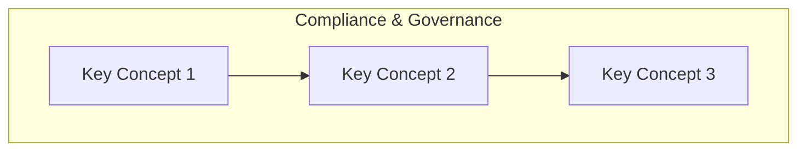

# Compliance & Governance

> **Domain 2: Domain 2: Security and Compliance (30%)** | **Topic 4** | **Status:** not_started

## 📚 Learning Objectives

- [ ] Understand shared responsibility model
- [ ] Security, governance, and compliance concepts
- [ ] Access management capabilities
- [ ] Security services and features

## 🎯 Key Concepts

### SOC, HIPAA, GDPR, PCI-DSS

### AWS Artifact for reports

### Audit Manager, Config, CloudTrail

## 📖 Study Resources

- ExamPro: Security, Governance

## 🔗 Related Services

*List AWS services related to this topic*

## 📊 Diagram

## 🧠 Key Takeaways

- **Important Point 1**: Description
- **Important Point 2**: Description
- **Important Point 3**: Description

## ❓ Practice Questions

1. **Question 1**: What is...?
   - A) Option A
   - B) Option B
   - C) Option C
   - D) Option D
   - **Answer**: B

2. **Question 2**: Which service...?
   - A) Option A
   - B) Option B
   - C) Option C
   - D) Option D
   - **Answer**: C

## 🔗 Integration with Microservices

*How this topic relates to microservices architecture*

## 📚 References

- [AWS Official Documentation](https://docs.aws.amazon.com/)
- [AWS Well-Architected Framework](https://aws.amazon.com/architecture/well-architected/)
- [AWS Free Tier](https://aws.amazon.com/free/)

---

*Last updated: 9/9/2025*
*Next: [SOC, HIPAA, GDPR, PCI-DSS](./README.md)*
