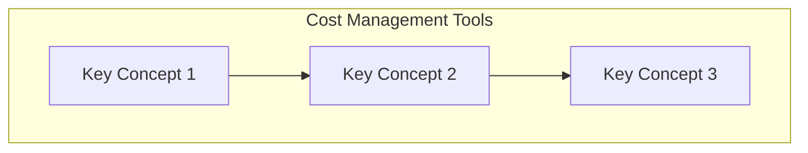

# Cost Management Tools

> **Domain 4: Domain 4: Billing, Pricing, and Support (12%)** | **Topic 2** | **Status:** not_started

## 📚 Learning Objectives

- [ ] Compare AWS pricing models
- [ ] Use billing and cost tools
- [ ] Identify support options

## 🎯 Key Concepts

### AWS Budgets, Cost Explorer

### Cost and Usage Reports (CUR)

### Cost allocation tags

## 📖 Study Resources

- ExamPro: Billing, Pricing and Support
- AWS Pricing Calculator

## 🔗 Related Services

*List AWS services related to this topic*

## 📊 Diagram

## 🧠 Key Takeaways

- **Important Point 1**: Description
- **Important Point 2**: Description
- **Important Point 3**: Description

## ❓ Practice Questions

1. **Question 1**: What is...?
   - A) Option A
   - B) Option B
   - C) Option C
   - D) Option D
   - **Answer**: B

2. **Question 2**: Which service...?
   - A) Option A
   - B) Option B
   - C) Option C
   - D) Option D
   - **Answer**: C

## 🔗 Integration with Microservices

*How this topic relates to microservices architecture*

## 📚 References

- [AWS Official Documentation](https://docs.aws.amazon.com/)
- [AWS Well-Architected Framework](https://aws.amazon.com/architecture/well-architected/)
- [AWS Free Tier](https://aws.amazon.com/free/)

---

*Last updated: 9/9/2025*
*Next: [AWS Budgets, Cost Explorer](./support-organizations.md)*
