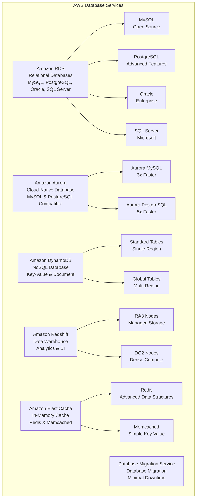

# AWS Core Services - Database

> **Domain 3: Cloud Technology and Services (34%)** | **Section 8** | **Status:** In Progress

## 📚 Learning Objectives

- [ ] Understand Amazon RDS and its database engines
- [ ] Learn Amazon Aurora features and benefits
- [ ] Explore Amazon DynamoDB for NoSQL workloads
- [ ] Understand Amazon Redshift for data warehousing
- [ ] Learn Amazon ElastiCache for caching
- [ ] Understand Database Migration Service (DMS)
- [ ] Identify appropriate database solutions for different use cases

## 🎯 Key Concepts

### Amazon RDS (Relational Database Service)

**Overview**: Fully managed relational database service supporting multiple database engines.

**Supported Database Engines**:
- **MySQL**: Open-source relational database
  - Versions: 5.7, 8.0
  - Use cases: Web applications, e-commerce, content management

- **PostgreSQL**: Advanced open-source relational database
  - Versions: 11.x, 12.x, 13.x, 14.x, 15.x
  - Use cases: Complex queries, JSON support, geospatial data

- **MariaDB**: MySQL-compatible database
  - Versions: 10.3, 10.4, 10.5, 10.6
  - Use cases: MySQL alternatives, open-source applications

- **Oracle**: Enterprise database with advanced features
  - Versions: 19c, 21c
  - Use cases: Enterprise applications, legacy systems

- **SQL Server**: Microsoft's relational database
  - Versions: 2017, 2019, 2022
  - Use cases: Windows applications, .NET applications

**RDS Features**:
- **Automated Backups**: Point-in-time recovery up to 35 days
- **Multi-AZ Deployment**: High availability across AZs
- **Read Replicas**: Scale read performance
- **Encryption**: At rest and in transit
- **Monitoring**: CloudWatch integration
- **Automated Patching**: OS and database updates
- **Scaling**: Vertical (instance size) and horizontal (read replicas)

**RDS Instance Classes**:
- **db.t3**: Burstable performance, cost-effective
- **db.t4g**: ARM-based, burstable performance
- **db.m5**: General purpose, balanced compute/memory
- **db.r5**: Memory optimized
- **db.x1e**: Memory optimized for large datasets
- **db.r6g**: ARM-based memory optimized

### Amazon Aurora

**Overview**: MySQL and PostgreSQL-compatible relational database built for the cloud.

**Aurora MySQL**:
- Up to 3x faster than standard MySQL
- 5x faster than standard PostgreSQL
- 6 copies across 3 AZs
- Continuous backup to S3
- Point-in-time recovery

**Aurora PostgreSQL**:
- PostgreSQL compatibility
- Advanced features: JSON support, full-text search
- Extensions support
- Performance Insights

**Aurora Features**:
- **Aurora Serverless**: Auto-scaling database
- **Aurora Global Database**: Cross-region replication
- **Aurora Multi-Master**: Multiple write locations
- **Aurora Backtrack**: Rewind database to specific time
- **Aurora Clones**: Fast database cloning
- **Aurora Parallel Query**: Parallel processing for analytics

**Aurora Storage**:
- Auto-scaling from 10 GB to 128 TB
- 6-way replication across 3 AZs
- Continuous backup to S3
- Point-in-time recovery
- No I/O suspension during scaling

### Amazon DynamoDB

**Overview**: Fully managed NoSQL database service for applications requiring single-digit millisecond latency.

**DynamoDB Features**:
- **Single-digit millisecond latency**: Consistent performance
- **Auto-scaling**: Scales automatically with traffic
- **Global Tables**: Multi-region, multi-active replication
- **On-demand billing**: Pay per request
- **Point-in-time recovery**: Continuous backups
- **Encryption**: At rest and in transit

**DynamoDB Data Model**:
- **Tables**: Collection of items
- **Items**: Collection of attributes
- **Attributes**: Key-value pairs
- **Primary Key**: Uniquely identifies each item
  - **Partition Key**: Single attribute
  - **Composite Key**: Partition key + sort key

**DynamoDB Capacity Modes**:
- **Provisioned**: Predictable workloads
  - Read/Write Capacity Units (RCU/WCU)
  - Reserved capacity pricing
  - Auto-scaling available

- **On-Demand**: Unpredictable workloads
  - Pay per request
  - No capacity planning
  - Scales automatically

**DynamoDB Indexes**:
- **Local Secondary Index (LSI)**: Same partition key, different sort key
- **Global Secondary Index (GSI)**: Different partition key and sort key

**DynamoDB Streams**: Time-ordered sequence of item-level changes

### Amazon Redshift

**Overview**: Fully managed data warehouse service for analytics and business intelligence.

**Redshift Features**:
- **Columnar Storage**: Optimized for analytics queries
- **Massively Parallel Processing (MPP)**: Distributes queries across nodes
- **Compression**: Automatic data compression
- **Concurrent Scaling**: Add compute capacity automatically
- **Spectrum**: Query data directly from S3

**Redshift Node Types**:
- **RA3**: Managed storage, separate compute and storage
  - 2-128 nodes
  - 32-128 vCPUs per node
  - Up to 128 TB managed storage

- **DC2**: Dense compute, local SSD storage
  - 1-128 nodes
  - 2-32 vCPUs per node
  - 160 GB - 2.56 TB per node

**Redshift Clusters**:
- **Single Node**: Development and testing
- **Multi-Node**: Production workloads
  - **Leader Node**: Coordinates queries
  - **Compute Nodes**: Execute queries

**Redshift Spectrum**: Query data in S3 without loading into Redshift

### Amazon ElastiCache

**Overview**: Fully managed in-memory caching service supporting Redis and Memcached.

**ElastiCache for Redis**:
- **Data Structures**: Strings, lists, sets, sorted sets, hashes
- **Persistence**: RDB snapshots, AOF logging
- **Clustering**: Multi-node clusters
- **Replication**: Read replicas
- **Backup/Restore**: Automated backups

**ElastiCache for Memcached**:
- **Simple Key-Value Store**: String-based caching
- **Multi-threaded**: Better performance
- **No Persistence**: Memory-only
- **Clustering**: Multi-node support

**ElastiCache Features**:
- **Auto Discovery**: Automatic endpoint discovery
- **Security**: VPC, encryption, IAM
- **Monitoring**: CloudWatch metrics
- **Backup/Restore**: Point-in-time recovery
- **Global Datastore**: Cross-region replication (Redis only)

### AWS Database Migration Service (DMS)

**Overview**: Service for migrating databases to AWS with minimal downtime.

**DMS Features**:
- **Homogeneous Migrations**: Same database engine
- **Heterogeneous Migrations**: Different database engines
- **Continuous Data Replication**: Minimal downtime
- **Schema Conversion**: Convert database schemas
- **Data Validation**: Verify migration accuracy

**DMS Components**:
- **Replication Instance**: Compute resource for migration
- **Replication Tasks**: Define migration parameters
- **Endpoints**: Source and target database connections

**DMS Use Cases**:
- Database consolidation
- Development and testing
- Disaster recovery
- Database splitting

## 📊 Database Comparison Diagram

## 🧠 Key Takeaways

- **RDS for relational databases**: MySQL, PostgreSQL, Oracle, SQL Server
- **Aurora for cloud-native**: 3-5x faster, auto-scaling, serverless option
- **DynamoDB for NoSQL**: Single-digit millisecond latency, auto-scaling
- **Redshift for analytics**: Columnar storage, MPP, data warehousing
- **ElastiCache for caching**: Redis and Memcached for performance
- **DMS for migration**: Minimal downtime database migration
- **Choose based on use case**: OLTP = RDS/Aurora, OLAP = Redshift, Cache = ElastiCache
- **Consider scaling needs**: Auto-scaling vs manual scaling

## ❓ Practice Questions

1. **Question**: Which AWS service would be best for a high-performance, cloud-native database that needs to scale automatically?
   - A) Amazon RDS
   - B) Amazon Aurora
   - C) Amazon DynamoDB
   - D) Amazon Redshift
   - **Answer**: B - Aurora is designed for cloud-native applications with auto-scaling

2. **Question**: What is the main advantage of Amazon DynamoDB over traditional databases?
   - A) Lower cost
   - B) Single-digit millisecond latency
   - C) SQL compatibility
   - D) Multi-master replication
   - **Answer**: B - DynamoDB provides consistent single-digit millisecond latency

3. **Question**: Which service would be best for analyzing large datasets and running business intelligence queries?
   - A) Amazon RDS
   - B) Amazon Aurora
   - C) Amazon DynamoDB
   - D) Amazon Redshift
   - **Answer**: D - Redshift is designed for data warehousing and analytics

4. **Question**: What is the difference between ElastiCache for Redis and ElastiCache for Memcached?
   - A) Redis supports data structures, Memcached is key-value only
   - B) Redis is more expensive
   - C) Memcached supports clustering
   - D) Redis doesn't support persistence
   - **Answer**: A - Redis supports complex data structures, Memcached is simple key-value

## 🔗 Integration with Microservices

**Database in Microservices Architecture**:
- **RDS/Aurora for microservice databases**: Each microservice can have its own database
- **DynamoDB for microservice state**: Store microservice state and session data
- **ElastiCache for microservice caching**: Cache frequently accessed data
- **Redshift for microservice analytics**: Aggregate data from multiple microservices
- **Database per service pattern**: Each microservice owns its data
- **Event sourcing**: Use DynamoDB Streams for event-driven architecture

## 📚 References

- [Amazon RDS Documentation](https://docs.aws.amazon.com/rds/)
- [Amazon Aurora Documentation](https://docs.aws.amazon.com/aurora/)
- [Amazon DynamoDB Documentation](https://docs.aws.amazon.com/dynamodb/)
- [Amazon Redshift Documentation](https://docs.aws.amazon.com/redshift/)
- [Amazon ElastiCache Documentation](https://docs.aws.amazon.com/elasticache/)
- [AWS Database Migration Service Documentation](https://docs.aws.amazon.com/dms/)
- [AWS Well-Architected Framework - Data](https://aws.amazon.com/architecture/well-architected/)

---

*Last updated: January 27, 2025*
*Next: [AWS Core Services - Networking](./networking.md)*
