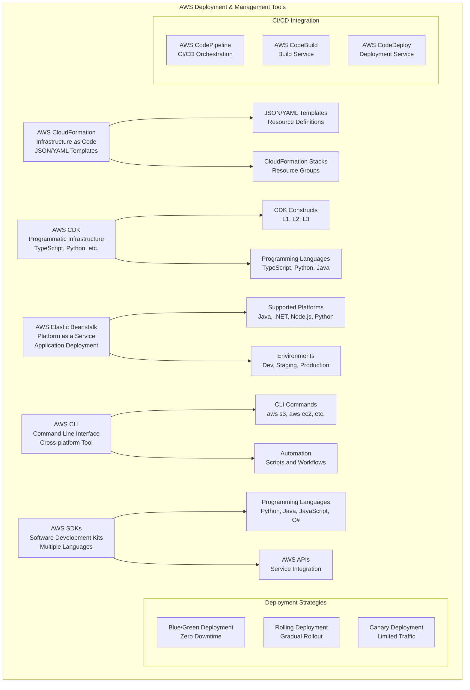

# Deployment & Management Tools

> **Domain 3: Cloud Technology and Services (34%)** | **Section 13** | **Status:** In Progress

## 📚 Learning Objectives

- [ ] Understand AWS CloudFormation for Infrastructure as Code
- [ ] Learn about AWS CDK for programmatic infrastructure
- [ ] Explore AWS Elastic Beanstalk for application deployment
- [ ] Understand AWS CLI for command-line management
- [ ] Learn about AWS SDKs for application development
- [ ] Understand deployment strategies and best practices
- [ ] Learn about CI/CD integration with AWS services

## 🎯 Key Concepts

### AWS CloudFormation

**Overview**: Infrastructure as Code service that helps you model and set up AWS resources using templates.

**CloudFormation Features**:
- **Infrastructure as Code**: Define infrastructure using code
- **Template-based**: JSON or YAML templates
- **Stack Management**: Create, update, and delete stacks
- **Dependency Management**: Automatically handles resource dependencies
- **Rollback Capability**: Automatic rollback on failures
- **Cross-account/Cross-region**: Deploy across multiple accounts and regions

**Template Structure**:
```yaml
AWSTemplateFormatVersion: '2010-09-09'
Description: 'Sample CloudFormation template'
Parameters:
  InstanceType:
    Type: String
    Default: t2.micro
Resources:
  MyEC2Instance:
    Type: AWS::EC2::Instance
    Properties:
      InstanceType: !Ref InstanceType
      ImageId: ami-12345678
Outputs:
  InstanceId:
    Value: !Ref MyEC2Instance
```

**CloudFormation Components**:
- **Parameters**: Input values for templates
- **Resources**: AWS resources to create
- **Outputs**: Values returned after stack creation
- **Conditions**: Conditional resource creation
- **Mappings**: Key-value pairs for lookups
- **Transforms**: Serverless Application Model (SAM)

**CloudFormation Benefits**:
- **Consistency**: Repeatable deployments
- **Version Control**: Track infrastructure changes
- **Automation**: Automated resource management
- **Cost Management**: Track resource costs
- **Compliance**: Meet regulatory requirements

### AWS CDK (Cloud Development Kit)

**Overview**: Framework for defining cloud infrastructure using familiar programming languages.

**CDK Features**:
- **Programming Languages**: TypeScript, Python, Java, C#, Go, JavaScript
- **Higher-level Constructs**: Pre-built components for common patterns
- **Type Safety**: Compile-time error checking
- **IDE Support**: Full IDE integration and autocomplete
- **Testing**: Unit and integration testing for infrastructure
- **CI/CD Integration**: Works with existing CI/CD pipelines

**Supported Languages**:
- **TypeScript**: Primary language, most features
- **Python**: Popular for data science workloads
- **Java**: Enterprise applications
- **C#**: .NET applications
- **Go**: High-performance applications
- **JavaScript**: Web applications

**CDK Constructs**:
- **L1 Constructs**: Direct CloudFormation resources
- **L2 Constructs**: AWS service-specific constructs
- **L3 Constructs**: Higher-level patterns and best practices

**CDK Example (TypeScript)**:
```typescript
import * as cdk from 'aws-cdk-lib';
import * as ec2 from 'aws-cdk-lib/aws-ec2';

export class MyStack extends cdk.Stack {
  constructor(scope: Construct, id: string, props?: cdk.StackProps) {
    super(scope, id, props);

    const vpc = new ec2.Vpc(this, 'MyVPC', {
      maxAzs: 2,
      natGateways: 1
    });

    const instance = new ec2.Instance(this, 'MyInstance', {
      vpc,
      instanceType: ec2.InstanceType.of(ec2.InstanceClass.T2, ec2.InstanceSize.MICRO),
      machineImage: ec2.MachineImage.latestAmazonLinux()
    });
  }
}
```

### AWS Elastic Beanstalk

**Overview**: Platform as a Service (PaaS) that makes it easy to deploy and manage applications.

**Elastic Beanstalk Features**:
- **Easy Deployment**: Deploy applications with minimal configuration
- **Automatic Scaling**: Scale based on demand
- **Health Monitoring**: Monitor application health
- **Multiple Languages**: Support for various programming languages
- **Environment Management**: Multiple environments (dev, staging, prod)
- **Rollback Capability**: Easy rollback to previous versions

**Supported Platforms**:
- **Java**: Tomcat, Spring Boot, Java SE
- **.NET**: .NET Core, .NET Framework
- **Node.js**: Node.js applications
- **Python**: Django, Flask, Bottle
- **PHP**: PHP applications
- **Ruby**: Ruby on Rails
- **Go**: Go applications
- **Docker**: Containerized applications

**Elastic Beanstalk Components**:
- **Application**: Container for environments and versions
- **Environment**: Running version of application
- **Version**: Deployable code package
- **Configuration**: Environment settings and resources

**Deployment Options**:
- **All at Once**: Deploy to all instances simultaneously
- **Rolling**: Deploy to instances in batches
- **Rolling with Additional Batch**: Add capacity during deployment
- **Immutable**: Deploy to new instances, then swap

### AWS CLI (Command Line Interface)

**Overview**: Command-line tool for managing AWS services from the terminal.

**CLI Features**:
- **Cross-platform**: Windows, macOS, Linux
- **All AWS Services**: Access to all AWS services
- **Automation**: Script and automate AWS operations
- **Configuration**: Manage credentials and settings
- **Output Formats**: JSON, YAML, table, text
- **Pagination**: Handle large result sets

**CLI Installation**:
```bash
# Install AWS CLI v2
curl "https://awscli.amazonaws.com/awscli-exe-linux-x86_64.zip" -o "awscliv2.zip"
unzip awscliv2.zip
sudo ./aws/install

# Verify installation
aws --version
```

**CLI Configuration**:
```bash
# Configure credentials
aws configure

# Set default region
aws configure set region us-east-1

# Set default output format
aws configure set output json
```

**Common CLI Commands**:
```bash
# List S3 buckets
aws s3 ls

# Create EC2 instance
aws ec2 run-instances --image-id ami-12345678 --instance-type t2.micro

# List RDS instances
aws rds describe-db-instances

# Create CloudFormation stack
aws cloudformation create-stack --stack-name my-stack --template-body file://template.yaml
```

**CLI Best Practices**:
- **Use IAM roles**: Avoid hardcoding credentials
- **Use profiles**: Manage multiple AWS accounts
- **Use pagination**: Handle large result sets
- **Use filters**: Reduce output size
- **Use dry-run**: Test commands before execution

### AWS SDKs

**Overview**: Software Development Kits for integrating AWS services into applications.

**SDK Features**:
- **Multiple Languages**: Support for popular programming languages
- **API Integration**: Direct access to AWS APIs
- **Authentication**: Built-in credential management
- **Error Handling**: Comprehensive error handling
- **Retry Logic**: Automatic retry for transient failures
- **Documentation**: Comprehensive documentation and examples

**Supported Languages**:
- **Python**: boto3 library
- **Java**: AWS SDK for Java
- **JavaScript/Node.js**: AWS SDK for JavaScript
- **C#**: AWS SDK for .NET
- **Go**: AWS SDK for Go
- **PHP**: AWS SDK for PHP
- **Ruby**: AWS SDK for Ruby
- **C++**: AWS SDK for C++

**Python SDK Example (boto3)**:
```python
import boto3

# Create S3 client
s3 = boto3.client('s3')

# List buckets
response = s3.list_buckets()
for bucket in response['Buckets']:
    print(f'Bucket: {bucket["Name"]}')

# Create EC2 instance
ec2 = boto3.client('ec2')
response = ec2.run_instances(
    ImageId='ami-12345678',
    MinCount=1,
    MaxCount=1,
    InstanceType='t2.micro'
)
```

**SDK Best Practices**:
- **Use IAM roles**: Avoid hardcoding credentials
- **Handle errors**: Implement proper error handling
- **Use pagination**: Handle large result sets
- **Configure retries**: Set appropriate retry policies
- **Use connection pooling**: Reuse connections when possible

### Deployment Strategies

#### Blue/Green Deployment
**Overview**: Deploy new version alongside old version, then switch traffic.

**Benefits**:
- **Zero downtime**: No service interruption
- **Quick rollback**: Instant rollback capability
- **Testing**: Test new version before switching
- **Risk reduction**: Lower risk of deployment failures

**Use Cases**:
- Production applications
- Critical services
- High-availability requirements

#### Rolling Deployment
**Overview**: Deploy new version gradually, replacing old instances.

**Benefits**:
- **Gradual rollout**: Deploy in small batches
- **Resource efficiency**: Use existing capacity
- **Monitoring**: Monitor each batch
- **Rollback**: Rollback individual instances

**Use Cases**:
- Stateless applications
- Microservices
- Containerized applications

#### Canary Deployment
**Overview**: Deploy new version to small percentage of traffic.

**Benefits**:
- **Risk mitigation**: Test with limited traffic
- **Real-world testing**: Test with actual users
- **Gradual rollout**: Increase traffic gradually
- **Monitoring**: Monitor performance and errors

**Use Cases**:
- Feature flags
- A/B testing
- Risk-sensitive deployments

### CI/CD Integration

#### AWS CodePipeline
**Overview**: Continuous integration and continuous deployment service.

**Features**:
- **Pipeline Management**: Visual pipeline creation
- **Source Integration**: GitHub, CodeCommit, S3
- **Build Integration**: CodeBuild, Jenkins
- **Deploy Integration**: CodeDeploy, CloudFormation
- **Approval Gates**: Manual approval steps

#### AWS CodeBuild
**Overview**: Fully managed build service.

**Features**:
- **Multiple Languages**: Support for various languages
- **Custom Environments**: Docker-based build environments
- **Scaling**: Automatically scale build capacity
- **Integration**: Works with other AWS services
- **Logging**: CloudWatch integration

#### AWS CodeDeploy
**Overview**: Service for automating application deployments.

**Features**:
- **Multiple Platforms**: EC2, Lambda, on-premises
- **Deployment Strategies**: Blue/green, rolling, canary
- **Rollback**: Automatic rollback on failures
- **Monitoring**: Track deployment progress
- **Integration**: Works with various deployment tools

## 📊 Deployment Tools Architecture Diagram



## 🧠 Key Takeaways

- **CloudFormation is Infrastructure as Code**: Define infrastructure using templates
- **CDK uses programming languages**: More powerful than CloudFormation templates
- **Elastic Beanstalk is PaaS**: Easy application deployment and management
- **CLI is for automation**: Command-line tool for AWS operations
- **SDKs are for applications**: Integrate AWS services into applications
- **Choose the right tool**: Different tools for different use cases
- **Use deployment strategies**: Blue/green, rolling, canary for different needs
- **Integrate with CI/CD**: Automate deployment processes

## ❓ Practice Questions

1. **Question**: Which AWS service would be best for deploying a Java web application with minimal configuration?
   - A) AWS CloudFormation
   - B) AWS CDK
   - C) AWS Elastic Beanstalk
   - D) AWS CLI
   - **Answer**: C - Elastic Beanstalk is designed for easy application deployment with minimal configuration

2. **Question**: What is the main advantage of AWS CDK over CloudFormation?
   - A) Lower cost
   - B) Uses programming languages instead of templates
   - C) Faster deployment
   - D) Better security
   - **Answer**: B - CDK allows you to define infrastructure using programming languages instead of JSON/YAML templates

3. **Question**: Which deployment strategy would be best for a production application that cannot tolerate downtime?
   - A) Rolling deployment
   - B) Blue/green deployment
   - C) Canary deployment
   - D) All at once deployment
   - **Answer**: B - Blue/green deployment provides zero downtime by running both versions simultaneously

4. **Question**: What is the primary use case for AWS CLI?
   - A) Application development
   - B) Infrastructure as Code
   - C) Automation and scripting
   - D) Application deployment
   - **Answer**: C - AWS CLI is primarily used for automation and scripting AWS operations

## 🔗 Integration with Microservices

**Deployment Tools in Microservices Architecture**:
- **CloudFormation for microservice infrastructure**: Define infrastructure for each microservice
- **CDK for complex microservice patterns**: Use programming languages for advanced patterns
- **Elastic Beanstalk for microservice deployment**: Deploy individual microservices
- **CLI for microservice automation**: Automate microservice operations
- **SDKs for microservice integration**: Integrate AWS services into microservices
- **Blue/green for microservice updates**: Zero-downtime microservice deployments
- **CI/CD for microservice pipelines**: Automate microservice build and deployment
- **Container orchestration**: Use ECS/EKS for containerized microservices

## 📚 References

- [AWS CloudFormation Documentation](https://docs.aws.amazon.com/cloudformation/)
- [AWS CDK Documentation](https://docs.aws.amazon.com/cdk/)
- [AWS Elastic Beanstalk Documentation](https://docs.aws.amazon.com/elasticbeanstalk/)
- [AWS CLI Documentation](https://docs.aws.amazon.com/cli/)
- [AWS SDKs Documentation](https://docs.aws.amazon.com/sdk/)
- [AWS Well-Architected Framework - Operational Excellence](https://aws.amazon.com/architecture/well-architected/)

---

*Last updated: January 27, 2025*
*Next: [Monitoring & Analytics](./monitoring-analytics.md)*
