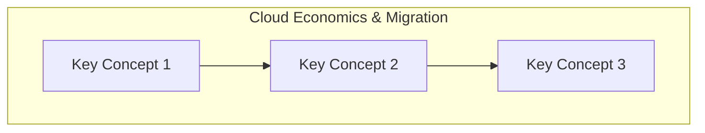

# Cloud Economics & Migration

> **Domain 1: Domain 1: Cloud Concepts (24%)** | **Topic 3** | **Status:** not_started

## 📚 Learning Objectives

- [ ] Define the benefits of the AWS Cloud
- [ ] Identify design principles of the AWS Cloud
- [ ] Understand migration strategies to AWS
- [ ] Understand cloud economics

## 🎯 Key Concepts

### TCO vs ROI

### CAPEX vs OPEX

### Fixed vs variable costs

### AWS Cloud Adoption Framework (AWS CAF)

### Migration tools: AWS DMS, Snow Family, Migration Evaluator

## 📖 Study Resources

- ExamPro: TCO and Migration
- freeCodeCamp: 7:00:00–7:30:00

## 🔗 Related Services

*List AWS services related to this topic*

## 📊 Diagram

## 🧠 Key Takeaways

- **Important Point 1**: Description
- **Important Point 2**: Description
- **Important Point 3**: Description

## ❓ Practice Questions

1. **Question 1**: What is...?
   - A) Option A
   - B) Option B
   - C) Option C
   - D) Option D
   - **Answer**: B

2. **Question 2**: Which service...?
   - A) Option A
   - B) Option B
   - C) Option C
   - D) Option D
   - **Answer**: C

## 🔗 Integration with Microservices

*How this topic relates to microservices architecture*

## 📚 References

- [AWS Official Documentation](https://docs.aws.amazon.com/)
- [AWS Well-Architected Framework](https://aws.amazon.com/architecture/well-architected/)
- [AWS Free Tier](https://aws.amazon.com/free/)

---

*Last updated: 9/9/2025*
*Next: [TCO vs ROI](./README.md)*
