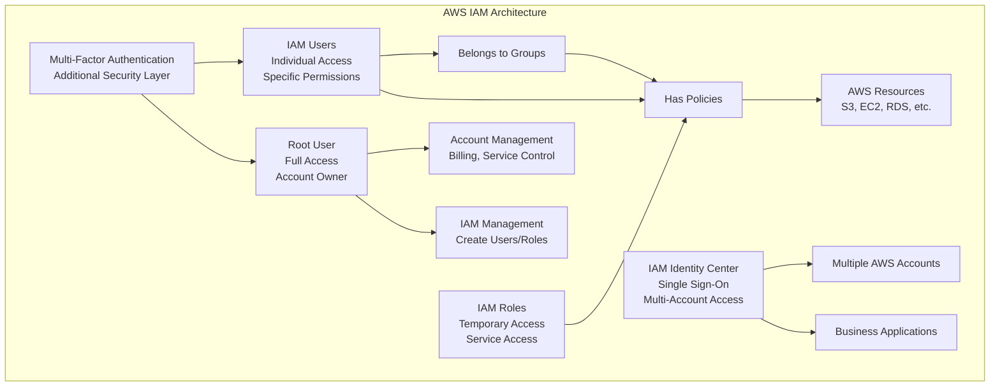

# Identity & Access Management (IAM)

> **Domain 2: Security and Compliance (30%)** | **Section 11** | **Status:** In Progress

## 📚 Learning Objectives

- [ ] Understand IAM users, groups, roles, and policies
- [ ] Learn about the principle of least privilege
- [ ] Understand Multi-Factor Authentication (MFA)
- [ ] Learn about AWS IAM Identity Center (SSO)
- [ ] Understand root user protection and best practices
- [ ] Learn about IAM policy types and evaluation
- [ ] Understand cross-account access and federation

## 🎯 Key Concepts

### IAM Overview

**Overview**: AWS Identity and Access Management (IAM) enables you to manage access to AWS services and resources securely.

**IAM Features**:
- **Centralized Access Control**: Manage access to AWS resources
- **Fine-grained Permissions**: Control what users can do
- **Multi-factor Authentication**: Add extra security layer
- **Identity Federation**: Use existing corporate identities
- **Free Service**: No additional charges for IAM

### IAM Users

**Overview**: Individual accounts for people or applications that need access to AWS resources.

**User Features**:
- **Unique Identity**: Each user has unique credentials
- **Access Keys**: Programmatic access to AWS APIs
- **Console Access**: Web-based access to AWS Management Console
- **Permissions**: Attached via policies
- **MFA Support**: Additional security layer

**User Types**:
- **Root User**: Account owner with full access
- **IAM User**: Individual user with specific permissions
- **Service User**: Application or service account

**User Best Practices**:
- **Never share credentials**: Each user should have their own
- **Use strong passwords**: Complex passwords with special characters
- **Enable MFA**: Multi-factor authentication for all users
- **Regular access reviews**: Audit user access regularly

### IAM Groups

**Overview**: Collection of IAM users for easier permission management.

**Group Features**:
- **Permission Inheritance**: Users inherit group permissions
- **Easier Management**: Manage permissions for multiple users
- **No Direct Access**: Groups cannot access AWS directly
- **Nested Groups**: Not supported (groups cannot contain other groups)

**Group Use Cases**:
- **Department-based**: Developers, Administrators, ReadOnly
- **Project-based**: Project-specific permissions
- **Role-based**: Based on job functions

### IAM Roles

**Overview**: Identity with permissions that can be assumed by users, applications, or AWS services.

**Role Features**:
- **Temporary Credentials**: Short-lived access credentials
- **Cross-account Access**: Access resources in other accounts
- **Service Roles**: Used by AWS services
- **Instance Roles**: Used by EC2 instances
- **Assume Role**: Switch to different permissions

**Role Types**:
- **Service Roles**: Used by AWS services
- **Service-linked Roles**: Predefined roles for specific services
- **Cross-account Roles**: Access resources in other accounts
- **Instance Roles**: Used by EC2 instances

**Role Best Practices**:
- **Least Privilege**: Grant minimum required permissions
- **Regular Rotation**: Rotate access keys regularly
- **Monitor Usage**: Track role usage and access patterns
- **Time-limited**: Use short session durations

### IAM Policies

**Overview**: Documents that define permissions for users, groups, and roles.

**Policy Types**:
- **Identity-based Policies**: Attached to users, groups, or roles
- **Resource-based Policies**: Attached to AWS resources
- **Permission Boundaries**: Limit maximum permissions
- **Organizations SCPs**: Control permissions across accounts
- **Access Control Lists (ACLs)**: Legacy access control

**Policy Structure**:
```json
{
  "Version": "2012-10-17",
  "Statement": [
    {
      "Effect": "Allow",
      "Action": "s3:GetObject",
      "Resource": "arn:aws:s3:::my-bucket/*"
    }
  ]
}
```

**Policy Elements**:
- **Effect**: Allow or Deny
- **Action**: What actions are allowed/denied
- **Resource**: Which resources the policy applies to
- **Condition**: When the policy applies
- **Principal**: Who the policy applies to

### Multi-Factor Authentication (MFA)

**Overview**: Additional security layer requiring users to provide two or more verification factors.

**MFA Types**:
- **Virtual MFA Device**: Software-based (Google Authenticator, Authy)
- **Hardware MFA Device**: Physical device (YubiKey, Gemalto)
- **SMS MFA**: Text message to mobile phone
- **U2F Security Key**: Universal 2nd Factor security key

**MFA Best Practices**:
- **Enable for Root User**: Always enable MFA for root user
- **Enable for IAM Users**: Enable MFA for all IAM users
- **Backup Codes**: Keep backup codes in secure location
- **Multiple Devices**: Register multiple MFA devices

### AWS IAM Identity Center (SSO)

**Overview**: Cloud-based service that makes it easy to centrally manage access to multiple AWS accounts and business applications.

**Identity Center Features**:
- **Single Sign-On**: One login for multiple applications
- **Centralized Management**: Manage users and access centrally
- **Multi-account Access**: Access multiple AWS accounts
- **Application Integration**: Integrate with business applications
- **Identity Federation**: Use existing corporate identities

**Identity Center Components**:
- **Identity Store**: User and group directory
- **Permission Sets**: Collections of permissions
- **Account Assignments**: Link users to accounts with permission sets
- **Access Portals**: Web-based access to applications

### Root User Protection

**Overview**: The root user has complete access to all AWS services and resources in the account.

**Root User Features**:
- **Full Access**: Cannot be restricted by IAM policies
- **Account Management**: Can close account, change billing
- **Service Management**: Can enable/disable services
- **IAM Management**: Can create and manage IAM users/roles

**Root User Best Practices**:
- **Never Use for Daily Tasks**: Create IAM users for daily operations
- **Enable MFA**: Always enable MFA for root user
- **Use Strong Password**: Complex, unique password
- **Limit Access**: Use root user only when necessary
- **Monitor Usage**: Track root user activity

### IAM Policy Evaluation

**Overview**: How AWS determines whether to allow or deny a request.

**Evaluation Process**:
1. **Check for Explicit Deny**: If any policy explicitly denies, request is denied
2. **Check for Explicit Allow**: If any policy explicitly allows, request is allowed
3. **Default Deny**: If no explicit allow, request is denied

**Evaluation Order**:
1. **Organizations SCPs**: Service Control Policies
2. **Resource-based Policies**: Policies attached to resources
3. **Identity-based Policies**: Policies attached to users/groups/roles
4. **Permission Boundaries**: Maximum permissions allowed

### Cross-Account Access

**Overview**: Allowing users or services in one AWS account to access resources in another account.

**Cross-Account Methods**:
- **Cross-Account Roles**: Assume roles in other accounts
- **Resource-based Policies**: Grant access from other accounts
- **IAM Identity Center**: Centralized cross-account access
- **AWS Organizations**: Manage multiple accounts

**Cross-Account Best Practices**:
- **Use Roles**: Prefer roles over sharing access keys
- **Least Privilege**: Grant minimum required permissions
- **Audit Access**: Monitor cross-account access
- **Time Limits**: Use short session durations

## 📊 IAM Architecture Diagram



## 🧠 Key Takeaways

- **IAM is free**: No additional charges for IAM services
- **Root user has full access**: Cannot be restricted by IAM policies
- **Use least privilege**: Grant minimum required permissions
- **Enable MFA**: Always enable MFA for security
- **Use roles for services**: Prefer roles over access keys for applications
- **Groups simplify management**: Use groups to manage permissions for multiple users
- **Policies define permissions**: Attach policies to users, groups, or roles
- **Monitor access**: Regularly audit and review access permissions

## ❓ Practice Questions

1. **Question**: What is the main difference between IAM users and IAM roles?
   - A) Users can have MFA, roles cannot
   - B) Users have permanent credentials, roles have temporary credentials
   - C) Users are free, roles cost money
   - D) Users can access the console, roles cannot
   - **Answer**: B - Users have permanent credentials, roles have temporary credentials

2. **Question**: Which IAM policy type would be best for limiting the maximum permissions a user can have?
   - A) Identity-based policy
   - B) Resource-based policy
   - C) Permission boundary
   - D) Organizations SCP
   - **Answer**: C - Permission boundaries limit the maximum permissions a user can have

3. **Question**: What is the recommended approach for granting an application access to AWS services?
   - A) Create an IAM user with access keys
   - B) Create an IAM role and assume it
   - C) Use the root user credentials
   - D) Share access keys between applications
   - **Answer**: B - Create an IAM role and assume it for applications

4. **Question**: Which MFA option provides the highest level of security?
   - A) SMS MFA
   - B) Virtual MFA device
   - C) Hardware MFA device
   - D) Email MFA
   - **Answer**: C - Hardware MFA devices provide the highest level of security

## 🔗 Integration with Microservices

**IAM in Microservices Architecture**:
- **Service roles for microservices**: Each microservice can have its own IAM role
- **Cross-service permissions**: Microservices can access each other's resources
- **Least privilege principle**: Each microservice gets only the permissions it needs
- **Temporary credentials**: Use IAM roles for secure service-to-service communication
- **Centralized identity management**: Use IAM Identity Center for multi-account microservices
- **Audit and monitoring**: Track microservice access patterns and permissions

## 📚 References

- [AWS IAM Documentation](https://docs.aws.amazon.com/iam/)
- [AWS IAM Identity Center Documentation](https://docs.aws.amazon.com/singlesignon/)
- [AWS IAM Best Practices](https://docs.aws.amazon.com/IAM/latest/UserGuide/best-practices.html)
- [AWS IAM Policy Reference](https://docs.aws.amazon.com/IAM/latest/UserGuide/reference_policies.html)
- [AWS Well-Architected Framework - Security](https://aws.amazon.com/architecture/well-architected/)

---

*Last updated: January 27, 2025*
*Next: [Billing, Pricing, and Support](./billing-pricing.md)*
