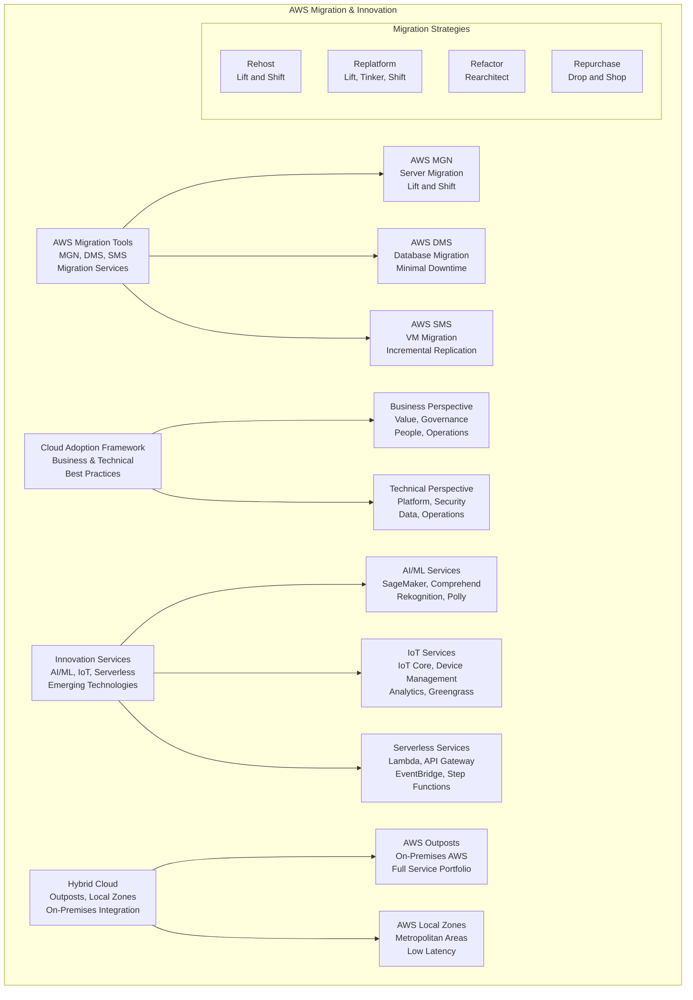

# Migration & Innovation

> **Domain 1: Cloud Concepts (24%)** | **Section 16** | **Status:** In Progress

## 📚 Learning Objectives

- [ ] Understand AWS migration strategies and approaches
- [ ] Learn about AWS migration tools and services
- [ ] Explore cloud adoption frameworks and best practices
- [ ] Understand innovation services like AI/ML and IoT
- [ ] Learn about hybrid cloud and multi-cloud strategies
- [ ] Understand migration planning and execution
- [ ] Learn about cost optimization during migration

## 🎯 Key Concepts

### AWS Migration Strategies

#### 6 R's of Migration
1. **Rehost (Lift and Shift)**: Move applications without changes
2. **Replatform (Lift, Tinker, and Shift)**: Make minor optimizations
3. **Refactor (Rearchitect)**: Redesign applications for cloud
4. **Repurchase (Drop and Shop)**: Replace with SaaS solutions
5. **Retire**: Decommission unused applications
6. **Retain**: Keep applications on-premises

#### Migration Approaches
- **Big Bang**: Migrate everything at once
- **Pilot Light**: Migrate core services first
- **Lift and Shift**: Move applications as-is
- **Gradual Migration**: Migrate incrementally

### AWS Migration Tools

#### AWS Application Migration Service (MGN)
**Overview**: Lift-and-shift migration service for physical, virtual, and cloud servers.

**Features**:
- **Agentless**: No agents required on source servers
- **Continuous Replication**: Real-time data replication
- **Automated Conversion**: Convert to native AWS instances
- **Testing**: Test migrated applications before cutover
- **Rollback**: Easy rollback if needed

#### AWS Database Migration Service (DMS)
**Overview**: Migrate databases to AWS with minimal downtime.

**Features**:
- **Homogeneous Migrations**: Same database engine
- **Heterogeneous Migrations**: Different database engines
- **Continuous Replication**: Minimal downtime migration
- **Schema Conversion**: Convert database schemas
- **Data Validation**: Verify migration accuracy

#### AWS Server Migration Service (SMS)
**Overview**: Migrate on-premises workloads to AWS.

**Features**:
- **VM Migration**: Migrate virtual machines
- **Incremental Replication**: Only replicate changes
- **Scheduling**: Schedule migration windows
- **Testing**: Test before migration
- **Rollback**: Easy rollback capability

### Cloud Adoption Framework

#### Business Perspective
- **Business Value**: Align cloud adoption with business goals
- **Governance**: Establish cloud governance
- **People**: Develop cloud skills and culture
- **Operations**: Optimize cloud operations

#### Technical Perspective
- **Platform**: Choose appropriate cloud platforms
- **Security**: Implement security best practices
- **Data**: Manage data lifecycle
- **Operations**: Monitor and optimize

### Innovation Services

#### Artificial Intelligence and Machine Learning
- **Amazon SageMaker**: Build, train, and deploy ML models
- **Amazon Comprehend**: Natural language processing
- **Amazon Rekognition**: Image and video analysis
- **Amazon Polly**: Text-to-speech service
- **Amazon Lex**: Build conversational interfaces
- **Amazon Transcribe**: Speech-to-text service

#### Internet of Things (IoT)
- **AWS IoT Core**: Connect IoT devices to the cloud
- **AWS IoT Device Management**: Manage IoT devices
- **AWS IoT Analytics**: Analyze IoT data
- **AWS IoT Greengrass**: Edge computing for IoT
- **AWS IoT SiteWise**: Industrial IoT data collection

#### Serverless Computing
- **AWS Lambda**: Run code without servers
- **Amazon API Gateway**: Build serverless APIs
- **Amazon EventBridge**: Event-driven serverless
- **AWS Step Functions**: Serverless workflows
- **Amazon DynamoDB**: Serverless database

### Hybrid Cloud Strategies

#### AWS Outposts
**Overview**: Bring AWS services to your on-premises data center.

**Features**:
- **AWS Services**: Full AWS services on-premises
- **Consistent Experience**: Same APIs and tools
- **Hybrid Applications**: Build hybrid applications
- **Data Residency**: Keep data on-premises
- **Low Latency**: Reduce latency for local applications

#### AWS Local Zones
**Overview**: Extend AWS infrastructure to metropolitan areas.

**Features**:
- **Low Latency**: Single-digit millisecond latency
- **Full AWS Services**: Complete AWS service portfolio
- **Easy Migration**: Seamless migration from on-premises
- **Compliance**: Meet data residency requirements

### Migration Planning

#### Assessment Phase
- **Application Discovery**: Discover and catalog applications
- **Dependency Mapping**: Map application dependencies
- **Performance Baseline**: Establish current performance
- **Cost Analysis**: Analyze current costs
- **Risk Assessment**: Identify migration risks

#### Migration Phase
- **Pilot Migration**: Start with pilot applications
- **Data Migration**: Migrate data and databases
- **Application Migration**: Migrate applications
- **Testing**: Comprehensive testing
- **Cutover**: Switch to cloud environment

#### Optimization Phase
- **Performance Optimization**: Optimize for cloud
- **Cost Optimization**: Reduce cloud costs
- **Security Hardening**: Implement security best practices
- **Monitoring**: Set up monitoring and alerting
- **Training**: Train teams on cloud services

## 📊 Migration Architecture Diagram

## 🧠 Key Takeaways

- **6 R's of Migration**: Rehost, Replatform, Refactor, Repurchase, Retire, Retain
- **Choose the right strategy**: Different approaches for different applications
- **Use migration tools**: MGN, DMS, SMS for different migration types
- **Follow cloud adoption framework**: Business and technical perspectives
- **Leverage innovation services**: AI/ML, IoT, serverless for competitive advantage
- **Plan hybrid cloud**: Use Outposts and Local Zones for hybrid strategies
- **Assess before migrating**: Understand applications and dependencies
- **Optimize after migration**: Continuous improvement and cost optimization

## ❓ Practice Questions

1. **Question**: Which migration strategy involves moving applications to the cloud without making changes?
   - A) Replatform
   - B) Refactor
   - C) Rehost
   - D) Repurchase
   - **Answer**: C - Rehost (lift and shift) moves applications without changes

2. **Question**: Which AWS service would be best for migrating databases with minimal downtime?
   - A) AWS MGN
   - B) AWS DMS
   - C) AWS SMS
   - D) AWS Outposts
   - **Answer**: B - DMS is specifically designed for database migration

3. **Question**: What is the main benefit of AWS Outposts?
   - A) Lower cost
   - B) Bring AWS services on-premises
   - C) Faster migration
   - D) Better security
   - **Answer**: B - Outposts brings AWS services to your on-premises data center

4. **Question**: Which service would be best for building machine learning models?
   - A) Amazon S3
   - B) Amazon EC2
   - C) Amazon SageMaker
   - D) Amazon RDS
   - **Answer**: C - SageMaker is designed for building, training, and deploying ML models

## 🔗 Integration with Microservices

**Migration & Innovation in Microservices Architecture**:
- **Migrate to microservices**: Break down monolithic applications
- **Use serverless for microservices**: Lambda for lightweight microservices
- **Implement event-driven architecture**: Use EventBridge for microservice communication
- **Leverage AI/ML services**: Add intelligence to microservices
- **Use IoT for microservice data**: Collect data from IoT devices
- **Hybrid microservices**: Run microservices on-premises and in cloud
- **Container migration**: Migrate to ECS/EKS for microservices
- **API-first migration**: Expose microservices through API Gateway

## 📚 References

- [AWS Migration Hub](https://aws.amazon.com/migration/)
- [AWS Application Migration Service](https://aws.amazon.com/application-migration-service/)
- [AWS Database Migration Service](https://aws.amazon.com/dms/)
- [AWS Cloud Adoption Framework](https://aws.amazon.com/professional-services/CAF/)
- [AWS AI/ML Services](https://aws.amazon.com/machine-learning/)
- [AWS IoT Services](https://aws.amazon.com/iot/)
- [AWS Well-Architected Framework](https://aws.amazon.com/architecture/well-architected/)

---

*Last updated: January 27, 2025*
*Next: [Well-Architected Framework](./well-architected.md)*