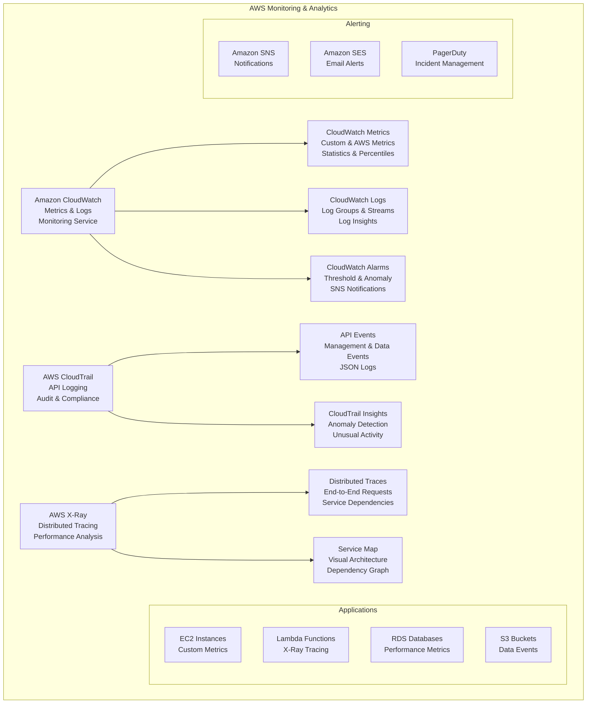

# Monitoring & Analytics

> **Domain 3: Cloud Technology and Services (34%)** | **Section 14** | **Status:** In Progress

## 📚 Learning Objectives

- [ ] Understand Amazon CloudWatch for monitoring and observability
- [ ] Learn about AWS CloudTrail for audit and compliance
- [ ] Explore AWS X-Ray for distributed tracing
- [ ] Understand monitoring best practices and strategies
- [ ] Learn about log management and analysis
- [ ] Understand alerting and notification systems
- [ ] Learn about performance optimization through monitoring

## 🎯 Key Concepts

### Amazon CloudWatch

**Overview**: Monitoring and observability service for AWS resources and applications.

**CloudWatch Features**:
- **Metrics**: Collect and track custom and AWS metrics
- **Logs**: Centralized log management and analysis
- **Alarms**: Automated alerting based on thresholds
- **Dashboards**: Visualize metrics and logs
- **Insights**: Automated anomaly detection
- **Synthetics**: Monitor application endpoints

**CloudWatch Metrics**:
- **AWS Metrics**: Pre-built metrics for AWS services
- **Custom Metrics**: Application-specific metrics
- **Namespace**: Logical container for metrics
- **Dimensions**: Key-value pairs for metric identification
- **Statistics**: Min, Max, Average, Sum, SampleCount
- **Percentiles**: P50, P95, P99 for performance analysis

**CloudWatch Logs**:
- **Log Groups**: Container for log streams
- **Log Streams**: Sequence of log events
- **Log Insights**: Query and analyze log data
- **Log Filters**: Real-time log processing
- **Metric Filters**: Extract metrics from logs
- **Retention**: Configurable log retention periods

**CloudWatch Alarms**:
- **Threshold Alarms**: Alert when metric exceeds threshold
- **Anomaly Detection**: ML-based anomaly detection
- **Composite Alarms**: Combine multiple alarms
- **Actions**: SNS, Auto Scaling, EC2 actions
- **State**: OK, ALARM, INSUFFICIENT_DATA

### AWS CloudTrail

**Overview**: Service that enables governance, compliance, and operational auditing of AWS account activity.

**CloudTrail Features**:
- **API Logging**: Log all API calls to AWS services
- **Event History**: 90-day event history
- **CloudTrail Lake**: Long-term data retention and analysis
- **Insights**: Detect unusual API activity
- **Data Events**: Log data plane operations
- **Management Events**: Log control plane operations

**CloudTrail Event Types**:
- **Management Events**: Create, modify, delete resources
- **Data Events**: S3 object-level, Lambda function execution
- **Insights Events**: Unusual API activity patterns
- **Lookup Events**: API calls that don't modify resources

**CloudTrail Logs**:
- **JSON Format**: Structured log format
- **Event Fields**: EventTime, EventName, UserIdentity, SourceIPAddress
- **Encryption**: Server-side encryption with KMS
- **Integrity Validation**: Verify log file integrity
- **Multi-region**: Enable across multiple regions

### AWS X-Ray

**Overview**: Service for analyzing and debugging distributed applications.

**X-Ray Features**:
- **Distributed Tracing**: Trace requests across services
- **Service Map**: Visual representation of service architecture
- **Trace Analysis**: Analyze trace data and patterns
- **Sampling**: Control trace sampling rates
- **Annotations**: Add custom metadata to traces
- **Segments**: Individual service components

**X-Ray Components**:
- **Traces**: End-to-end request paths
- **Segments**: Individual service work
- **Subsegments**: Work within a segment
- **Annotations**: Key-value pairs for filtering
- **Metadata**: Additional trace information
- **Service Map**: Visual service dependencies

**X-Ray Integration**:
- **AWS Services**: Lambda, API Gateway, ECS, EKS
- **Applications**: Java, .NET, Node.js, Python, Go
- **SDKs**: X-Ray SDKs for various languages
- **Instrumentation**: Automatic and manual instrumentation

### Monitoring Best Practices

#### Application Monitoring
- **Custom Metrics**: Track business-specific metrics
- **Log Aggregation**: Centralize logs from all services
- **Error Tracking**: Monitor and alert on errors
- **Performance Monitoring**: Track response times and throughput
- **User Experience**: Monitor end-user experience

#### Infrastructure Monitoring
- **Resource Utilization**: CPU, memory, disk, network
- **Capacity Planning**: Monitor resource usage trends
- **Health Checks**: Monitor service health
- **Dependency Monitoring**: Monitor external dependencies
- **Cost Monitoring**: Track resource costs

#### Security Monitoring
- **Access Logging**: Monitor user access patterns
- **Anomaly Detection**: Detect unusual activity
- **Compliance**: Meet regulatory requirements
- **Incident Response**: Quick response to security events
- **Audit Trails**: Maintain complete audit trails

## 📊 Monitoring Architecture Diagram

## 🧠 Key Takeaways

- **CloudWatch is the central monitoring service**: Metrics, logs, alarms, dashboards
- **CloudTrail provides audit and compliance**: API logging and event history
- **X-Ray enables distributed tracing**: Debug and analyze distributed applications
- **Use custom metrics**: Track application-specific KPIs
- **Implement comprehensive logging**: Centralize logs for analysis
- **Set up proper alerting**: Proactive monitoring and incident response
- **Monitor costs**: Track resource usage and costs
- **Follow monitoring best practices**: Comprehensive observability strategy

## ❓ Practice Questions

1. **Question**: Which AWS service would be best for monitoring API calls and ensuring compliance?
   - A) Amazon CloudWatch
   - B) AWS CloudTrail
   - C) AWS X-Ray
   - D) Amazon SNS
   - **Answer**: B - CloudTrail is specifically designed for API logging and compliance

2. **Question**: What is the main purpose of AWS X-Ray?
   - A) Monitor resource utilization
   - B) Log API calls
   - C) Trace distributed applications
   - D) Send notifications
   - **Answer**: C - X-Ray is designed for distributed tracing and performance analysis

3. **Question**: Which CloudWatch feature allows you to query and analyze log data?
   - A) CloudWatch Metrics
   - B) CloudWatch Logs
   - C) CloudWatch Insights
   - D) CloudWatch Alarms
   - **Answer**: C - CloudWatch Logs Insights allows you to query and analyze log data

4. **Question**: What is the maximum retention period for CloudTrail event history?
   - A) 30 days
   - B) 60 days
   - C) 90 days
   - D) 1 year
   - **Answer**: C - CloudTrail provides 90 days of event history by default

## 🔗 Integration with Microservices

**Monitoring in Microservices Architecture**:
- **Distributed tracing with X-Ray**: Trace requests across microservices
- **Centralized logging**: Aggregate logs from all microservices
- **Service-specific metrics**: Monitor each microservice independently
- **Health checks**: Monitor microservice health and availability
- **Dependency monitoring**: Track inter-service communication
- **Performance monitoring**: Monitor response times and throughput
- **Error tracking**: Track and alert on microservice errors
- **Cost monitoring**: Track costs per microservice

## 📚 References

- [Amazon CloudWatch Documentation](https://docs.aws.amazon.com/cloudwatch/)
- [AWS CloudTrail Documentation](https://docs.aws.amazon.com/cloudtrail/)
- [AWS X-Ray Documentation](https://docs.aws.amazon.com/xray/)
- [AWS Well-Architected Framework - Operational Excellence](https://aws.amazon.com/architecture/well-architected/)

---

*Last updated: January 27, 2025*
*Next: [Application Integration](./application-integration.md)*
