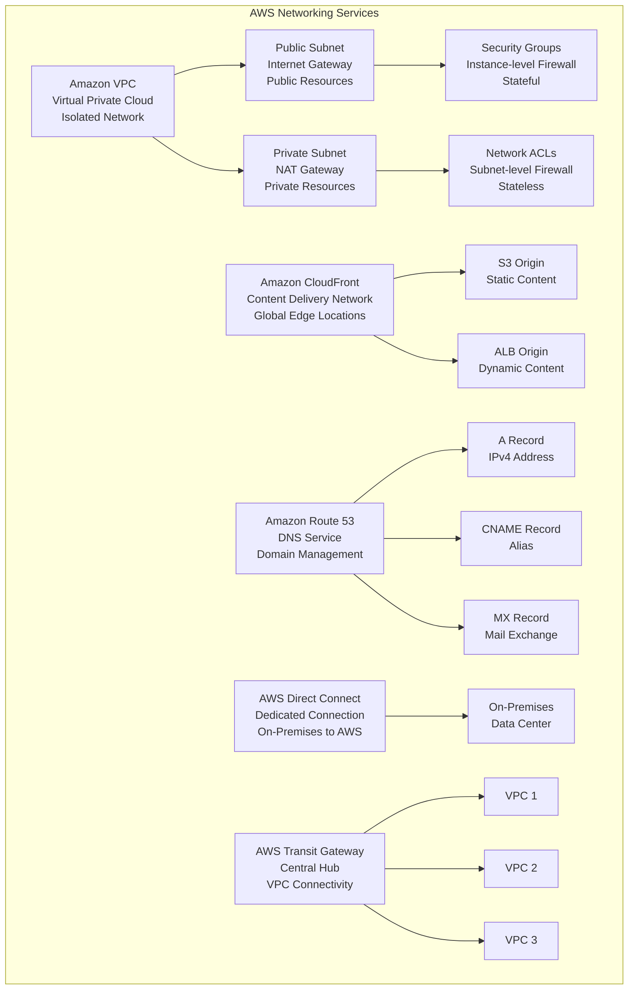

# AWS Core Services - Networking

> **Domain 3: Cloud Technology and Services (34%)** | **Section 9** | **Status:** In Progress

## 📚 Learning Objectives

- [ ] Understand Amazon VPC and its components
- [ ] Learn about subnets, route tables, and internet gateways
- [ ] Understand security groups and network ACLs
- [ ] Explore Amazon CloudFront for content delivery
- [ ] Learn about Route 53 for DNS management
- [ ] Understand AWS Direct Connect for dedicated connections
- [ ] Learn about VPN and AWS Transit Gateway

## 🎯 Key Concepts

### Amazon VPC (Virtual Private Cloud)

**Overview**: Isolated virtual network in the AWS cloud where you can launch AWS resources.

**VPC Components**:
- **VPC**: Virtual network isolated from other VPCs
- **Subnets**: Subdivision of VPC IP address range
- **Route Tables**: Control traffic routing between subnets
- **Internet Gateway**: Enables internet access for VPC
- **NAT Gateway/Instance**: Enables outbound internet access for private subnets
- **VPC Peering**: Connect VPCs together
- **Transit Gateway**: Central hub for VPC connections

**VPC Features**:
- **Custom IP Address Range**: Choose your own CIDR block
- **Multiple Subnets**: Public and private subnets
- **Security Groups**: Stateful firewall at instance level
- **Network ACLs**: Stateless firewall at subnet level
- **Flow Logs**: Monitor network traffic

### Subnets

**Overview**: Subdivision of VPC IP address range, located in specific Availability Zones.

**Subnet Types**:
- **Public Subnet**: Has route to Internet Gateway
  - Resources can have public IP addresses
  - Use cases: Web servers, load balancers, NAT gateways

- **Private Subnet**: No direct route to Internet Gateway
  - Resources cannot have public IP addresses
  - Use cases: Databases, application servers, internal services

**Subnet Features**:
- **AZ-specific**: Each subnet exists in one AZ
- **CIDR blocks**: Define IP address range
- **Route tables**: Control traffic routing
- **Auto-assign public IP**: Automatically assign public IPs

### Security Groups

**Overview**: Virtual firewall that controls inbound and outbound traffic for EC2 instances.

**Security Group Features**:
- **Stateful**: Return traffic automatically allowed
- **Instance-level**: Applied to individual instances
- **Default deny**: All traffic denied by default
- **Rules**: Allow specific traffic based on protocol, port, source
- **Multiple groups**: Instance can belong to multiple security groups

**Security Group Rules**:
- **Type**: Protocol (TCP, UDP, ICMP, etc.)
- **Port Range**: Specific port or range
- **Source/Destination**: IP address or security group
- **Description**: Optional description for rule

### Network ACLs (NACLs)

**Overview**: Stateless firewall that controls traffic at the subnet level.

**NACL Features**:
- **Stateless**: Both inbound and outbound rules must be defined
- **Subnet-level**: Applied to entire subnet
- **Default allow**: All traffic allowed by default
- **Rule numbers**: Processed in numerical order
- **Explicit deny**: Can explicitly deny traffic

**NACL vs Security Groups**:
- **NACL**: Subnet-level, stateless, default allow
- **Security Group**: Instance-level, stateful, default deny

### Amazon CloudFront

**Overview**: Global content delivery network (CDN) that delivers content with low latency.

**CloudFront Features**:
- **Global Edge Locations**: 400+ locations worldwide
- **Caching**: Cache content at edge locations
- **HTTPS**: SSL/TLS encryption
- **Custom Error Pages**: Custom error handling
- **Geographic Restrictions**: Block content by country
- **Price Classes**: Choose edge locations based on cost

**CloudFront Origins**:
- **S3 Buckets**: Static website hosting
- **EC2 Instances**: Dynamic content
- **Load Balancers**: Application load balancers
- **Custom Origins**: Any HTTP/HTTPS server

**CloudFront Behaviors**:
- **Path Patterns**: Route requests based on URL
- **Cache Policies**: Control caching behavior
- **Origin Request Policies**: Modify requests to origin
- **Response Headers Policies**: Add/modify response headers

### Amazon Route 53

**Overview**: Scalable DNS web service for domain registration and routing.

**Route 53 Features**:
- **Domain Registration**: Register and manage domains
- **DNS Resolution**: Convert domain names to IP addresses
- **Health Checks**: Monitor resource health
- **Traffic Routing**: Route traffic based on policies
- **Private DNS**: Internal DNS for VPCs

**Route 53 Record Types**:
- **A**: IPv4 address
- **AAAA**: IPv6 address
- **CNAME**: Canonical name (alias)
- **MX**: Mail exchange
- **TXT**: Text records
- **NS**: Name server

**Route 53 Routing Policies**:
- **Simple**: Single resource
- **Weighted**: Distribute traffic by weight
- **Latency**: Route to lowest latency
- **Failover**: Active-passive failover
- **Geolocation**: Route based on user location
- **Geoproximity**: Route based on geographic distance
- **Multivalue**: Multiple healthy resources

### AWS Direct Connect

**Overview**: Dedicated network connection from on-premises to AWS.

**Direct Connect Features**:
- **Dedicated Connection**: 1 Gbps or 10 Gbps
- **Hosted Connection**: 50 Mbps to 10 Gbps
- **Private Connectivity**: Traffic doesn't go over internet
- **Reduced Data Transfer Costs**: Lower egress costs
- **Consistent Performance**: Predictable network performance
- **Hybrid Cloud**: Connect on-premises to AWS

**Direct Connect Components**:
- **Connection**: Physical connection to AWS
- **Virtual Interface**: Logical connection
- **VLAN**: Virtual LAN for traffic separation
- **BGP**: Border Gateway Protocol for routing

### VPN (Virtual Private Network)

**Overview**: Secure connection between on-premises and AWS VPC.

**VPN Types**:
- **Site-to-Site VPN**: Connect on-premises network to VPC
- **Client VPN**: Connect individual devices to VPC
- **AWS VPN CloudHub**: Connect multiple sites through AWS

**VPN Features**:
- **IPsec Encryption**: Secure data transmission
- **Static/Dynamic Routing**: Route traffic to AWS
- **High Availability**: Multiple VPN connections
- **Cost-effective**: Lower cost than Direct Connect

### AWS Transit Gateway

**Overview**: Central hub for connecting VPCs and on-premises networks.

**Transit Gateway Features**:
- **Centralized Management**: Single point of control
- **Route Tables**: Control traffic routing
- **Peering**: Connect multiple VPCs
- **Cross-Region**: Connect VPCs across regions
- **Shared Services**: Share resources across VPCs

## 📊 Networking Architecture Diagram

## 🧠 Key Takeaways

- **VPC is your private network**: Isolated virtual network in AWS
- **Subnets are AZ-specific**: Each subnet exists in one Availability Zone
- **Security Groups are stateful**: Return traffic automatically allowed
- **NACLs are stateless**: Both inbound and outbound rules must be defined
- **CloudFront is global CDN**: Cache content at edge locations worldwide
- **Route 53 is DNS service**: Domain registration and traffic routing
- **Direct Connect is dedicated**: Private connection from on-premises to AWS
- **Transit Gateway is central hub**: Connect multiple VPCs and networks

## ❓ Practice Questions

1. **Question**: What is the main difference between a public subnet and a private subnet?
   - A) Public subnets have more IP addresses
   - B) Public subnets have a route to an Internet Gateway
   - C) Private subnets are more secure
   - D) Private subnets are in different regions
   - **Answer**: B - Public subnets have a route to an Internet Gateway, private subnets do not

2. **Question**: Which AWS service would be best for delivering static content globally with low latency?
   - A) Amazon VPC
   - B) Amazon CloudFront
   - C) Amazon Route 53
   - D) AWS Direct Connect
   - **Answer**: B - CloudFront is a global CDN for content delivery

3. **Question**: What is the difference between Security Groups and Network ACLs?
   - A) Security Groups are stateless, NACLs are stateful
   - B) Security Groups are subnet-level, NACLs are instance-level
   - C) Security Groups are stateful, NACLs are stateless
   - D) Security Groups are more expensive
   - **Answer**: C - Security Groups are stateful (return traffic allowed), NACLs are stateless (both directions must be defined)

4. **Question**: Which service would be best for connecting an on-premises data center to AWS with consistent performance?
   - A) VPN
   - B) AWS Direct Connect
   - C) Internet Gateway
   - D) Transit Gateway
   - **Answer**: B - Direct Connect provides dedicated, consistent performance connection

## 🔗 Integration with Microservices

**Networking in Microservices Architecture**:
- **VPC for microservice isolation**: Each microservice can be in its own subnet
- **Security Groups for microservice security**: Control traffic between microservices
- **CloudFront for microservice APIs**: Cache API responses globally
- **Route 53 for microservice discovery**: DNS-based service discovery
- **Load balancers for microservice routing**: Distribute traffic across microservice instances
- **Private subnets for microservice databases**: Keep databases secure
- **Transit Gateway for microservice connectivity**: Connect microservices across VPCs

## 📚 References

- [Amazon VPC Documentation](https://docs.aws.amazon.com/vpc/)
- [Amazon CloudFront Documentation](https://docs.aws.amazon.com/cloudfront/)
- [Amazon Route 53 Documentation](https://docs.aws.amazon.com/route53/)
- [AWS Direct Connect Documentation](https://docs.aws.amazon.com/directconnect/)
- [AWS Transit Gateway Documentation](https://docs.aws.amazon.com/vpc/latest/tgw/)
- [AWS Well-Architected Framework - Networking](https://aws.amazon.com/architecture/well-architected/)

---

*Last updated: January 27, 2025*
*Next: [Security & Compliance](./security-compliance.md)*
