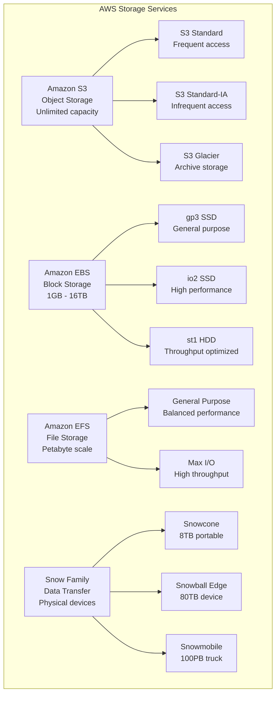

# AWS Core Services - Storage

> **Domain 3: Cloud Technology and Services (34%)** | **Section 7** | **Status:** In Progress

## 📚 Learning Objectives

- [ ] Understand Amazon S3 storage classes and use cases
- [ ] Learn Amazon EBS volume types and features
- [ ] Explore Amazon EFS for file storage
- [ ] Understand AWS Snow Family for data transfer
- [ ] Learn storage lifecycle management and cost optimization
- [ ] Identify appropriate storage solutions for different workloads

## 🎯 Key Concepts

### Amazon S3 (Simple Storage Service)

**Overview**: Object storage service offering industry-leading scalability, data availability, security, and performance.

**Storage Classes**:
- **S3 Standard**: General-purpose storage for frequently accessed data
  - 99.999999999% (11 9's) durability
  - 99.99% availability SLA
  - Millisecond access time
  - Use cases: websites, content distribution, mobile apps

- **S3 Standard-IA (Infrequent Access)**: For data accessed less frequently
  - Lower storage cost, higher retrieval cost
  - 99.999999999% durability
  - 99.9% availability SLA
  - 30-day minimum storage duration
  - Use cases: backups, disaster recovery, long-term storage

- **S3 One Zone-IA**: Lower-cost option for infrequently accessed data
  - Stored in single AZ (less resilient)
  - 20% less expensive than Standard-IA
  - Use cases: secondary backup copies, data you can recreate

- **S3 Glacier**: Archive storage for long-term retention
  - 99.999999999% durability
  - 3 retrieval options: Expedited (1-5 min), Standard (3-5 hours), Bulk (5-12 hours)
  - 90-day minimum storage duration
  - Use cases: archives, compliance, long-term backup

- **S3 Glacier Deep Archive**: Lowest-cost storage for long-term retention
  - 99.999999999% durability
  - 12-hour retrieval time
  - 180-day minimum storage duration
  - Use cases: compliance archives, digital preservation

**S3 Features**:
- **Versioning**: Keep multiple versions of objects
- **Lifecycle Policies**: Automatically transition objects between storage classes
- **Cross-Region Replication**: Replicate objects to different regions
- **Transfer Acceleration**: Fast, secure file transfers using CloudFront
- **Event Notifications**: Trigger actions when objects are created/deleted

### Amazon EBS (Elastic Block Store)

**Overview**: High-performance block storage service designed for use with Amazon EC2.

**Volume Types**:
- **gp3 (General Purpose SSD)**: Latest generation, balanced price/performance
  - 3,000-16,000 IOPS (configurable)
  - 125-1,000 MiB/s throughput
  - 1 GB - 16 TB
  - Use cases: Boot volumes, transactional workloads

- **gp2 (General Purpose SSD)**: Previous generation
  - 3-16,000 IOPS (baseline 3 IOPS per GB)
  - 128-250 MiB/s throughput
  - 1 GB - 16 TB
  - Use cases: Boot volumes, development, test environments

- **io2 (Provisioned IOPS SSD)**: High-performance SSD
  - 100-64,000 IOPS (configurable)
  - 125-1,000 MiB/s throughput
  - 4 GB - 16 TB
  - Use cases: Critical applications, databases

- **io1 (Provisioned IOPS SSD)**: Previous generation high-performance
  - 100-64,000 IOPS
  - 125-1,000 MiB/s throughput
  - 4 GB - 16 TB
  - Use cases: Large databases, I/O intensive applications

- **st1 (Throughput Optimized HDD)**: Low-cost HDD for frequently accessed data
  - 40-500 IOPS
  - 125-500 MiB/s throughput
  - 500 GB - 16 TB
  - Use cases: Big data, data warehouses, log processing

- **sc1 (Cold HDD)**: Lowest-cost HDD for infrequently accessed data
  - 12-250 IOPS
  - 125-250 MiB/s throughput
  - 500 GB - 16 TB
  - Use cases: File servers, backup, disaster recovery

**EBS Features**:
- **Snapshots**: Point-in-time backups of volumes
- **Encryption**: Data encrypted at rest using AWS KMS
- **Multi-Attach**: Attach single volume to multiple instances (io1/io2 only)
- **Fast Snapshot Restore**: Restore snapshots instantly

### Amazon EFS (Elastic File System)

**Overview**: Fully managed, scalable file storage for use with AWS Cloud services and on-premises resources.

**Performance Modes**:
- **General Purpose**: Default mode, balanced performance
  - 7,000+ IOPS per file system
  - Use cases: Web serving, content management, home directories

- **Max I/O**: Higher levels of aggregate throughput and operations per second
  - 500,000+ IOPS per file system
  - Higher latency per operation
  - Use cases: Big data, media processing, scientific computing

**Throughput Modes**:
- **Bursting**: Throughput scales with file system size
  - 50 MiB/s per TiB of data stored
  - Burst to 100 MiB/s per TiB
  - Use cases: General purpose workloads

- **Provisioned**: Consistent throughput regardless of file system size
  - 1-10,000 MiB/s
  - Use cases: Applications requiring consistent performance

**EFS Features**:
- **Multi-AZ**: Data stored across multiple AZs
- **Encryption**: Data encrypted in transit and at rest
- **POSIX-compliant**: Standard file system interface
- **Auto-scaling**: Scales automatically as files are added/removed
- **Lifecycle Management**: Automatically move files to IA storage class

### AWS Snow Family

**Overview**: Physical devices for data transfer when internet transfer is impractical.

**Snowcone**:
- Smallest device (8 TB usable storage)
- Rugged, portable, secure
- Use cases: Edge computing, data migration, content distribution

**Snowball Edge**:
- **Storage Optimized**: 80 TB usable storage
  - Use cases: Large-scale data migrations, content distribution
- **Compute Optimized**: 42 TB usable storage + compute capabilities
  - Use cases: Machine learning, data processing at edge

**Snowmobile**:
- Exabyte-scale data transfer
- Up to 100 PB per Snowmobile
- Use cases: Massive data center migrations

**Snow Family Features**:
- **Encryption**: All data encrypted using AWS KMS
- **Tamper-resistant**: Physical security features
- **Tracking**: Real-time location tracking
- **Data validation**: Verify data integrity

### AWS Storage Gateway

**Overview**: Hybrid cloud storage service connecting on-premises environments to AWS cloud storage.

**Gateway Types**:
- **File Gateway**: NFS/SMB file interface to S3
- **Volume Gateway**: iSCSI interface to EBS snapshots
- **Tape Gateway**: VTL interface for backup applications

## 📊 Storage Comparison Diagram

## 🧠 Key Takeaways

- **S3 is for object storage**: Best for static websites, backups, data lakes
- **EBS is for block storage**: Best for databases, boot volumes, applications
- **EFS is for file storage**: Best for shared file systems, content management
- **Snow Family is for data transfer**: Best when internet transfer is impractical
- **Choose storage class based on access patterns**: Frequent = Standard, Infrequent = IA, Archive = Glacier
- **Lifecycle policies save costs**: Automatically transition data to cheaper storage classes
- **Encryption is available**: All storage services support encryption at rest and in transit

## ❓ Practice Questions

1. **Question**: Which AWS storage service would be best for a shared file system that needs to be accessed by multiple EC2 instances?
   - A) Amazon S3
   - B) Amazon EBS
   - C) Amazon EFS
   - D) Amazon Glacier
   - **Answer**: C - EFS provides shared file storage with POSIX-compliant interface

2. **Question**: What is the main difference between S3 Standard and S3 Standard-IA?
   - A) Durability
   - B) Availability
   - C) Storage cost vs retrieval cost
   - D) Encryption
   - **Answer**: C - Standard-IA has lower storage cost but higher retrieval cost

3. **Question**: Which EBS volume type offers the best price/performance ratio for general-purpose workloads?
   - A) gp2
   - B) gp3
   - C) io1
   - D) st1
   - **Answer**: B - gp3 is the latest generation with better price/performance

4. **Question**: When would you use AWS Snowball instead of internet transfer?
   - A) For small files under 1GB
   - B) When internet bandwidth is limited
   - C) For real-time data streaming
   - D) For temporary storage
   - **Answer**: B - Snowball is used when internet transfer is impractical due to bandwidth or data size

## 🔗 Integration with Microservices

**Storage in Microservices Architecture**:
- **S3 for static assets**: Store images, documents, configuration files
- **EBS for databases**: Persistent storage for microservice databases
- **EFS for shared data**: Common configuration files, shared libraries
- **S3 for data lakes**: Centralized storage for analytics and reporting
- **Lifecycle policies**: Automatically manage data lifecycle across microservices

## 📚 References

- [Amazon S3 Documentation](https://docs.aws.amazon.com/s3/)
- [Amazon EBS Documentation](https://docs.aws.amazon.com/ebs/)
- [Amazon EFS Documentation](https://docs.aws.amazon.com/efs/)
- [AWS Snow Family Documentation](https://docs.aws.amazon.com/snowball/)
- [AWS Storage Gateway Documentation](https://docs.aws.amazon.com/storagegateway/)
- [AWS Well-Architected Framework - Storage](https://aws.amazon.com/architecture/well-architected/)

---

*Last updated: January 27, 2025*
*Next: [AWS Core Services - Database](./databases.md)*
