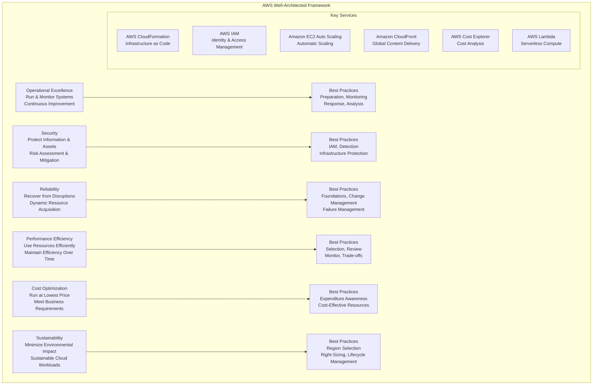

# Well-Architected Framework

> **Domain 1: Cloud Concepts (24%)** | **Section 17** | **Status:** In Progress

## 📚 Learning Objectives

- [ ] Understand the 6 pillars of the Well-Architected Framework
- [ ] Learn about Operational Excellence principles
- [ ] Understand Security best practices and principles
- [ ] Learn about Reliability and fault tolerance
- [ ] Understand Performance Efficiency optimization
- [ ] Learn about Cost Optimization strategies
- [ ] Understand Sustainability considerations

## 🎯 Key Concepts

### Well-Architected Framework Overview

**Overview**: The AWS Well-Architected Framework provides architectural best practices across six pillars to help you design and operate reliable, secure, efficient, and cost-effective systems in the cloud.

**Framework Benefits**:
- **Consistent Approach**: Standardized way to evaluate architectures
- **Best Practices**: Proven architectural patterns
- **Risk Mitigation**: Identify and address risks early
- **Cost Optimization**: Optimize costs while maintaining performance
- **Continuous Improvement**: Regular reviews and improvements

### Pillar 1: Operational Excellence

**Focus**: The ability to run and monitor systems to deliver business value and to continually improve supporting processes and procedures.

#### Design Principles
- **Perform operations as code**: Define infrastructure as code
- **Make frequent, small, reversible changes**: Enable rapid iteration
- **Refine operations procedures frequently**: Continuous improvement
- **Anticipate failure**: Design for failure scenarios
- **Learn from all operational failures**: Post-incident reviews

#### Best Practices
- **Preparation**: Establish operational readiness
- **Monitoring**: Implement comprehensive monitoring
- **Response**: Respond to events effectively
- **Analysis**: Learn from operational events

#### Key Services
- **AWS CloudFormation**: Infrastructure as code
- **AWS CloudWatch**: Monitoring and observability
- **AWS Systems Manager**: Operational management
- **AWS Config**: Configuration management
- **AWS CloudTrail**: Audit and compliance

### Pillar 2: Security

**Focus**: The ability to protect information, systems, and assets while delivering business value through risk assessments and mitigation strategies.

#### Design Principles
- **Implement a strong identity foundation**: Centralize identity management
- **Apply security at all layers**: Defense in depth
- **Enable traceability**: Monitor and audit actions
- **Automate security best practices**: Reduce human error
- **Protect data in transit and at rest**: Encryption everywhere
- **Keep people away from data**: Use least privilege access
- **Prepare for security events**: Incident response planning

#### Best Practices
- **Identity and Access Management**: IAM, MFA, least privilege
- **Detection**: Monitoring, logging, alerting
- **Infrastructure Protection**: Network security, encryption
- **Data Protection**: Encryption, backup, recovery
- **Incident Response**: Preparation, detection, response

#### Key Services
- **AWS IAM**: Identity and access management
- **AWS KMS**: Key management
- **Amazon GuardDuty**: Threat detection
- **AWS WAF**: Web application firewall
- **Amazon Inspector**: Security assessment

### Pillar 3: Reliability

**Focus**: The ability of a system to recover from infrastructure or service disruptions, dynamically acquire computing resources to meet demand, and mitigate disruptions.

#### Design Principles
- **Test recovery procedures**: Regular testing
- **Automatically recover from failure**: Self-healing systems
- **Scale horizontally to increase aggregate system availability**: Auto scaling
- **Stop guessing capacity**: Right-size resources
- **Manage change in automation**: Controlled changes

#### Best Practices
- **Foundations**: Multi-AZ, backup strategies
- **Change Management**: Controlled deployments
- **Failure Management**: Detection, response, recovery
- **Monitoring**: Health checks, alarms

#### Key Services
- **Amazon EC2 Auto Scaling**: Automatic scaling
- **Amazon RDS Multi-AZ**: High availability databases
- **Amazon S3**: Durable object storage
- **Amazon CloudFront**: Global content delivery
- **AWS Route 53**: DNS and health checks

### Pillar 4: Performance Efficiency

**Focus**: The ability to use computing resources efficiently to meet system requirements and to maintain that efficiency as demand changes and technologies evolve.

#### Design Principles
- **Democratize advanced technologies**: Use managed services
- **Go global in minutes**: Global deployment
- **Use serverless architectures**: Focus on business logic
- **Experiment more often**: A/B testing, feature flags
- **Consider mechanical sympathy**: Choose appropriate technology

#### Best Practices
- **Selection**: Choose appropriate services
- **Review**: Regular performance reviews
- **Monitor**: Performance monitoring
- **Trade-offs**: Balance performance vs cost

#### Key Services
- **Amazon CloudFront**: Global content delivery
- **AWS Lambda**: Serverless compute
- **Amazon ElastiCache**: In-memory caching
- **Amazon RDS**: Managed databases
- **Amazon S3**: Object storage

### Pillar 5: Cost Optimization

**Focus**: The ability to run systems at the lowest price point while still meeting your business requirements.

#### Design Principles
- **Adopt a consumption model**: Pay for what you use
- **Measure overall efficiency**: Monitor costs
- **Stop spending money on undifferentiated heavy lifting**: Use managed services
- **Analyze and attribute expenditure**: Cost allocation
- **Use managed services to reduce cost of ownership**: Focus on business value

#### Best Practices
- **Expenditure Awareness**: Cost monitoring and alerting
- **Cost-Effective Resources**: Right-sizing, Reserved Instances
- **Supply and Demand Matching**: Auto scaling
- **Optimizing Over Time**: Continuous optimization

#### Key Services
- **AWS Cost Explorer**: Cost analysis
- **AWS Budgets**: Cost management
- **Amazon EC2 Reserved Instances**: Cost savings
- **Amazon S3 Lifecycle**: Storage optimization
- **AWS Trusted Advisor**: Cost recommendations

### Pillar 6: Sustainability

**Focus**: The ability to minimize the environmental impacts of running cloud workloads.

#### Design Principles
- **Understand your impact**: Measure and monitor
- **Establish sustainability goals**: Set targets
- **Maximize utilization**: Right-size resources
- **Anticipate and adopt new, more efficient hardware and software offerings**: Stay current
- **Use managed services**: Reduce environmental impact
- **Reduce the downstream impact of your cloud workloads**: Optimize data transfer

#### Best Practices
- **Region Selection**: Choose regions with renewable energy
- **Instance Right-Sizing**: Match capacity to demand
- **Storage Optimization**: Use appropriate storage classes
- **Data Transfer Optimization**: Minimize data movement
- **Lifecycle Management**: Automate resource lifecycle

#### Key Services
- **Amazon EC2**: Right-sized instances
- **Amazon S3**: Storage lifecycle management
- **AWS Lambda**: Serverless efficiency
- **Amazon CloudFront**: Reduce data transfer
- **Amazon RDS**: Managed database efficiency

## 📊 Well-Architected Framework Diagram

## 🧠 Key Takeaways

- **6 Pillars**: Operational Excellence, Security, Reliability, Performance Efficiency, Cost Optimization, Sustainability
- **Design Principles**: Each pillar has specific design principles
- **Best Practices**: Proven practices for each pillar
- **Continuous Improvement**: Regular reviews and improvements
- **Trade-offs**: Balance competing priorities
- **Use AWS Services**: Leverage managed services for best practices
- **Measure and Monitor**: Track progress and improvements
- **Start Early**: Apply framework from the beginning

## ❓ Practice Questions

1. **Question**: Which Well-Architected pillar focuses on protecting information and assets?
   - A) Operational Excellence
   - B) Security
   - C) Reliability
   - D) Performance Efficiency
   - **Answer**: B - Security focuses on protecting information, systems, and assets

2. **Question**: What is the main focus of the Reliability pillar?
   - A) Cost optimization
   - B) Performance efficiency
   - C) Recovery from disruptions
   - D) Environmental impact
   - **Answer**: C - Reliability focuses on recovering from disruptions and maintaining availability

3. **Question**: Which pillar emphasizes using computing resources efficiently?
   - A) Security
   - B) Reliability
   - C) Performance Efficiency
   - D) Cost Optimization
   - **Answer**: C - Performance Efficiency focuses on using computing resources efficiently

4. **Question**: What is the newest pillar added to the Well-Architected Framework?
   - A) Security
   - B) Cost Optimization
   - C) Sustainability
   - D) Operational Excellence
   - **Answer**: C - Sustainability is the newest pillar, added to address environmental concerns

## 🔗 Integration with Microservices

**Well-Architected Framework in Microservices Architecture**:
- **Operational Excellence**: Use CloudFormation for microservice infrastructure
- **Security**: Implement IAM roles for each microservice
- **Reliability**: Use Auto Scaling and health checks for microservices
- **Performance Efficiency**: Use appropriate services for each microservice
- **Cost Optimization**: Right-size microservice resources
- **Sustainability**: Optimize microservice resource usage
- **Service Mesh**: Implement service mesh for microservice communication
- **API Gateway**: Centralize microservice API management

## 📚 References

- [AWS Well-Architected Framework](https://aws.amazon.com/architecture/well-architected/)
- [Well-Architected Tool](https://aws.amazon.com/well-architected-tool/)
- [Well-Architected Labs](https://www.wellarchitectedlabs.com/)
- [AWS Well-Architected Framework Whitepapers](https://aws.amazon.com/architecture/well-architected/)
- [AWS Well-Architected Framework - Sustainability](https://aws.amazon.com/architecture/well-architected/sustainability/)

---

*Last updated: January 27, 2025*
*Next: [Practice Exams & Final Review](./practice-exams.md)*